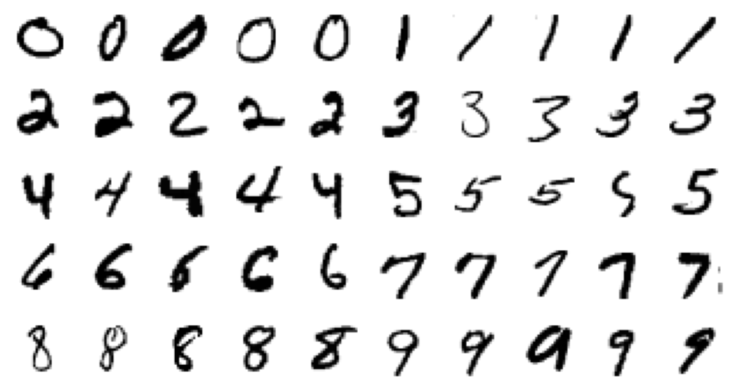
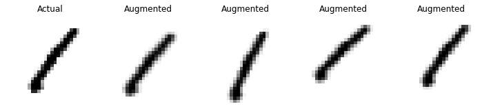
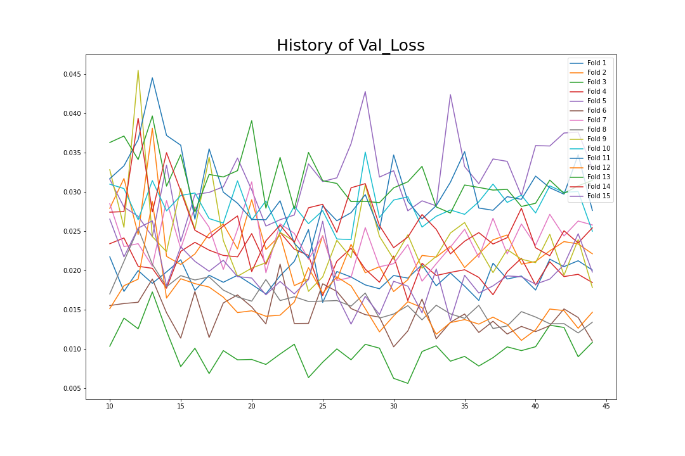
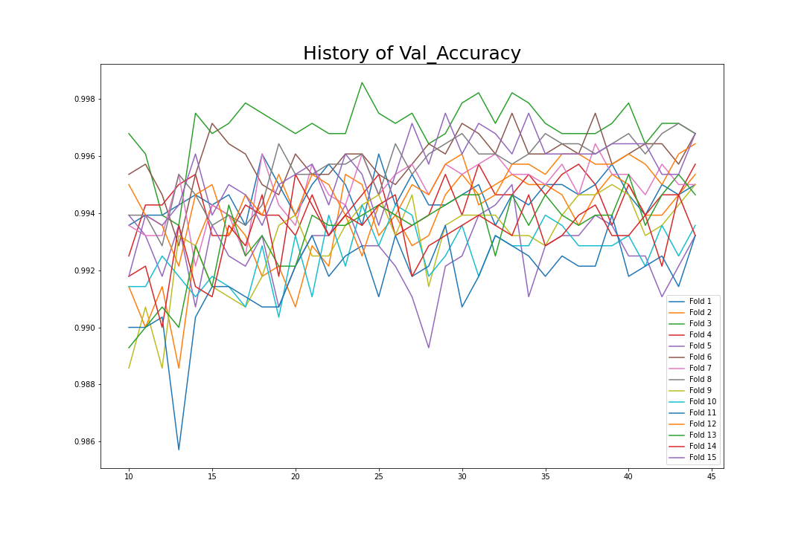
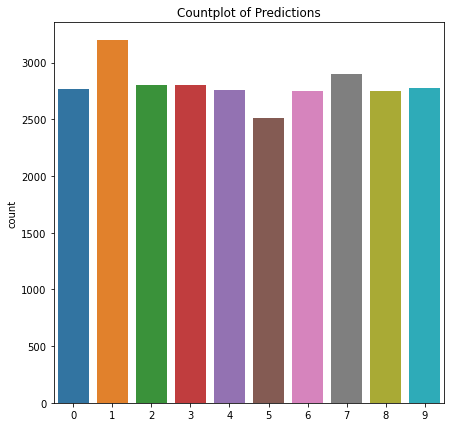
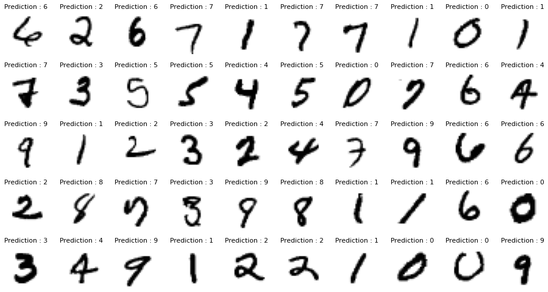

This notebook is basically my notebook run on [kaggle](https://www.kaggle.com/) so if you want to try
and run the code with same environment as mine go to link bellow.

Kaggle Notebook : [CNN Keras CV - 0.996 [TPU]](https://www.kaggle.com/wahyusetianto/cnn-keras-cv-0-996-tpu)

P.S. Don't forget to _upvote_ if you like it 😊.

# Overview

This kernel is on purpose to build model for MNIST digits dataset. In this kernel we're gonna do some preprocessing then make augmentation datagen so our model didn't train on the same image data, then at each of our model(here we use 15 folds so there will be 15 models) to make prediction for test dataset and by the end we're gonna do ensembles for the prediction.

# Web App

You can visit my web app for the live prediction by the best model trained on this kernel run on Tensorflow.js [Digit Recognizer](https://hyuto.github.io/showcase/digit-recognizer/).

# Train on TPU!!

why? Because it's **faster**. While people usually train on GPU for image related things, in this notebook we try to do things on TPU and see how it affect the Accuracy.

```python
import random
import numpy as np
import pandas as pd
from timeit import default_timer
from sklearn.model_selection import KFold

# Plot
import matplotlib.pyplot as plt
import seaborn as sns

# Tensorflow and Keras
import tensorflow as tf
from tensorflow import keras
import tensorflow.keras.backend as K
from tensorflow.keras.utils import to_categorical
from tensorflow.keras.models import Sequential, load_model
from tensorflow.keras.layers import Dense, Dropout, Flatten, Conv2D
from tensorflow.keras.layers import MaxPool2D, BatchNormalization
from tensorflow.keras.preprocessing.image import ImageDataGenerator
from tensorflow.keras.callbacks import LearningRateScheduler, ModelCheckpoint

print(f'Using Tensorflow Version : {tf.__version__}')
print(f'Using Keras Version      : {keras.__version__}')
```

    Using Tensorflow Version : 2.2.0
    Using Keras Version      : 2.3.0-tf

# Load the Data

Load the MNIST data

```python
train = pd.read_csv('../input/digit-recognizer/train.csv')
test = pd.read_csv('../input/digit-recognizer/test.csv')
train.head()
```

    5 rows × 785 columns

# Preprocess

## 1. Specifying X and y

for y we need to encode to one hot vector. In keras we have function `to_categorical` for this.

Example :

```
y = [1, 0, 4]
to_categorical(y)

# Output:
[
 [0,1,0,0,0], # 1
 [1,0,0,0,0], # 0
 [0,0,0,0,1], # 4
]
```

```python
# Specifying X and y
X = train.drop(['label'], axis = 1)
y = to_categorical(train['label'].values) # To Categorical y
```

## 2. Normalizing Images

Data normalization is an important step to ensures that each input parameter (pixel, in this case) has a similar data distribution. This makes convergence faster while training the network.

```python
# Normalize
X = X / 255.0
X_test = test / 255.0
```

## 3. Reshape

Train and test images (28px x 28px) has been stock into pandas. Dataframe as 1D vectors of 784 values. We reshape all data to 28x28x1 3D matrices.

```python
# Reshape Array
X = X.values.reshape(-1, 28, 28, 1)
X_test = X_test.values.reshape(-1, 28, 28, 1)
```

## Let's take a look at our data

```python
fig, axes = plt.subplots(ncols=10, nrows=5, figsize = (13, 7))
init = 0
for i in range(5):
    j = 0
    for k in range(2):
        ind = random.choices(train.label[train.label == init].index, k = 5)
        init += 1
        while j < len(ind):
            axes[i, k*5 + j].imshow(X[ind[j]][:,:,0], cmap=plt.cm.binary)
            axes[i, k*5 + j].axis('off')
            j += 1
        j = 0
fig.tight_layout()
plt.show()
```



as you can see there some nice & bad hand written digits number at our dataset.

# Data Augmentation

we currently have about 42000 image data, let's multiply that value by doing some soft augmentation.

```python
datagen = ImageDataGenerator(rotation_range=10,
                             zoom_range = 0.10,
                             width_shift_range=0.1,
                             height_shift_range=0.1)
```

let's take a look on our Augmentation datagen

```python
def AUG_test(X, y):
    fig, axes = plt.subplots(1, 5, figsize = (10,5))
    axes[0].imshow(X[:,:,0], cmap=plt.cm.binary)
    axes[0].set_title('Actual')
    axes[0].axis('off')
    for i in range(1, 5):
        aug, _ = datagen.flow(X.reshape(1,28,28,1), y.reshape(1,10)).next()
        axes[i].imshow(aug.reshape(28,28),cmap=plt.cm.binary)
        axes[i].set_title('Augmented')
        axes[i].axis('off')
    fig.tight_layout()
    return plt.show()
```

```python
AUG_test(X[0], y[0])
```



# Build CNN Model

The CNN's in this kernel follow LeNet5's design on [Chris Deotte](https://www.kaggle.com/cdeotte) kernel [here](https://www.kaggle.com/cdeotte/25-million-images-0-99757-mnist)

```python
def build_model():
    model = Sequential()
    model.add(Conv2D(32, kernel_size = 3, activation='relu',
                     input_shape = (28, 28, 1)))
    model.add(BatchNormalization())
    model.add(Conv2D(32, kernel_size = 3, activation='relu'))
    model.add(BatchNormalization())
    model.add(Conv2D(32, kernel_size = 5, strides=2, padding='same',
                     activation='relu'))
    model.add(BatchNormalization())
    model.add(Dropout(0.4))

    model.add(Conv2D(64, kernel_size = 3, activation='relu'))
    model.add(BatchNormalization())
    model.add(Conv2D(64, kernel_size = 3, activation='relu'))
    model.add(BatchNormalization())
    model.add(Conv2D(64, kernel_size = 5, strides=2, padding='same',
                     activation='relu'))
    model.add(BatchNormalization())
    model.add(Dropout(0.4))

    model.add(Conv2D(128, kernel_size = 4, activation='relu'))
    model.add(BatchNormalization())
    model.add(Flatten())
    model.add(Dropout(0.4))
    model.add(Dense(10, activation='softmax'))

    model.compile(optimizer="adam", loss="categorical_crossentropy",
                  metrics=["accuracy"])

    return model
```

# Detect and Instantiate TPU Distribution Strategy

```python
# detect and init the TPU
tpu = tf.distribute.cluster_resolver.TPUClusterResolver()
tf.config.experimental_connect_to_cluster(tpu)
tf.tpu.experimental.initialize_tpu_system(tpu)

# instantiate a distribution strategy
tpu_strategy = tf.distribute.experimental.TPUStrategy(tpu)
```

```python
# Config
EPOCHS = 45
BATCH_SIZE = 16 * tpu_strategy.num_replicas_in_sync
```

# Training

Here we use Kfold CV to split our data by 15 and build model at each fold. At the callbacks we use $f(x) = 0.001 \times 0.95^x$ for our LR Scheduler and do Checkpoint at **best _val_acc_** score.

Note that Tensorflow distribution strategy haven't supported `ImageDataGenerator` by this [issue](https://github.com/tensorflow/tensorflow/issues/34346) so instead use that at `fit_generator` we just have to extract Augmentation data by looping through and done training by `fit`.

```python
# Init
scores, History = [], []
pred = np.zeros(shape = (len(test), 10))

# CV
cv = KFold(n_splits=15, shuffle = True, random_state = 42)
for fold, (train_index, val_index) in enumerate(cv.split(X)):
    start = default_timer()
    # Clear Session
    K.clear_session()
    tf.tpu.experimental.initialize_tpu_system(tpu)

    # Splitting
    X_train , y_train = X[train_index], y[train_index]
    X_val, y_val = X[val_index], y[val_index]

    # Augmentation
    Train_x, Train_y = None, None
    batch = 0
    for x_batch, y_batch in datagen.flow(X_train, y_train,
                                         batch_size=BATCH_SIZE):
        if batch == 0:
            Train_x, Train_y = x_batch, y_batch
        elif batch >= X.shape[0] // BATCH_SIZE:
            break
        else:
            Train_x = np.concatenate((Train_x, x_batch))
            Train_y = np.concatenate((Train_y, y_batch))
        batch += 1

    # Model
    with tpu_strategy.scope():
        model = build_model()

    # Callbacks
    annealer = LearningRateScheduler(lambda x: 1e-3 * 0.95 ** x) # LR
    sv = ModelCheckpoint(f'Model Fold {fold}.h5', monitor='val_accuracy',
                         save_best_only=True, mode='max')

    # Training
    history = model.fit(Train_x, Train_y, batch_size = BATCH_SIZE,
                        epochs = EPOCHS, verbose = 0, callbacks=[annealer, sv],
                        steps_per_epoch = X_train.shape[0]//BATCH_SIZE,
                        validation_data = (X_val, y_val))
    History.append(history.history)

    # Load best model
    model = load_model(f'Model Fold {fold}.h5')

    # Evaluate
    score = model.evaluate(X_val, y_val, verbose = 0)[1]
    scores.append(score)

    # Making Prediction
    pred += model.predict(X_test)

    time = round(default_timer() - start, 4)
    print(f'[INFO] Fold {fold + 1} val_accuracy : {round(score, 4)} - Time : {time} s')

print()
print(f'[INFO] Mean CV scores : {round(sum(scores)/len(scores), 4)}')
```

    [INFO] Fold 1 val_accuracy : 0.9961 - Time : 168.7797 s
    [INFO] Fold 2 val_accuracy : 0.9957 - Time : 173.7161 s
    [INFO] Fold 3 val_accuracy : 0.9986 - Time : 178.845 s
    [INFO] Fold 4 val_accuracy : 0.9957 - Time : 174.5829 s
    [INFO] Fold 5 val_accuracy : 0.9946 - Time : 173.8493 s
    [INFO] Fold 6 val_accuracy : 0.9979 - Time : 175.585 s
    [INFO] Fold 7 val_accuracy : 0.9964 - Time : 176.5861 s
    [INFO] Fold 8 val_accuracy : 0.9968 - Time : 177.6894 s
    [INFO] Fold 9 val_accuracy : 0.995 - Time : 179.8059 s
    [INFO] Fold 10 val_accuracy : 0.9943 - Time : 176.4369 s
    [INFO] Fold 11 val_accuracy : 0.9939 - Time : 182.6052 s
    [INFO] Fold 12 val_accuracy : 0.9961 - Time : 177.0005 s
    [INFO] Fold 13 val_accuracy : 0.995 - Time : 180.026 s
    [INFO] Fold 14 val_accuracy : 0.9954 - Time : 179.1445 s
    [INFO] Fold 15 val_accuracy : 0.9975 - Time : 175.2097 s

    [INFO] Mean CV scores : 0.9959

And so we've got really great CV score there. Let's check the Training History.

# History

**Validation Loss**



**Validation Accuracy**



# Ensembleing Predictions

`np.argmax` through the prediction to get the number of class

```python
pred = np.array([np.argmax(x) for x in pred])

# Countplot Prediction
plt.figure(figsize = (7,7))
sns.countplot(pred)
plt.title('Countplot of Predictions')
plt.show()
```



## Let's check some of our prediction

```python
fig, axes = plt.subplots(ncols=10, nrows=5, figsize = (13, 7))
init = 0
for i in range(5):
    j = 0
    for k in range(2):
        ind = random.choices(test.index, k = 5)
        init += 1
        while j < len(ind):
            axes[i, k*5 + j].imshow(X_test[ind[j]][:,:,0], cmap=plt.cm.binary)
            axes[i, k*5 + j].set_title(f'Prediction : {pred[ind][j]}', fontsize = 11)
            axes[i, k*5 + j].axis('off')
            j += 1
        j = 0
fig.tight_layout()
plt.show()
```



looks like our models really doing good for predicting test data

# Conclusions

Based on our CV scores it's lower than [Chris Deotte](https://www.kaggle.com/cdeotte) kernel [here](https://www.kaggle.com/cdeotte/25-million-images-0-99757-mnist) with 0.99757 on validation accuracy on the same model architecture. So here's the point:

> GPU do better job in this task [Expected] while TPU give you lower accuracy but faster since we'd train 15 CNNs model on 45 epochs in less than one hour.

# References

1. 25 Million Images! [0.99757] MNIST [Link](https://www.kaggle.com/cdeotte/25-million-images-0-99757-mnist)
1. Introduction to CNN Keras - 0.997 (top 6%) [Link](https://www.kaggle.com/yassineghouzam/introduction-to-cnn-keras-0-997-top-6)
