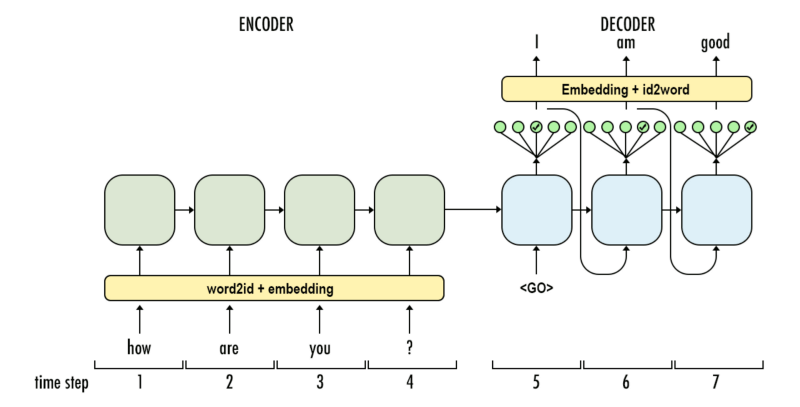
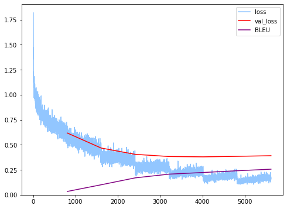

Hello guys, lately i've been studying about machine translation and give it a try.

Most of code in this notebook is based on tensorflow tutorial on their website
[TensorFlow Addons Networks : Sequence-to-Sequence NMT with Attention Mechanism](https://www.tensorflow.org/addons/tutorials/networks_seq2seq_nmt).

This notebook is basically my notebook run on [kaggle](https://www.kaggle.com/) so if you want to try
and run the code with same environment as mine go to link bellow.

Kaggle Notebook : [Machine Translation EN-JP Seq2Seq Tensorflow](https://www.kaggle.com/wahyusetianto/machine-translation-en-jp-seq2seq-tf)

P.S. Don't forget to _upvote_ if you like it 😊.

# English - Japanese Machine Translation

So in this notebook we're going to build English to Japanese machine translation, Japanese text contains lots of unique words because they have 3 type of it:

1. Kanji
2. Katakana
3. Hiragana

that's the interesting part of it and so it'll be little complicated to process. So let's get started.

## Install some tools

1. Sacreblue for calculate BLEU score
2. Googletrans => Google Translate for testing some sentences later

Note : You can use NLTK for calculating BLEU score [documentation](https://www.nltk.org/_modules/nltk/translate/bleu_score.html)

```python
!pip -q install sacrebleu
!pip -q install googletrans
!pip -q install tensorflow-addons --upgrade
```

```python
import random, re, string, itertools, timeit, sacrebleu
import numpy as np
import pandas as pd
import matplotlib.pyplot as plt
import seaborn as sns
from tqdm.notebook import tqdm
from IPython.display import display, clear_output
from sklearn.model_selection import train_test_split

# Tensorflow & Keras
import tensorflow as tf
import tensorflow_addons as tfa
import tensorflow.keras.backend as K
from tensorflow.keras.layers import Input, Dense, LSTM, LSTMCell
from tensorflow.keras.layers import Embedding, Bidirectional
from tensorflow.keras.models import Model
from tensorflow.keras.preprocessing.text import Tokenizer
from tensorflow.keras.preprocessing.sequence import pad_sequences
from tensorflow.keras.losses import SparseCategoricalCrossentropy
from tensorflow.keras.optimizers import Adam

# Japanese Word Tokenizer
from janome.tokenizer import Tokenizer as janome_tokenizer

plt.style.use('seaborn-pastel')
```

## Dataset

Here we use 55463 en-jp corpus from [ManyThings.org Bilingual Sentence Pairs](http://www.manythings.org/bilingual/)

```python
# Download Data & Unzip Data
!wget http://www.manythings.org/anki/jpn-eng.zip
!unzip jpn-eng.zip
```

    --2020-08-19 01:52:31--  http://www.manythings.org/anki/jpn-eng.zip
    Resolving www.manythings.org (www.manythings.org)... 104.24.109.196, 104.24.108.196, 172.67.173.198, ...
    Connecting to www.manythings.org (www.manythings.org)|104.24.109.196|:80... connected.
    HTTP request sent, awaiting response... 200 OK
    Length: 2303148 (2.2M) [application/zip]
    Saving to: ‘jpn-eng.zip’

    jpn-eng.zip         100%[===================>]   2.20M  9.70MB/s    in 0.2s

    2020-08-19 01:52:32 (9.70 MB/s) - ‘jpn-eng.zip’ saved [2303148/2303148]

    Archive:  jpn-eng.zip
      inflating: jpn.txt
      inflating: _about.txt

Load data to memory.

```python
data = []

f1 = open('./jpn.txt', 'r')
data += [x.rstrip().lower().split('\t')[:2] for x in tqdm(f1.readlines())]
f1.close()

print(f'Loaded {len(data)} Sentences')
```

    Loaded 53594 Sentences

## Text Preprocessing

### Handling misspell words & Clearing Punctuation

we're gonna change the misspell words in english sentences and clearing punctuation from text.

"aren't my english bad?" -> "are not my english bad"

```python
mispell_dict = {
    "aren't" : "are not",
    "can't" : "cannot",
    "couldn't" : "could not",
    "didn't" : "did not",
    "doesn't" : "does not",
    "don't" : "do not",
    "hadn't" : "had not",
    "hasn't" : "has not",
    "haven't" : "have not",
    "he'd" : "he would",
    "he'll" : "he will",
    "he's" : "he is",
    "i'd" : "i would",
    "i'd" : "i had",
    "i'll" : "i will",
    "i'm" : "i am",
    "isn't" : "is not",
    "it's" : "it is",
    "it'll":"it will",
    "i've" : "i have",
    "let's" : "let us",
    "mightn't" : "might not",
    "mustn't" : "must not",
    "shan't" : "shall not",
    "she'd" : "she would",
    "she'll" : "she will",
    "she's" : "she is",
    "shouldn't" : "should not",
    "that's" : "that is",
    "there's" : "there is",
    "they'd" : "they would",
    "they'll" : "they will",
    "they're" : "they are",
    "they've" : "they have",
    "we'd" : "we would",
    "we're" : "we are",
    "weren't" : "were not",
    "we've" : "we have",
    "what'll" : "what will",
    "what're" : "what are",
    "what's" : "what is",
    "what've" : "what have",
    "where's" : "where is",
    "who'd" : "who would",
    "who'll" : "who will",
    "who're" : "who are",
    "who's" : "who is",
    "who've" : "who have",
    "won't" : "will not",
    "wouldn't" : "would not",
    "you'd" : "you would",
    "you'll" : "you will",
    "you're" : "you are",
    "you've" : "you have",
    "'re": " are",
    "wasn't": "was not",
    "we'll":" will",
    "didn't": "did not",
    "tryin'":"trying"
}

mispell_re = re.compile('(%s)' % '|'.join(mispell_dict.keys()))

def preprocess(text) -> str:
    def replace(match):
        return mispell_dict[match.group(0)]

    text = mispell_re.sub(replace, text)
    return text
```

Japanese words have their own punctuation like 【this】

```python
# Adding Japanese Punctuation
string.punctuation += '、。【】「」『』…・〽（）〜？！｡：､；･'

CP = lambda x : x.translate(str.maketrans('', '', string.punctuation))
```

```python
data = [x for x in data if len(x) == 2]

eng_data = [CP(preprocess(x[0])) for x in data]
jpn_data = [CP(x[1]) for x in data]
```

### Segmenting Japanese Sentences

Unlike english sentence we can tokenize it by splitting words with space just like this,

```
'This is english or i think so'.split()

Output:
['This', 'is', 'english', 'or', 'i', 'think', 'so']
```

but in Japanese we can't do it that way. Here we gonna use Janome Tokenizer to segmenting Japanese sentence and adding space to it so Keras Tokenizer can handle it.

```python
# Initialize Janome Tokenizer
token_jp = janome_tokenizer()
```

```python
sample_text = 'ここで私は英語で話している'
' '.join([word for word in token_jp.tokenize(sample_text, wakati=True) \
          if word != ' '])
```

    'ここ で 私 は 英語 で 話し て いる'

```python
# Apply to Japanese Sentences
jpn_data = [' '.join([word for word in token_jp.tokenize(x, wakati=True) \
                      if word != ' ']) for x in tqdm(jpn_data)]
```

For evaluating our model let's split our data.

```python
eng_train, eng_test, jpn_train, jpn_test = \
train_test_split(eng_data, jpn_data, test_size = 0.04, random_state = 42)

print(f"Splitting to {len(eng_train)} Train data and \
{len(eng_test)} Test data")
```

    Splitting to 51450 Train data and 2144 Test data

### Add BOS and EOS

We put BOS "Begin of Sequence" and EOS “End of Sequence" to help our decoder recognize begin and end of a sequence.

```python
eng_train = ['bos '+ x + ' eos' for x in eng_train + ['unk unk unk']]
jpn_train = ['bos '+ x + ' eos' for x in jpn_train + ['unk unk unk']]

eng_val = ['bos '+ x + ' eos' for x in eng_test]
jpn_val = ['bos '+ x + ' eos' for x in jpn_test]
```

## Word Tokenizing

Here we use Tokenizer API from Keras to make vocabulary and tokenizing our data

```python
# English Tokenizer
en_tokenizer = Tokenizer(filters='')
en_tokenizer.fit_on_texts(eng_train)

# Japannese Tokenizer
jp_tokenizer = Tokenizer(filters='')
jp_tokenizer.fit_on_texts(jpn_train)
```

```python
print(f'English vocab size   :', len(en_tokenizer.word_index) - 3)
print(f'Japanese vocab size  :', len(jp_tokenizer.word_index) - 3)
```

    English vocab size   : 9646
    Japanese vocab size  : 14403

## Word Cloud

What comes when doing NLP? It's Word Cloud. Let's do it for our vocab.

Font : [Google Noto Fonts](https://www.google.com/get/noto/) -> Noto Sans CJK JP

```python
!wget https://noto-website-2.storage.googleapis.com/pkgs/NotoSansCJKjp-hinted.zip
!wget https://raw.githubusercontent.com/Hyuto/NMT-TF-Seq2seq-EN-JP/master/Japan.jpg
!wget https://raw.githubusercontent.com/Hyuto/NMT-TF-Seq2seq-EN-JP/master/English.png
!mkdir font
!unzip NotoSansCJKjp-hinted.zip -d ./font
```

    --2020-08-19 01:53:52--  https://noto-website-2.storage.googleapis.com/pkgs/NotoSansCJKjp-hinted.zip
    Resolving noto-website-2.storage.googleapis.com (noto-website-2.storage.googleapis.com)... 172.217.204.128, 2607:f8b0:400c:c15::80
    Connecting to noto-website-2.storage.googleapis.com (noto-website-2.storage.googleapis.com)|172.217.204.128|:443... connected.
    HTTP request sent, awaiting response... 200 OK
    Length: 121096772 (115M) [application/zip]
    Saving to: ‘NotoSansCJKjp-hinted.zip’

    NotoSansCJKjp-hinte 100%[===================>] 115.49M  53.3MB/s    in 2.2s

    2020-08-19 01:53:54 (53.3 MB/s) - ‘NotoSansCJKjp-hinted.zip’ saved [121096772/121096772]

    --2020-08-19 01:53:55--  https://raw.githubusercontent.com/Hyuto/NMT-TF-Seq2seq-EN-JP/master/Japan.jpg
    Resolving raw.githubusercontent.com (raw.githubusercontent.com)... 151.101.200.133
    Connecting to raw.githubusercontent.com (raw.githubusercontent.com)|151.101.200.133|:443... connected.
    HTTP request sent, awaiting response... 200 OK
    Length: 3976 (3.9K) [image/jpeg]
    Saving to: ‘Japan.jpg’

    Japan.jpg           100%[===================>]   3.88K  --.-KB/s    in 0s

    2020-08-19 01:53:55 (46.7 MB/s) - ‘Japan.jpg’ saved [3976/3976]

    --2020-08-19 01:53:56--  https://raw.githubusercontent.com/Hyuto/NMT-TF-Seq2seq-EN-JP/master/English.png
    Resolving raw.githubusercontent.com (raw.githubusercontent.com)... 151.101.200.133
    Connecting to raw.githubusercontent.com (raw.githubusercontent.com)|151.101.200.133|:443... connected.
    HTTP request sent, awaiting response... 200 OK
    Length: 303684 (297K) [image/png]
    Saving to: ‘English.png’

    English.png         100%[===================>] 296.57K  --.-KB/s    in 0.1s

    2020-08-19 01:53:56 (2.18 MB/s) - ‘English.png’ saved [303684/303684]

    Archive:  NotoSansCJKjp-hinted.zip
      inflating: ./font/LICENSE_OFL.txt
      inflating: ./font/NotoSansCJKjp-Black.otf
      inflating: ./font/NotoSansCJKjp-Bold.otf
      inflating: ./font/NotoSansCJKjp-DemiLight.otf
      inflating: ./font/NotoSansCJKjp-Light.otf
      inflating: ./font/NotoSansCJKjp-Medium.otf
      inflating: ./font/NotoSansCJKjp-Regular.otf
      inflating: ./font/NotoSansCJKjp-Thin.otf
      inflating: ./font/NotoSansMonoCJKjp-Bold.otf
      inflating: ./font/NotoSansMonoCJKjp-Regular.otf
      inflating: ./font/README

```python
from wordcloud import WordCloud, ImageColorGenerator
from PIL import Image

def get_words(arr):
    keys = list(arr.keys())
    count = list(arr.values())
    return ' '.join([x for _,x in sorted(zip(count, keys), reverse = True)][2:])

def transform(arr):
    for i in range(len(arr)):
        for j in range(len(arr[i])):
            if not any(arr[i][j]):
                arr[i][j] = np.array([225, 225, 225, 225])
    return arr

font_path = './font/NotoSansCJKjp-Light.otf'


mask = './English.png'
mask = np.array(Image.open(mask))
mask = transform(mask)
image_colors = ImageColorGenerator(mask)
words = get_words(en_tokenizer.word_counts).title()
wc = WordCloud(background_color="white", max_words=2000, random_state=42,
               width=mask.shape[1], height=mask.shape[0])
wc = wc.generate(words)
fig1, ax1 = plt.subplots(figsize=(20,15))
ax1.imshow(wc.recolor(color_func=image_colors), interpolation='bilinear')
ax1.axis("off")

mask = './Japan.jpg'
mask = np.array(Image.open(mask))
image_colors = ImageColorGenerator(mask)
words = get_words(jp_tokenizer.word_counts).title()
wc = WordCloud(collocations=False, background_color="white", mode="RGBA",
               max_words=6000, font_path=font_path, contour_width=1,
               scale=5, max_font_size = 50, relative_scaling=0.5,
               random_state=42, width=mask.shape[1], height=mask.shape[0])
wc = wc.generate(words)
fig2, ax2 = plt.subplots(figsize=(20,15))
ax2.imshow(wc.recolor(color_func=image_colors), interpolation='bilinear')
ax2.axis("off")

fig1.savefig('WC_English.png')
fig2.savefig('WC_Japanese.png')
plt.close(fig1)
plt.close(fig2)

!rm -rf ./font
```

<div className="tabbed">
  
  
</div>

now let's transform our train sentences to sequences.

```python
def Sequences(texts, tokenizer):
    res = []
    for text in texts:
        seq = []
        for w in text.split():
            try:
                seq.append(tokenizer.word_index[w])
            except:
                seq.append(tokenizer.word_index['unk'])
        res.append(seq)
    return res
```

```python
# Transform Sentences to Sequences
data_en = en_tokenizer.texts_to_sequences(eng_train)
data_jp = jp_tokenizer.texts_to_sequences(jpn_train)

val_en = Sequences(eng_val, en_tokenizer)
val_jp = Sequences(jpn_val, jp_tokenizer)
```

```python
plt.figure(figsize = (8,8))
sns.distplot([len(x) for x in data_en], label='English')
sns.distplot([len(x) for x in data_jp], label='Japanese')
plt.title('Distribution of Sentences Length')
plt.legend()
plt.show()
```


based on the distplot English sentences contains about 20 - 40 words while Japanese have more wider range.

Let's check their max length

```python
max_en = max([len(x) for x in data_en] + [len(x) for x in val_en])
max_jp = max([len(x) for x in data_jp] + [len(x) for x in val_jp])

print(f'Maximum length of English sequences is  {max_en}')
print(f'Maximum length of Japanese sequences is {max_jp}')
```

    Maximum length of English sequences is  49
    Maximum length of Japanese sequences is 54

```python
# Padding Sequences
data_en = pad_sequences(data_en, padding='post', maxlen = max_en)
data_jp = pad_sequences(data_jp, padding='post', maxlen = max_jp)

val_en = pad_sequences(val_en, padding='post', maxlen = max_en)
val_jp = pad_sequences(val_jp, padding='post', maxlen = max_jp)
```

## Build & Train Model

Now it's the time brace yourself.

We'll build model based on Seq2seq approaches with Attention optimization.

> Seq2Seq is a method of encoder-decoder based machine translation that maps an input of sequence to an output of sequence with a tag and attention value. The idea is to use 2 RNN that will work together with a special token and trying to predict the next state sequence from the previous sequence.



```python
# Config
epochs = 7
BATCH_SIZE = 64
BUFFER_SIZE = len(data_jp)
steps_per_epoch = BUFFER_SIZE//BATCH_SIZE
val_steps_per_epoch = len(val_jp) // BATCH_SIZE
embedding_dims = 256
rnn_units = 1024
dense_units = 1024
Dtype = tf.float32
```

```python
def max_len(tensor):
    """
    Get max len in Sequences
    """
    return max( len(t) for t in tensor)
```

```python
# Max Len
Tx = max_len(data_en)
Ty = max_len(data_jp)

# Vocab
input_vocab_size = len(en_tokenizer.word_index) + 1   # English
output_vocab_size = len(jp_tokenizer.word_index) + 1  # Japanese

# Changing to TF data
dataset = (tf.data.Dataset.from_tensor_slices((data_en, data_jp))
           .shuffle(BUFFER_SIZE)
           .batch(BATCH_SIZE, drop_remainder=True)
          )

val_dataset = (tf.data.Dataset.from_tensor_slices((val_en, val_jp))
               .batch(BATCH_SIZE)
              )
```

Let's define our based Seq2Seq Model

```python
# ENCODER
class EncoderNetwork(tf.keras.Model):
    def __init__(self,input_vocab_size,embedding_dims, rnn_units ):
        super().__init__()
        self.encoder_embedding = Embedding(input_dim=input_vocab_size,
                                           output_dim=embedding_dims)
        self.encoder_rnnlayer = LSTM(rnn_units,return_sequences=True,
                                     return_state=True )

# DECODER
class DecoderNetwork(tf.keras.Model):
    def __init__(self,output_vocab_size, embedding_dims, rnn_units):
        super().__init__()
        self.decoder_embedding = Embedding(input_dim=output_vocab_size,
                                           output_dim=embedding_dims)
        self.dense_layer = Dense(output_vocab_size)
        self.decoder_rnncell = LSTMCell(rnn_units)
        # Sampler
        self.sampler = tfa.seq2seq.sampler.TrainingSampler()
        # Create attention mechanism with memory = None
        self.attention_mechanism = \
            self.build_attention_mechanism(dense_units,None,BATCH_SIZE*[Tx])
        self.rnn_cell = self.build_rnn_cell(BATCH_SIZE)
        self.decoder = tfa.seq2seq.BasicDecoder(self.rnn_cell,
                                                sampler= self.sampler,
                                                output_layer = self.dense_layer
                                               )

    def build_attention_mechanism(self, units, memory, MSL):
        """
        MSL : Memory Sequence Length
        """
        #return tfa.seq2seq.LuongAttention(units, memory = memory,
        #                                  memory_sequence_length = MSL)
        return tfa.seq2seq.BahdanauAttention(units, memory = memory,
                                             memory_sequence_length = MSL)

    # wrap decodernn cell
    def build_rnn_cell(self, batch_size):
        return tfa.seq2seq.AttentionWrapper(self.decoder_rnncell,
                                            self.attention_mechanism,
                                            attention_layer_size=dense_units)

    def build_decoder_initial_state(self, batch_size, encoder_state, Dtype):
        decoder_initial_state = self.rnn_cell.get_initial_state(batch_size = batch_size,
                                                                dtype = Dtype)
        decoder_initial_state = decoder_initial_state.clone(cell_state = encoder_state)
        return decoder_initial_state
```

```python
# Build Model
encoderNetwork = EncoderNetwork(input_vocab_size, embedding_dims, rnn_units)
decoderNetwork = DecoderNetwork(output_vocab_size, embedding_dims, rnn_units)

# Optimizer
optimizer = tf.keras.optimizers.Adam()
```

Make custom training loop

```python
def loss_function(y_pred, y):
    #shape of y [batch_size, ty]
    #shape of y_pred [batch_size, Ty, output_vocab_size]
    sparsecategoricalcrossentropy = SparseCategoricalCrossentropy(from_logits=True,
                                                                  reduction='none')
    loss = sparsecategoricalcrossentropy(y_true=y, y_pred=y_pred)
    mask = tf.logical_not(tf.math.equal(y,0))   #output 0 for y=0 else output 1
    mask = tf.cast(mask, dtype=loss.dtype)
    loss = mask * loss
    loss = tf.reduce_mean(loss)
    return loss

@tf.function
def train_step(input_batch, output_batch, encoder_initial_cell_state):
    # initialize loss = 0
    loss = 0
    with tf.GradientTape() as tape:
        encoder_emb_inp = encoderNetwork.encoder_embedding(input_batch)
        a, a_tx, c_tx = encoderNetwork.encoder_rnnlayer(encoder_emb_inp,
                                                        initial_state = encoder_initial_cell_state)

        # [last step activations,last memory_state] of
        # encoder passed as input to decoder Network

        # Prepare correct Decoder input & output sequence data
        decoder_input = output_batch[:,:-1] # ignore eos
        # compare logits with timestepped +1 version of decoder_input
        decoder_output = output_batch[:,1:] #ignore bos

        # Decoder Embeddings
        decoder_emb_inp = decoderNetwork.decoder_embedding(decoder_input)

        # Setting up decoder memory from encoder output
        # and Zero State for AttentionWrapperState
        decoderNetwork.attention_mechanism.setup_memory(a)
        decoder_initial_state = decoderNetwork.build_decoder_initial_state(BATCH_SIZE,
                                                                           encoder_state=[a_tx, c_tx],
                                                                           Dtype=tf.float32)

        # BasicDecoderOutput
        outputs, _, _ = decoderNetwork.decoder(decoder_emb_inp,initial_state=decoder_initial_state,
                                               sequence_length=BATCH_SIZE*[Ty-1])

        logits = outputs.rnn_output

        # Calculate loss
        loss = loss_function(logits, decoder_output)

    # Returns the list of all layer variables / weights.
    variables = encoderNetwork.trainable_variables + decoderNetwork.trainable_variables
    # differentiate loss wrt variables
    gradients = tape.gradient(loss, variables)

    # grads_and_vars – List of(gradient, variable) pairs.
    grads_and_vars = zip(gradients,variables)
    optimizer.apply_gradients(grads_and_vars)
    return loss

@tf.function
def evaluate(input_batch, output_batch, encoder_initial_cell_state):
    loss = 0
    encoder_emb_inp = encoderNetwork.encoder_embedding(input_batch)
    a, a_tx, c_tx = encoderNetwork.encoder_rnnlayer(encoder_emb_inp,
                                                    initial_state =encoder_initial_cell_state)
    decoder_input = output_batch[:,:-1]
    decoder_output = output_batch[:,1:]
    decoder_emb_inp = decoderNetwork.decoder_embedding(decoder_input)
    decoderNetwork.attention_mechanism.setup_memory(a)
    decoder_initial_state = decoderNetwork.build_decoder_initial_state(BATCH_SIZE,
                                                                       encoder_state=[a_tx, c_tx],
                                                                       Dtype=tf.float32)
    outputs, _, _ = decoderNetwork.decoder(decoder_emb_inp,initial_state=decoder_initial_state,
                                           sequence_length=BATCH_SIZE*[Ty-1])
    logits = outputs.rnn_output
    loss = loss_function(logits, decoder_output)
    return loss
```

```python
# RNN LSTM hidden and memory state initializer
def initialize_initial_state():
    return [tf.zeros((BATCH_SIZE, rnn_units)), tf.zeros((BATCH_SIZE, rnn_units))]
```

## Calculating BLEU Score

> BLEU (bilingual evaluation understudy) is an algorithm for evaluating the quality of text which has been machine-translated from one natural language to another. Quality is considered to be the correspondence between a machine's output and that of a human: "the closer a machine translation is to a professional human translation, the better it is". - Wikipedia

BLEU is a metric for evaluating a generated sentence to a reference sentence.
A perfect match results in a score of 1.0, whereas a perfect mismatch results in a score of 0.0.

So now we're going to define our translation function & calculate the BLEU score for test data at the end of every epoch while training. Note that test data is sentences that our tokenizer didn't train with, so there must be some words that our tokenizer didn't know.
I'm currently working to fix this issue. Based on keras Tokenizer API it have `oov_token` for handling this but i'm not sure.

For now i'm handling this by adding `unk` in train dataset so the tokenizer can read it, and then when coming to translation if there is word that our tokenizer don't know i'll set it by index of `unk` not very eficient but it works.

```python
# Translate
def Translate(input_raw):
    input_raw = CP(preprocess(input_raw))
    input_lines = ['bos '+ input_raw + '']

    input_sequences, unique = [], []
    for line in input_lines:
        temp = []
        for w in line.split(' '):
            try:
                temp.append(en_tokenizer.word_index[w])
            except: # Avoid Error
                unique.append(w)
                temp.append(en_tokenizer.word_index['unk'])
        input_sequences.append(temp)

    input_sequences = pad_sequences(input_sequences, maxlen=Tx, padding='post')
    inp = tf.convert_to_tensor(input_sequences)
    inference_batch_size = input_sequences.shape[0]
    encoder_initial_cell_state = [tf.zeros((inference_batch_size, rnn_units)),
                                  tf.zeros((inference_batch_size, rnn_units))]
    encoder_emb_inp = encoderNetwork.encoder_embedding(inp)
    a, a_tx, c_tx = encoderNetwork.encoder_rnnlayer(encoder_emb_inp,
                                                    initial_state = encoder_initial_cell_state)

    start_tokens = tf.fill([inference_batch_size], jp_tokenizer.word_index['bos'])

    end_token = jp_tokenizer.word_index['eos']

    greedy_sampler = tfa.seq2seq.GreedyEmbeddingSampler()

    decoder_input = tf.expand_dims([jp_tokenizer.word_index['bos']] * inference_batch_size,1)
    decoder_emb_inp = decoderNetwork.decoder_embedding(decoder_input)

    decoder_instance = tfa.seq2seq.BasicDecoder(cell = decoderNetwork.rnn_cell,
                                                sampler = greedy_sampler,
                                                output_layer = decoderNetwork.dense_layer)
    decoderNetwork.attention_mechanism.setup_memory(a)

    decoder_initial_state = decoderNetwork.build_decoder_initial_state(
        inference_batch_size, encoder_state=[a_tx, c_tx], Dtype=tf.float32)

    maximum_iterations = tf.round(tf.reduce_max(Tx) * 2)

    decoder_embedding_matrix = decoderNetwork.decoder_embedding.variables[0]
    (first_finished, first_inputs,first_state) = decoder_instance.initialize(
        decoder_embedding_matrix, start_tokens = start_tokens,
        end_token = end_token, initial_state = decoder_initial_state)

    inputs = first_inputs
    state = first_state
    predictions = np.empty((inference_batch_size,0), dtype = np.int32)
    for j in range(maximum_iterations):
        outputs, next_state, next_inputs, finished = decoder_instance.step(j, inputs,state)
        inputs = next_inputs
        state = next_state
        outputs = np.expand_dims(outputs.sample_id,axis = -1)
        predictions = np.append(predictions, outputs, axis = -1)

    res = ''
    for i in range(len(predictions)):
        line = predictions[i,:]
        seq = list(itertools.takewhile(lambda index: index !=2, line))
        res += " ".join( [jp_tokenizer.index_word[w] for w in seq])
    res = res.split()

    # Return back Unique words
    for i in range(len(res)):
        if res[i] == 'unk' and unique != []:
            res[i] = unique.pop(0)

    return ' '.join(res)

# Calculate BLEU
def BLEU(X, y):
    # Prediction
    pred = [Translate(w) for w in tqdm(X)]
    # Calculate BLEU
    score = sacrebleu.corpus_bleu(pred, [y]).score / 100
    return score, pred
```

```python
# Custom Train Progress
class Progress:
    def __init__(self):
        self.fig = plt.figure(figsize = (8,6))
        self.ax = self.fig.add_subplot(1, 1, 1)
        self.loss, self.val_loss, self.BLEU = [], [], []
        self.epoch_loss = 0

    def get_val_loss(self):
        return [x[1] for x in self.val_loss]

    # Plot
    def dynamic_plot(self):
        self.ax.cla()
        self.ax.plot(range(len(self.loss)), self.loss, label='loss')
        if len(self.val_loss) >= 1:
            x = [l[0] for l in self.val_loss]
            y = [l[1] for l in self.val_loss]
            self.ax.plot(x, y, color = 'r', label='val_loss')
            self.ax.plot(x, self.BLEU, color = 'purple', label='BLEU')
        self.ax.set_ylim(0,)
        self.ax.legend(loc = 1)
        display(self.fig)

    # Train step progress
    def train_progress(self, epoch, step, steps_per_epoch, start):
        self.dynamic_plot()
        print(f'Working on Epoch {epoch}')
        print('[' + ('=' * int((step + 1) / steps_per_epoch * 60)).ljust(61, ' ')
              + f']  {step + 1}/{steps_per_epoch} - loss : {round(self.epoch_loss / step, 4)}')
        print(f'Time per Step {round(timeit.default_timer() - start, 2)} s')

    def summary(self):
        loss = np.array_split(np.array(self.loss), len(self.val_loss))
        loss = [np.mean(x) for x in loss]
        val_loss = [x[1] for x in self.val_loss]
        df = pd.DataFrame({'Epochs' : range(1, len(val_loss) + 1), 'loss' : loss,
                           'val loss' : val_loss, 'BLEU' : self.BLEU})

        self.dynamic_plot()
        clear_output(wait = True)
        display(df)
```

```python
# Initialize Train Progress
TP = Progress()
best_prediction = []

for i in range(1, epochs + 1):

    encoder_initial_cell_state = initialize_initial_state()
    total_loss = 0.0
    # Train Loss
    TP.epoch_loss = 0

    # Train
    for (batch , (input_batch, output_batch)) in enumerate(dataset.take(steps_per_epoch)):
        start = timeit.default_timer()
        batch_loss = train_step(input_batch, output_batch, encoder_initial_cell_state)
        total_loss += batch_loss
        TP.loss.append(batch_loss.numpy())
        TP.epoch_loss += batch_loss.numpy()

        if (batch+1) % 30 == 0:
            TP.train_progress(i, batch, steps_per_epoch, start)
            clear_output(wait = True)

    # Validitate
    encoderNetwork.trainable = False  # Freeze our model layer to make sure
    decoderNetwork.trainable = False  # it didn't learn anything from val_data

    # Valid loss
    val_loss = 0
    for (batch, (input_batch, output_batch)) in enumerate(val_dataset.take(val_steps_per_epoch)):
        batch_loss = evaluate(input_batch, output_batch, encoder_initial_cell_state)
        val_loss += batch_loss.numpy()
    val_loss /= val_steps_per_epoch

    TP.val_loss.append((i * steps_per_epoch - 1, val_loss))

    # Bleu Score
    bleu_score, pred = BLEU(eng_test, jpn_test)
    TP.BLEU.append(bleu_score)

    encoderNetwork.trainable = True  # Unfreeze layer for next epoch
    decoderNetwork.trainable = True

    # Save best model
    if bleu_score == max(TP.BLEU) and val_loss == min(TP.get_val_loss()):
        best_prediction = pred
        encoderNetwork.save_weights('encoderNetwork')
        decoderNetwork.save_weights('decoderNetwork')

TP.summary()
```

| Epochs |   loss   | val loss |   BLEU   |
| :----: | :------: | :------: | :------: |
|   1    | 0.755007 | 0.617767 | 0.033657 |
|   2    | 0.507803 | 0.467358 | 0.100527 |
|   3    | 0.366943 | 0.404535 | 0.169416 |
|   4    | 0.278531 | 0.382699 | 0.206622 |
|   5    | 0.220114 | 0.379538 | 0.223136 |
|   6    | 0.180076 | 0.384533 | 0.240543 |
|   7    | 0.152284 | 0.390775 | 0.256055 |



```python
# Load best weights
encoderNetwork.load_weights('encoderNetwork')
decoderNetwork.load_weights('decoderNetwork')
```

    <tensorflow.python.training.tracking.util.CheckpointLoadStatus at 0x7fb3601083d0>

Let's check the best prediction of our model.

```python
for i in range(7,16):
    print("English Sentence:")
    print(eng_test[i])
    print("\nJapanese Translation:")
    print(best_prediction[i])
    print("\nJapanese Reference:")
    print(jpn_test[i])
    print(''.ljust(60, '-'))
```

    English Sentence:
    in september there are just a few people here and there on the beach

    Japanese Translation:
    ９ 時 に は ここ に 他 の 人 が 住ん で い ない 人 が その ビーチ で 他 の 人達 が 残り の もと を あちら に 建設 見 た

    Japanese Reference:
    ９月 の 海 は 人 が まばら だ ね
    ------------------------------------------------------------
    English Sentence:
    while you are young you should read a lot

    Japanese Translation:
    若い 頃 は 読み 終わっ たら いい よ

    Japanese Reference:
    若い うち に たくさん の 本 を 読む べき だ
    ------------------------------------------------------------
    English Sentence:
    here i come

    Japanese Translation:
    ここ に 来 た の

    Japanese Reference:
    いま 行き ます
    ------------------------------------------------------------
    English Sentence:
    once you have decided when you will be coming let me know

    Japanese Translation:
    来る か 君 に は 連絡 を 言っ て き た よ

    Japanese Reference:
    いつ 来る か 決まっ たら 教え て
    ------------------------------------------------------------
    English Sentence:
    he jumped on the train

    Japanese Translation:
    彼 は 電車 に 旗 を 飛び越え た

    Japanese Reference:
    彼 は 電車 に 飛び乗っ た
    ------------------------------------------------------------
    English Sentence:
    he passed away yesterday

    Japanese Translation:
    彼 は 昨日 亡くなっ た

    Japanese Reference:
    彼 は 昨日 お 亡くなり に なり まし た
    ------------------------------------------------------------
    English Sentence:
    i had no other choice

    Japanese Translation:
    他 に 選択肢 が なかっ た

    Japanese Reference:
    他 に 手 が なかっ た の だ
    ------------------------------------------------------------
    English Sentence:
    are you good at bowling

    Japanese Translation:
    ボーリング は 得意 です か

    Japanese Reference:
    ボウリング は 得意
    ------------------------------------------------------------
    English Sentence:
    it is strange that you do not know anything about that matter

    Japanese Translation:
    それ について 何 も 知ら ない こと が ない という こと は 変 だ

    Japanese Reference:
    あなた が その こと について 何 も 知ら ない の は 変 だ
    ------------------------------------------------------------

## Test with Some Raw Input

Yeay now let's play with **our** Machine Translation with some raw input. We'll cross check the prediction from MT with Google Translate API to translate it back to english and see how bad **our** MT is :).

```python
from googletrans import Translator
# Google Translate
translator = Translator()
```

```python
raw_input = ['i love you', 'i am sorry', 'hello', 'thank you',
             'is there something i can help?']

for i in range(len(raw_input)):
    prediction = Translate(raw_input[i])
    print("English Sentence:")
    print(raw_input[i])
    print("\nJapanese Translation:")
    print(prediction)
    print("\nEnglish Translation from prediction [GoogleTranslate]:")
    print(translator.translate(prediction).text)
    print(''.ljust(60, '-'))
```

    English Sentence:
    i love you

    Japanese Translation:
    愛し てる よ

    English Translation from prediction [GoogleTranslate]:
    I love you
    ------------------------------------------------------------
    English Sentence:
    i am sorry

    Japanese Translation:
    すみません

    English Translation from prediction [GoogleTranslate]:
    Excuse me
    ------------------------------------------------------------
    English Sentence:
    hello

    Japanese Translation:
    もしもし

    English Translation from prediction [GoogleTranslate]:
    Hello
    ------------------------------------------------------------
    English Sentence:
    thank you

    Japanese Translation:
    ありがとう ござい ます

    English Translation from prediction [GoogleTranslate]:
    Thank you
    ------------------------------------------------------------
    English Sentence:
    is there something i can help?

    Japanese Translation:
    何 か 手伝える もの が ある の

    English Translation from prediction [GoogleTranslate]:
    There is something to help
    ------------------------------------------------------------

```python
import pickle

with open('en_tokenizer.pickle', 'wb') as handle:
    pickle.dump(en_tokenizer, handle, protocol=pickle.HIGHEST_PROTOCOL)
handle.close()

with open('jp_tokenizer.pickle', 'wb') as handle:
    pickle.dump(jp_tokenizer, handle, protocol=pickle.HIGHEST_PROTOCOL)
handle.close()
```

## Reference

1. TensorFlow Addons Networks : Sequence-to-Sequence NMT with Attention Mechanism [Link](https://www.tensorflow.org/addons/tutorials/networks_seq2seq_nmt)
2. seq2seq (Sequence to Sequence) Model for Deep Learning with PyTorch [Link](https://www.guru99.com/seq2seq-model.html)
