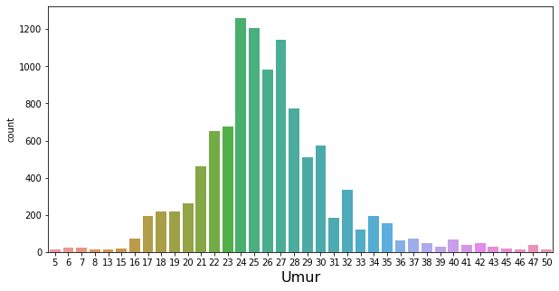
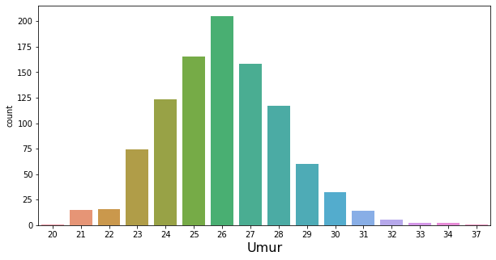

[](https://github.com/Hyuto/bdc-2021)

Beberapa bulan yang lalu penulis dan teman - teman yang tergabung dalam sebuah tim mengikuti lomba
`Big Data Competition` di acara `Satria Data 2021` yang diselenggarakan oleh _PUSPRESNAS_
yang bekerjasama dengan _IPB University_. Ini merupakan kali kedua penulis mengikuti lomba
`BDC - Satria Data`, dengan susunan tim yang sedikit berbeda dan task yang berbeda juga penulis
mendapatkan banyak pengalaman dan ilmu dari lomba tersebut. Meskipun belum diberikan rezeki untuk
menjadi juara _Alhamdulillah_ tim kami berhasil melaju sampai babak final.

Berikut ini adalah kode dan langkah - langkah yang tim kami gunakan pada saat mengikuti lomba
`BDC Satria Data 2021`.

## Author

- [Naufal Zhafran Albaqi](https://www.linkedin.com/in/naufal-zhafran-albaqi-95360b184/)
- [Muhammad Amanda](https://www.linkedin.com/in/muhammadamanda/)
- [Wahyu Setianto](https://www.linkedin.com/in/wahyu-setianto/)

## Running Environment

- Platform : Kaggle
- Accelerator : GPU `NVIDIA TESLA P100`

## Main Dataset

Dataset hasil preprocessing dan augmentasi dapat diakses lewat platform berikut.

[](https://github.com/Hyuto/bdc-2021/tree/master/data)
[](https://www.kaggle.com/wahyusetianto/bdc-2021)

# Gender Classification

[](https://www.kaggle.com/code/wahyusetianto/gender-bdc-2021)

Pada tahap penyisihan kami ditugaskan untuk melakukan pengklasifikasian terhadap _gender_ seseorang
didalam foto (_binary classification_). Data yang disediakan merupakan data gambar dengan ukuran dan
resolusi yang berbeda sehingga merupakan tantangan tersendiri untuk melakukan _data preprocessing_.
Pada data yang disediakan juga terdapat beberapa gambar yang memiliki lebih dari satu orang di
dalamnya sehingga menurut tim kami cukup sulit jika membersihkan data secara otomatis dan perlu
dilakukan _manual filtering_ untuk meningkatkan kualitas data sebelum dilatih kedalam model. Kami
juga melakukan proses _augmentasi_ sehingga data semakin banyak dan lebih banyak yang dapat
dipelajari oleh model. Model yang digunakan oleh tim kami dalam menyelesaikan masalah ini adalah
_tensorflow custom_ model dengan arsitektur 5 `convolution layer` yang dipadukan dengan
`max pooling layer` dan ditutup dengan `dense layer` berkativasi _sigmoid_. Ditahap akhir untuk
meningkatkan kualitas prediksi kami melakukan _ensembel_ terhadap hasil prediksi 5 model yang
dilatih dengan data yang berbeda (menggunakan `StratifiedKfold`).

## First Thing First

Menginstall library yang diperlukan dan mengimport library - library yang akan digunakan serta
menseting variable config yang akan digunakan di dalam notebook ini.

1. Menginstal library `MTCNN` dan `Albumentations`

Library `MTCNN` dan `Albumentations` adalah library yang digunakan untuk preprocessing data gambar
pada notebook ini

```python
!pip -q install mtcnn --upgrade
!pip -q install albumentations --upgrade
```

    WARNING: Running pip as the 'root' user can result in broken permissions and conflicting behaviour with the system package manager. It is recommended to use a virtual environment instead: https://pip.pypa.io/warnings/venv
    WARNING: Running pip as the 'root' user can result in broken permissions and conflicting behaviour with the system package manager. It is recommended to use a virtual environment instead: https://pip.pypa.io/warnings/venv

2. Importing library

Mengimport library yang akan digunakan dalam notebook ini.

```python
# Umum
import os, random, re
from tqdm.notebook import tqdm
import numpy as np
import pandas as pd
from PIL import Image

# Tensorflow
import tensorflow as tf
from tensorflow.keras.preprocessing.image import load_img, img_to_array

# Metrics & Splitting data
from sklearn.metrics import *
from sklearn.model_selection import *

# Plotting
import matplotlib.pyplot as plt
import seaborn as sns

# Preprocessing
import cv2
from mtcnn import MTCNN
import albumentations as A

print("Tensorflow :", tf.__version__)
```

    Tensorflow : 2.6.0

3. Setup `CONFIG`

Mensetup varible - variable yang digunakan sebagai config pada notebook ini

```python
SEED = 2021
SIZE = (200, 200)
BATCH_SIZE = 32
FACE_THRESHOLD = 0.95
FACE_DETECTOR = MTCNN()
```

    2022-03-25 05:01:04.404789: I tensorflow/stream_executor/cuda/cuda_gpu_executor.cc:937] successful NUMA node read from SysFS had negative value (-1), but there must be at least one NUMA node, so returning NUMA node zero
    2022-03-25 05:01:04.507729: I tensorflow/stream_executor/cuda/cuda_gpu_executor.cc:937] successful NUMA node read from SysFS had negative value (-1), but there must be at least one NUMA node, so returning NUMA node zero
    2022-03-25 05:01:04.508532: I tensorflow/stream_executor/cuda/cuda_gpu_executor.cc:937] successful NUMA node read from SysFS had negative value (-1), but there must be at least one NUMA node, so returning NUMA node zero
    2022-03-25 05:01:04.510232: I tensorflow/core/platform/cpu_feature_guard.cc:142] This TensorFlow binary is optimized with oneAPI Deep Neural Network Library (oneDNN) to use the following CPU instructions in performance-critical operations:  AVX2 AVX512F FMA
    To enable them in other operations, rebuild TensorFlow with the appropriate compiler flags.
    2022-03-25 05:01:04.511454: I tensorflow/stream_executor/cuda/cuda_gpu_executor.cc:937] successful NUMA node read from SysFS had negative value (-1), but there must be at least one NUMA node, so returning NUMA node zero
    2022-03-25 05:01:04.512136: I tensorflow/stream_executor/cuda/cuda_gpu_executor.cc:937] successful NUMA node read from SysFS had negative value (-1), but there must be at least one NUMA node, so returning NUMA node zero
    2022-03-25 05:01:04.512828: I tensorflow/stream_executor/cuda/cuda_gpu_executor.cc:937] successful NUMA node read from SysFS had negative value (-1), but there must be at least one NUMA node, so returning NUMA node zero
    2022-03-25 05:01:06.301278: I tensorflow/stream_executor/cuda/cuda_gpu_executor.cc:937] successful NUMA node read from SysFS had negative value (-1), but there must be at least one NUMA node, so returning NUMA node zero
    2022-03-25 05:01:06.302130: I tensorflow/stream_executor/cuda/cuda_gpu_executor.cc:937] successful NUMA node read from SysFS had negative value (-1), but there must be at least one NUMA node, so returning NUMA node zero
    2022-03-25 05:01:06.302815: I tensorflow/stream_executor/cuda/cuda_gpu_executor.cc:937] successful NUMA node read from SysFS had negative value (-1), but there must be at least one NUMA node, so returning NUMA node zero
    2022-03-25 05:01:06.303445: I tensorflow/core/common_runtime/gpu/gpu_device.cc:1510] Created device /job:localhost/replica:0/task:0/device:GPU:0 with 15403 MB memory:  -> device: 0, name: Tesla P100-PCIE-16GB, pci bus id: 0000:00:04.0, compute capability: 6.0

## Dataset

Menggunakan dataset yang telah digunakan oleh tim kami dan melakukan loading agar mendapatkan
informasi path dari data gambar

Dataset : [Data SD20210000722](https://www.kaggle.com/wahyusetianto/bdc-2021)

```python
train = pd.read_csv("../input/bdc-2021/train.csv")
test = pd.read_csv("../input/bdc-2021/submission.csv")
train.head()
```

| nomor | jenis kelamin | usia |
| :---: | :-----------: | :--: |
|   1   |       0       |  27  |
|   2   |       1       |  24  |
|   3   |       0       |  29  |
|   4   |       1       |  23  |
|   5   |       0       |  20  |

memperjelas `path` ke setiap data gambar

```python
images = []
labels = []
test_images = []

TRAIN_DIR = "../input/bdc-2021/Training"
TEST_DIR = "../input/bdc-2021/Testing"

for no, label in train[["nomor", "jenis kelamin"]].values:
    TEMP_DIR = os.path.join(TRAIN_DIR, str(no))
    for file in os.listdir(TEMP_DIR):
        file_dir = os.path.join(TEMP_DIR, file)
        if ".ini" not in file_dir:
            images.append(file_dir)
            labels.append(label)

for no in test.id.values:
    file_dir = os.path.join(TEST_DIR, f"{no}.jpg")
    if os.path.isfile(file_dir):
        test_images.append(file_dir)
    else:
        test_images.append(None)
        print(file_dir)
```

menampilkan dan mengecek beberapa gambar pada data `train`

```python
def read(path):
    """
    Read data gambar
    """
    img = Image.open(path)
    return img

def show_images(list_dir, label = None, load_image = read, seed = SEED):
    """
    Menampilkan Gambar Secara acak sebanyak 5 buah.
    """
    random.seed(seed)
    unique = ["init"]
    if label:
        unique = list(set(label))
    fig, axes = plt.subplots(len(unique), 5, figsize = (20, 5 * len(unique)))
    for i in range(len(unique)):
        if i == 0 and unique[i] == "init":
            data = random.sample(list_dir, 5)
        else:
            data = random.sample([x for x in zip(list_dir, label) if x[1] == unique[i]], 5)
        for j in range(5):
            if unique[0] != "init":
                img = load_image(data[j][0])
                axes[i, j].imshow(img)
                axes[i, j].set_title(f'Label : {data[j][1]}', fontsize = 14)
                axes[i, j].axis('off')
            else:
                img = load_image(data[j])
                axes[j].imshow(img)
                axes[j].axis('off')
    fig.tight_layout()
    plt.show()
```

```python
show_images(images, labels, seed=20)
```


## Preprocess Data

Metode yang digunakan:

1. Mengekstrak wajah - wajah yang terdapat pada gambar menjadi gambar - gambar baru dengan label
   yang sama dengan menggunakan model `MTCNN`
2. Pada data test jika terdapat dua wajah yang terdeteksi pada satu gambar akan di ambil wajah
   dengan tingkat confidence terbesar yang diberikan oleh model `MTCNN`.
3. Jika tidak terdetect wajah pada salah satu gambar maka akan dilakukan crop pada bagian tengah
   gambar sehingga gambar berbentuk persegi atau `jxj` pixel.
4. Selanjutnya gambar akan di resize menjadi ukuran `256x256` pixel

berikut adalah contoh hasil preprocess data gambar.

```python
def get_faces(path):
    image = cv2.cvtColor(cv2.imread(path), cv2.COLOR_BGR2RGB)
    faces = FACE_DETECTOR.detect_faces(image)
    return faces

def load_and_preprocess_image(path: str, size = SIZE):
    """
    Load & Preprocess data gambar
    """
    image = img_to_array(load_img(path))
    faces = [x['box'] for x in get_faces(path) if x['confidence'] > FACE_THRESHOLD]
    if len(faces) > 0:
        x, y, w, h = faces[0]
        image = image[y:y+h, x:x+w]
    img = tf.convert_to_tensor(image, dtype=tf.float32)
    if len(faces) == 0:
        shapes = tf.shape(img)
        h, w = shapes[-3], shapes[-2]
        dim = tf.minimum(h, w)
        img = tf.image.resize_with_crop_or_pad(img, dim, dim)
    img = tf.image.resize(img, size)
    img = tf.cast(img, tf.float32) / 255.0
    return img.numpy()
```

```python
show_images(images, labels, load_image = load_and_preprocess_image, seed=20)
```

    2022-03-25 05:01:13.728692: I tensorflow/compiler/mlir/mlir_graph_optimization_pass.cc:185] None of the MLIR Optimization Passes are enabled (registered 2)
    2022-03-25 05:01:14.721635: I tensorflow/stream_executor/cuda/cuda_dnn.cc:369] Loaded cuDNN version 8005


## Augmentasi Data

Melakukan augmentasi untuk memperbanyak data. Metode augmentasi yang digunakan yaitu:

1. Horizontal flip
2. Donwscale kualitas gambar
3. Random rotate dengan rentang -30 sampai 30 derajad
4. Shift, scale, dan rotate gambar
5. Blur
6. Random brightness

```python
aug = A.Compose([
    A.HorizontalFlip(p=0.4),
    A.Downscale(scale_min=0.6, scale_max=0.9, p=0.3),
    A.Rotate(limit=(-30,30), p=0.6),
    A.ShiftScaleRotate(shift_limit=(-0.07, 0.07), scale_limit=(-0.05, 0.1), rotate_limit=(-15, 15), p=0.4),
    A.OneOf([
        A.MotionBlur(p=.4),
        A.MedianBlur(blur_limit=3, p=0.4),
        A.Blur(blur_limit=3, p=0.4),
    ], p=0.4),
    A.RandomBrightnessContrast(brightness_limit=(-0.25, 0.15), p=0.4),
])
```

```python
def visualize_aug(path):
    fig, axes = plt.subplots(1, 5, figsize = (20, 5))
    image = load_and_preprocess_image(path)
    axes[0].imshow(image)
    axes[0].axis('off')
    for i in range(1, 5):
        augmented = aug(image=image)['image']
        axes[i].imshow(augmented)
        axes[i].axis('off')
    fig.tight_layout()
    plt.show()
```

```python
random.seed(SEED)
for i in range(3):
    visualize_aug(images[i])
```


Running preprocessing pada data gambar secara keseluruhan

```python
def image_preprocessing(new_dir, images, labels=None):
    if os.path.isdir(new_dir):
        !rm -rf {new_dir}
    os.mkdir(new_dir)

    new_images, new_labels = [], []
    if not labels:
        labels = [None for _ in range(len(images))]

    for path, label in tqdm(zip(images, labels), total=len(images)):
        image = img_to_array(load_img(path))
        if label != None:
            faces = [x['box'] for x in sorted(get_faces(path), key=lambda x: x['confidence'],
                                              reverse=True) if x['confidence'] > FACE_THRESHOLD]
        else:
            faces = [x['box'] for x in sorted(get_faces(path), key=lambda x: x['confidence'], reverse=True)]
        if len(faces) > 0:
            if label != None:
                for j, (x, y, w, h) in enumerate(faces):
                    img = image[y:y+h, x:x+w]
                    img = tf.convert_to_tensor(img, dtype=tf.float32)
                    img = tf.image.resize(img, SIZE)
                    img = tf.cast(img, tf.float32) / 255.0

                    img_dir = os.path.join(new_dir, f'{j}_{path.split("/")[-1]}')
                    new_images.append(img_dir)
                    new_labels.append(label)
                    tf.keras.preprocessing.image.save_img(img_dir, img)

                    for k in range(3):
                        augmented = aug(image=img.numpy())['image']
                        img_dir = os.path.join(new_dir, f'aug-{k}_{j}_{path.split("/")[-1]}')
                        new_images.append(img_dir)
                        new_labels.append(label)
                        tf.keras.preprocessing.image.save_img(img_dir, augmented)
            else:
                x, y, w, h = faces[0]
                img = image[y:y+h, x:x+w]
                img = tf.convert_to_tensor(img, dtype=tf.float32)
                img = tf.image.resize(img, SIZE)
                img = tf.cast(img, tf.float32) / 255.0

                img_dir = os.path.join(new_dir, path.split('/')[-1])
                new_images.append(img_dir)
                new_labels.append(label)
                tf.keras.preprocessing.image.save_img(img_dir, img)
        else :
            img = tf.convert_to_tensor(image, dtype=tf.float32)
            shapes = tf.shape(img)
            h, w = shapes[-3], shapes[-2]
            dim = tf.minimum(h, w)
            img = tf.image.resize_with_crop_or_pad(img, dim, dim)
            img = tf.image.resize(img, SIZE)
            img = tf.cast(img, tf.float32) / 255.0

            img_dir = os.path.join(new_dir, path.split('/')[-1])
            new_images.append(img_dir)
            new_labels.append(label)
            tf.keras.preprocessing.image.save_img(img_dir, img)

            if label != None:
                for k in range(3):
                    augmented = aug(image=img.numpy())['image']
                    img_dir = os.path.join(new_dir,  f'aug-{k}_{path.split("/")[-1]}')
                    new_images.append(img_dir)
                    new_labels.append(label)
                    tf.keras.preprocessing.image.save_img(img_dir, augmented)

    return new_images, new_labels
```

Untuk menghemat waktu running akan di skip bagian ini dan di ganti dengan meload data hasil
preprocess yang sudah di save pada run sebelumnya. Namun jika ingin melakukan preprocess pada run
sekarang maka uncomment code di bawah ini.

**Peringatan** : running block code di bawah memakan waktu sekitar 50 menit dengan GPU Nvidia
Tesla P100-PCIE.

```python
# new_train_dir = "./train"
# new_test_dir = "./test"

# random.seed(SEED)
# new_images, new_labels = image_preprocessing(new_train_dir, images, labels)
# new_test_images, _ = image_preprocessing(new_test_dir, test_images)
```

**Note** : Comment dua block kode di bawah jika melakukan preprocess pada run saat ini.

```python
preprocessed = pd.read_csv("../input/bdc-2021/preprocessed-augmented/preprocessed.csv")
preprocessed.head()
```

| image                   | label | age |
| :---------------------- | :---: | :-: |
| ./train/0_1_3.jpg       |   0   | 27  |
| ./train/aug-0_0_1_3.jpg |   0   | 27  |
| ./train/aug-1_0_1_3.jpg |   0   | 27  |
| ./train/aug-2_0_1_3.jpg |   0   | 27  |
| ./train/0_1_1.jpg       |   0   | 27  |

## Filterisasi Data

Menyaring data yang akan dilatih ke dalam model dengan melakukan filterisasi terhadap data gambar
yang memiliki kualitas gambar yang kurang baik dan misslabel.

1. Mendownload list data gambar yang akan dibuang.

```python
!wget https://raw.githubusercontent.com/Hyuto/bdc-2021/master/excluded-gender.txt

with open("./excluded-gender.txt") as f:
    excluded = f.read().split("\n")

patterns = fr'{"|".join(excluded)}'
```

    --2022-03-25 05:01:44--  https://raw.githubusercontent.com/Hyuto/bdc-2021/master/excluded-gender.txt
    Resolving raw.githubusercontent.com (raw.githubusercontent.com)... 185.199.110.133, 185.199.111.133, 185.199.108.133, ...
    Connecting to raw.githubusercontent.com (raw.githubusercontent.com)|185.199.110.133|:443... connected.
    HTTP request sent, awaiting response... 200 OK
    Length: 3111 (3.0K) [text/plain]
    Saving to: ‘excluded-gender.txt’

    excluded-gender.txt 100%[===================>]   3.04K  --.-KB/s    in 0s

    2022-03-25 05:01:44 (23.6 MB/s) - ‘excluded-gender.txt’ saved [3111/3111]

2. Filterisasi data

```python
preprocessed_dir = "../input/bdc-2021/preprocessed-augmented"
new_images, new_labels = [], []

for image, label in preprocessed[["image", "label"]].values:
    if not re.search(patterns, image):
        new_images.append(os.path.join(preprocessed_dir, image))
        new_labels.append(label)

new_test_images = np.asarray([os.path.join(preprocessed_dir, "test", f"{x}.jpg") for x in test.id.values])

new_images = np.asarray(new_images)
new_labels = np.asarray(new_labels)
```

Mengecek distribusi label pada data

```python
plt.figure(figsize=(5, 5))
sns.countplot(x=new_labels)
plt.show()
```


Jumlah data yang berlabel `0` dan `1` cenderung sama.

## Modelling

Membuat model dengan arsitektur sebagai berikut


```python
def build_model(kernel_s=(3,3)):
    model = tf.keras.models.Sequential([
        tf.keras.layers.Conv2D(32,kernel_s,activation='relu',input_shape=(200,200,3),
                            kernel_regularizer=tf.keras.regularizers.l2(0.001),padding="VALID"),
        tf.keras.layers.MaxPooling2D((2,2)),
        tf.keras.layers.Conv2D(64,kernel_s,activation='relu'),
        tf.keras.layers.MaxPooling2D((2,2)),
        tf.keras.layers.Conv2D(64,kernel_s,activation='relu'),
        tf.keras.layers.MaxPooling2D((2,2)),
        tf.keras.layers.Conv2D(128,kernel_s,activation='relu'),
        tf.keras.layers.MaxPooling2D((2,2)),
        tf.keras.layers.Conv2D(128,kernel_s,activation='relu'),
        tf.keras.layers.MaxPooling2D((2,2)),
        tf.keras.layers.Flatten(),
        tf.keras.layers.Dense(256, activation='relu',
                              kernel_regularizer=tf.keras.regularizers.l2(5e-4)),
        tf.keras.layers.Dense(1, activation='sigmoid')
    ])
    model.compile(loss="binary_crossentropy", optimizer="adam", metrics=['accuracy'])
    return model
```

**Tensorflow Data**

Load data gambar menggunakan `Tensorflow Data` agar pada saat pelatihan model penggunaan memmori
dapat lebih optimal

```python
def decode_image(filename, label=None, image_size=SIZE):
    """
    Decode Image from String Path Tensor
    """
    bits = tf.io.read_file(filename)
    image = tf.image.decode_jpeg(bits, channels=3)
    image = tf.cast(image, tf.float32) / 255.0
    image = tf.image.resize(image, SIZE)

    if label is None: # if test
        return image
    else:
        return image, label
```

**Training Model**

Proses ini dilakukan dengan mensplit data menggunakan `StratifiedKFold` sebanyak 5 split lalu untuk
setiap split akan dibangun sebuah model untuk dilatih. Setiap model ini akan digunakan untuk
melakukan peramalan terhadap data test. Pada proses trainingnya setiap model akan diukur tingkat
kebaikannya dengan menggunakan metric `accuracy` lalu dikakukan penyimpanan weight pada model saat
`val_accuracy` berada pada nilai terbesar selama pelatihan model sebanyak `50 epochs`.

```python
split = 5
prediksi = np.zeros((len(new_test_images), 1), dtype=np.float32)
acc_scores, f1_scores = [], []

test_dataset = (
    tf.data.Dataset
    .from_tensor_slices((new_test_images))
    .map(decode_image)
    .batch(BATCH_SIZE)
)

cv = StratifiedKFold(n_splits=split, shuffle=True, random_state=SEED)
for i, (train_index, test_index) in enumerate(cv.split(new_images, new_labels)):
    tf.keras.backend.clear_session()
    x_train, x_valid = new_images[train_index], new_images[test_index]
    y_train, y_valid = new_labels[train_index], new_labels[test_index]

    train_dataset = (
        tf.data.Dataset
        .from_tensor_slices((x_train, y_train))
        .map(decode_image, num_parallel_calls=tf.data.AUTOTUNE)
        .cache()
        .repeat()
        .shuffle(1024)
        .batch(BATCH_SIZE)
        .prefetch(tf.data.AUTOTUNE)
    )

    valid_dataset = (
        tf.data.Dataset
        .from_tensor_slices((x_valid, y_valid))
        .map(decode_image, num_parallel_calls=tf.data.AUTOTUNE)
        .batch(BATCH_SIZE)
        .cache()
        .prefetch(tf.data.AUTOTUNE)
    )

    model = build_model()
    checkpoint = tf.keras.callbacks.ModelCheckpoint(f'{i}_best_model.h5', monitor='val_accuracy',
                                                save_best_only=True, save_weights_only=True,
                                                mode='max')
    print(f"\nCV {i+1}")
    model.fit(train_dataset, epochs=50, validation_data=valid_dataset,
              steps_per_epoch=len(x_train) // BATCH_SIZE,
              callbacks = [checkpoint])
    model.load_weights(f'{i}_best_model.h5')
    val_pred_classes = np.array(model.predict(valid_dataset).flatten() >= .5, dtype = 'int')
    acc, f1 = accuracy_score(y_valid, val_pred_classes), f1_score(y_valid, val_pred_classes)

    acc_scores.append(acc)
    f1_scores.append(f1)
    prediksi += model.predict(test_dataset)

    del train_dataset
    del valid_dataset
```

    CV 1
    Epoch 1/50
    263/263 [==============================] - 32s 107ms/step - loss: 0.5496 - accuracy: 0.7317 - val_loss: 0.3710 - val_accuracy: 0.8544
    Epoch 2/50
    263/263 [==============================] - 7s 27ms/step - loss: 0.3210 - accuracy: 0.8819 - val_loss: 0.3272 - val_accuracy: 0.8753
    Epoch 3/50
    263/263 [==============================] - 7s 26ms/step - loss: 0.2792 - accuracy: 0.8977 - val_loss: 0.2815 - val_accuracy: 0.8957
    Epoch 4/50
    263/263 [==============================] - 7s 26ms/step - loss: 0.2451 - accuracy: 0.9177 - val_loss: 0.2392 - val_accuracy: 0.9189
    Epoch 5/50
    263/263 [==============================] - 7s 26ms/step - loss: 0.2160 - accuracy: 0.9268 - val_loss: 0.2512 - val_accuracy: 0.9151
    Epoch 6/50
    263/263 [==============================] - 7s 28ms/step - loss: 0.1843 - accuracy: 0.9437 - val_loss: 0.2210 - val_accuracy: 0.9265
    Epoch 7/50
    263/263 [==============================] - 7s 26ms/step - loss: 0.1688 - accuracy: 0.9470 - val_loss: 0.2120 - val_accuracy: 0.9336
    Epoch 8/50
    263/263 [==============================] - 7s 26ms/step - loss: 0.1480 - accuracy: 0.9578 - val_loss: 0.2075 - val_accuracy: 0.9346
    Epoch 9/50
    263/263 [==============================] - 7s 26ms/step - loss: 0.1341 - accuracy: 0.9627 - val_loss: 0.2290 - val_accuracy: 0.9294
    Epoch 10/50
    263/263 [==============================] - 7s 26ms/step - loss: 0.1163 - accuracy: 0.9701 - val_loss: 0.1956 - val_accuracy: 0.9417
    Epoch 11/50
    263/263 [==============================] - 7s 27ms/step - loss: 0.1062 - accuracy: 0.9718 - val_loss: 0.2243 - val_accuracy: 0.9369
    Epoch 12/50
    263/263 [==============================] - 7s 26ms/step - loss: 0.0872 - accuracy: 0.9802 - val_loss: 0.2190 - val_accuracy: 0.9403
    Epoch 13/50
    263/263 [==============================] - 7s 26ms/step - loss: 0.0953 - accuracy: 0.9781 - val_loss: 0.2050 - val_accuracy: 0.9507
    Epoch 14/50
    263/263 [==============================] - 7s 26ms/step - loss: 0.0794 - accuracy: 0.9841 - val_loss: 0.2156 - val_accuracy: 0.9455
    Epoch 15/50
    263/263 [==============================] - 7s 26ms/step - loss: 0.0732 - accuracy: 0.9874 - val_loss: 0.2320 - val_accuracy: 0.9426
    Epoch 16/50
    263/263 [==============================] - 7s 27ms/step - loss: 0.0663 - accuracy: 0.9870 - val_loss: 0.2245 - val_accuracy: 0.9502
    Epoch 17/50
    263/263 [==============================] - 7s 26ms/step - loss: 0.0748 - accuracy: 0.9843 - val_loss: 0.2315 - val_accuracy: 0.9469
    Epoch 18/50
    263/263 [==============================] - 7s 26ms/step - loss: 0.0637 - accuracy: 0.9884 - val_loss: 0.2470 - val_accuracy: 0.9497
    Epoch 19/50
    263/263 [==============================] - 7s 26ms/step - loss: 0.0601 - accuracy: 0.9892 - val_loss: 0.2627 - val_accuracy: 0.9436
    Epoch 20/50
    263/263 [==============================] - 7s 26ms/step - loss: 0.0570 - accuracy: 0.9901 - val_loss: 0.3084 - val_accuracy: 0.9360
    Epoch 21/50
    263/263 [==============================] - 7s 27ms/step - loss: 0.0535 - accuracy: 0.9916 - val_loss: 0.2784 - val_accuracy: 0.9393
    Epoch 22/50
    263/263 [==============================] - 7s 26ms/step - loss: 0.0552 - accuracy: 0.9910 - val_loss: 0.2408 - val_accuracy: 0.9488
    Epoch 23/50
    263/263 [==============================] - 7s 26ms/step - loss: 0.0517 - accuracy: 0.9925 - val_loss: 0.2810 - val_accuracy: 0.9350
    Epoch 24/50
    263/263 [==============================] - 7s 26ms/step - loss: 0.0525 - accuracy: 0.9914 - val_loss: 0.2122 - val_accuracy: 0.9459
    Epoch 25/50
    263/263 [==============================] - 7s 27ms/step - loss: 0.0522 - accuracy: 0.9917 - val_loss: 0.2259 - val_accuracy: 0.9493
    Epoch 26/50
    263/263 [==============================] - 7s 26ms/step - loss: 0.0522 - accuracy: 0.9919 - val_loss: 0.2751 - val_accuracy: 0.9379
    Epoch 27/50
    263/263 [==============================] - 7s 26ms/step - loss: 0.0560 - accuracy: 0.9904 - val_loss: 0.2802 - val_accuracy: 0.9422
    Epoch 28/50
    263/263 [==============================] - 7s 26ms/step - loss: 0.0383 - accuracy: 0.9960 - val_loss: 0.2612 - val_accuracy: 0.9464
    Epoch 29/50
    263/263 [==============================] - 7s 27ms/step - loss: 0.0558 - accuracy: 0.9905 - val_loss: 0.2870 - val_accuracy: 0.9440
    Epoch 30/50
    263/263 [==============================] - 7s 27ms/step - loss: 0.0329 - accuracy: 0.9981 - val_loss: 0.2645 - val_accuracy: 0.9559
    Epoch 31/50
    263/263 [==============================] - 7s 26ms/step - loss: 0.0476 - accuracy: 0.9923 - val_loss: 0.2235 - val_accuracy: 0.9464
    Epoch 32/50
    263/263 [==============================] - 7s 26ms/step - loss: 0.0371 - accuracy: 0.9961 - val_loss: 0.2934 - val_accuracy: 0.9521
    Epoch 33/50
    263/263 [==============================] - 7s 27ms/step - loss: 0.0494 - accuracy: 0.9923 - val_loss: 0.2960 - val_accuracy: 0.9393
    Epoch 34/50
    263/263 [==============================] - 7s 25ms/step - loss: 0.0551 - accuracy: 0.9905 - val_loss: 0.2176 - val_accuracy: 0.9535
    Epoch 35/50
    263/263 [==============================] - 7s 27ms/step - loss: 0.0355 - accuracy: 0.9958 - val_loss: 0.2783 - val_accuracy: 0.9502
    Epoch 36/50
    263/263 [==============================] - 7s 26ms/step - loss: 0.0387 - accuracy: 0.9949 - val_loss: 0.2497 - val_accuracy: 0.9493
    Epoch 37/50
    263/263 [==============================] - 7s 26ms/step - loss: 0.0338 - accuracy: 0.9957 - val_loss: 0.2888 - val_accuracy: 0.9521
    Epoch 38/50
    263/263 [==============================] - 7s 27ms/step - loss: 0.0592 - accuracy: 0.9891 - val_loss: 0.2465 - val_accuracy: 0.9422
    Epoch 39/50
    263/263 [==============================] - 7s 26ms/step - loss: 0.0314 - accuracy: 0.9980 - val_loss: 0.2826 - val_accuracy: 0.9478
    Epoch 40/50
    263/263 [==============================] - 7s 26ms/step - loss: 0.0322 - accuracy: 0.9966 - val_loss: 0.3041 - val_accuracy: 0.9474
    Epoch 41/50
    263/263 [==============================] - 7s 26ms/step - loss: 0.0365 - accuracy: 0.9954 - val_loss: 0.4735 - val_accuracy: 0.9241
    Epoch 42/50
    263/263 [==============================] - 7s 26ms/step - loss: 0.0423 - accuracy: 0.9935 - val_loss: 0.2528 - val_accuracy: 0.9578
    Epoch 43/50
    263/263 [==============================] - 7s 27ms/step - loss: 0.0274 - accuracy: 0.9982 - val_loss: 0.3552 - val_accuracy: 0.9459
    Epoch 44/50
    263/263 [==============================] - 7s 27ms/step - loss: 0.0300 - accuracy: 0.9973 - val_loss: 0.2836 - val_accuracy: 0.9398
    Epoch 45/50
    263/263 [==============================] - 7s 25ms/step - loss: 0.0340 - accuracy: 0.9952 - val_loss: 0.2927 - val_accuracy: 0.9497
    Epoch 46/50
    263/263 [==============================] - 7s 26ms/step - loss: 0.0442 - accuracy: 0.9917 - val_loss: 0.3046 - val_accuracy: 0.9388
    Epoch 47/50
    263/263 [==============================] - 7s 26ms/step - loss: 0.0264 - accuracy: 0.9986 - val_loss: 0.2410 - val_accuracy: 0.9540
    Epoch 48/50
    263/263 [==============================] - 7s 26ms/step - loss: 0.0287 - accuracy: 0.9973 - val_loss: 0.3600 - val_accuracy: 0.9374
    Epoch 49/50
    263/263 [==============================] - 7s 27ms/step - loss: 0.0464 - accuracy: 0.9907 - val_loss: 0.2628 - val_accuracy: 0.9469
    Epoch 50/50
    263/263 [==============================] - 7s 26ms/step - loss: 0.0275 - accuracy: 0.9976 - val_loss: 0.2887 - val_accuracy: 0.9578

    CV 2
    Epoch 1/50
    263/263 [==============================] - 17s 57ms/step - loss: 0.6296 - accuracy: 0.6513 - val_loss: 0.5415 - val_accuracy: 0.7240
    Epoch 2/50
    263/263 [==============================] - 7s 26ms/step - loss: 0.3590 - accuracy: 0.8524 - val_loss: 0.3806 - val_accuracy: 0.8350
    Epoch 3/50
    263/263 [==============================] - 7s 26ms/step - loss: 0.3032 - accuracy: 0.8843 - val_loss: 0.3152 - val_accuracy: 0.8630
    Epoch 4/50
    263/263 [==============================] - 7s 26ms/step - loss: 0.2561 - accuracy: 0.9057 - val_loss: 0.2714 - val_accuracy: 0.8928
    Epoch 5/50
    263/263 [==============================] - 7s 27ms/step - loss: 0.2361 - accuracy: 0.9123 - val_loss: 0.2537 - val_accuracy: 0.9090
    Epoch 6/50
    263/263 [==============================] - 7s 26ms/step - loss: 0.2088 - accuracy: 0.9269 - val_loss: 0.2638 - val_accuracy: 0.8985
    Epoch 7/50
    263/263 [==============================] - 7s 26ms/step - loss: 0.2099 - accuracy: 0.9269 - val_loss: 0.2278 - val_accuracy: 0.9156
    Epoch 8/50
    263/263 [==============================] - 7s 26ms/step - loss: 0.1721 - accuracy: 0.9433 - val_loss: 0.2418 - val_accuracy: 0.9042
    Epoch 9/50
    263/263 [==============================] - 7s 25ms/step - loss: 0.1546 - accuracy: 0.9474 - val_loss: 0.2095 - val_accuracy: 0.9298
    Epoch 10/50
    263/263 [==============================] - 7s 27ms/step - loss: 0.1497 - accuracy: 0.9527 - val_loss: 0.2097 - val_accuracy: 0.9213
    Epoch 11/50
    263/263 [==============================] - 7s 26ms/step - loss: 0.1343 - accuracy: 0.9588 - val_loss: 0.2332 - val_accuracy: 0.9075
    Epoch 12/50
    263/263 [==============================] - 7s 26ms/step - loss: 0.1173 - accuracy: 0.9630 - val_loss: 0.1970 - val_accuracy: 0.9350
    Epoch 13/50
    263/263 [==============================] - 7s 26ms/step - loss: 0.1042 - accuracy: 0.9686 - val_loss: 0.1894 - val_accuracy: 0.9407
    Epoch 14/50
    263/263 [==============================] - 7s 26ms/step - loss: 0.1053 - accuracy: 0.9697 - val_loss: 0.2082 - val_accuracy: 0.9350
    Epoch 15/50
    263/263 [==============================] - 7s 27ms/step - loss: 0.0924 - accuracy: 0.9745 - val_loss: 0.2383 - val_accuracy: 0.9241
    Epoch 16/50
    263/263 [==============================] - 7s 27ms/step - loss: 0.0796 - accuracy: 0.9806 - val_loss: 0.2311 - val_accuracy: 0.9398
    Epoch 17/50
    263/263 [==============================] - 7s 26ms/step - loss: 0.0795 - accuracy: 0.9787 - val_loss: 0.1954 - val_accuracy: 0.9478
    Epoch 18/50
    263/263 [==============================] - 7s 26ms/step - loss: 0.0676 - accuracy: 0.9837 - val_loss: 0.2104 - val_accuracy: 0.9488
    Epoch 19/50
    263/263 [==============================] - 7s 26ms/step - loss: 0.0645 - accuracy: 0.9849 - val_loss: 0.2294 - val_accuracy: 0.9464
    Epoch 20/50
    263/263 [==============================] - 7s 28ms/step - loss: 0.0607 - accuracy: 0.9861 - val_loss: 0.2366 - val_accuracy: 0.9398
    Epoch 21/50
    263/263 [==============================] - 7s 26ms/step - loss: 0.0668 - accuracy: 0.9822 - val_loss: 0.2420 - val_accuracy: 0.9360
    Epoch 22/50
    263/263 [==============================] - 7s 26ms/step - loss: 0.0617 - accuracy: 0.9869 - val_loss: 0.2115 - val_accuracy: 0.9478
    Epoch 23/50
    263/263 [==============================] - 7s 26ms/step - loss: 0.0499 - accuracy: 0.9898 - val_loss: 0.3090 - val_accuracy: 0.9284
    Epoch 24/50
    263/263 [==============================] - 7s 26ms/step - loss: 0.0541 - accuracy: 0.9895 - val_loss: 0.2563 - val_accuracy: 0.9403
    Epoch 25/50
    263/263 [==============================] - 7s 28ms/step - loss: 0.0453 - accuracy: 0.9913 - val_loss: 0.2587 - val_accuracy: 0.9483
    Epoch 26/50
    263/263 [==============================] - 7s 26ms/step - loss: 0.0576 - accuracy: 0.9881 - val_loss: 0.2429 - val_accuracy: 0.9488
    Epoch 27/50
    263/263 [==============================] - 7s 26ms/step - loss: 0.0355 - accuracy: 0.9955 - val_loss: 0.2969 - val_accuracy: 0.9384
    Epoch 28/50
    263/263 [==============================] - 7s 26ms/step - loss: 0.0564 - accuracy: 0.9875 - val_loss: 0.2725 - val_accuracy: 0.9388
    Epoch 29/50
    263/263 [==============================] - 7s 26ms/step - loss: 0.0396 - accuracy: 0.9949 - val_loss: 0.2618 - val_accuracy: 0.9526
    Epoch 30/50
    263/263 [==============================] - 7s 27ms/step - loss: 0.0440 - accuracy: 0.9928 - val_loss: 0.3184 - val_accuracy: 0.9398
    Epoch 31/50
    263/263 [==============================] - 7s 26ms/step - loss: 0.0753 - accuracy: 0.9816 - val_loss: 0.2277 - val_accuracy: 0.9388
    Epoch 32/50
    263/263 [==============================] - 7s 26ms/step - loss: 0.0435 - accuracy: 0.9922 - val_loss: 0.2447 - val_accuracy: 0.9502
    Epoch 33/50
    263/263 [==============================] - 7s 26ms/step - loss: 0.0357 - accuracy: 0.9955 - val_loss: 0.2904 - val_accuracy: 0.9455
    Epoch 34/50
    263/263 [==============================] - 7s 26ms/step - loss: 0.0654 - accuracy: 0.9850 - val_loss: 0.2455 - val_accuracy: 0.9436
    Epoch 35/50
    263/263 [==============================] - 7s 27ms/step - loss: 0.0321 - accuracy: 0.9966 - val_loss: 0.2937 - val_accuracy: 0.9516
    Epoch 36/50
    263/263 [==============================] - 7s 26ms/step - loss: 0.0222 - accuracy: 0.9999 - val_loss: 0.2844 - val_accuracy: 0.9559
    Epoch 37/50
    263/263 [==============================] - 7s 26ms/step - loss: 0.0193 - accuracy: 1.0000 - val_loss: 0.2873 - val_accuracy: 0.9602
    Epoch 38/50
    263/263 [==============================] - 7s 26ms/step - loss: 0.0174 - accuracy: 1.0000 - val_loss: 0.2869 - val_accuracy: 0.9602
    Epoch 39/50
    263/263 [==============================] - 7s 27ms/step - loss: 0.0157 - accuracy: 1.0000 - val_loss: 0.2909 - val_accuracy: 0.9602
    Epoch 40/50
    263/263 [==============================] - 7s 27ms/step - loss: 0.0141 - accuracy: 1.0000 - val_loss: 0.2880 - val_accuracy: 0.9592
    Epoch 41/50
    263/263 [==============================] - 7s 25ms/step - loss: 0.0127 - accuracy: 1.0000 - val_loss: 0.2887 - val_accuracy: 0.9616
    Epoch 42/50
    263/263 [==============================] - 7s 26ms/step - loss: 0.0113 - accuracy: 1.0000 - val_loss: 0.2911 - val_accuracy: 0.9625
    Epoch 43/50
    263/263 [==============================] - 7s 26ms/step - loss: 0.0100 - accuracy: 1.0000 - val_loss: 0.2906 - val_accuracy: 0.9611
    Epoch 44/50
    263/263 [==============================] - 7s 26ms/step - loss: 0.0088 - accuracy: 1.0000 - val_loss: 0.2956 - val_accuracy: 0.9545
    Epoch 45/50
    263/263 [==============================] - 7s 28ms/step - loss: 0.0251 - accuracy: 0.9945 - val_loss: 0.3765 - val_accuracy: 0.8853
    Epoch 46/50
    263/263 [==============================] - 7s 26ms/step - loss: 0.1159 - accuracy: 0.9606 - val_loss: 0.2241 - val_accuracy: 0.9360
    Epoch 47/50
    263/263 [==============================] - 7s 26ms/step - loss: 0.0551 - accuracy: 0.9849 - val_loss: 0.2401 - val_accuracy: 0.9426
    Epoch 48/50
    263/263 [==============================] - 7s 27ms/step - loss: 0.0517 - accuracy: 0.9873 - val_loss: 0.2366 - val_accuracy: 0.9388
    Epoch 49/50
    263/263 [==============================] - 7s 26ms/step - loss: 0.0354 - accuracy: 0.9933 - val_loss: 0.2496 - val_accuracy: 0.9393
    Epoch 50/50
    263/263 [==============================] - 7s 28ms/step - loss: 0.0344 - accuracy: 0.9917 - val_loss: 0.2557 - val_accuracy: 0.9379

    CV 3
    Epoch 1/50
    263/263 [==============================] - 18s 60ms/step - loss: 0.7068 - accuracy: 0.5899 - val_loss: 0.6871 - val_accuracy: 0.5965
    Epoch 2/50
    263/263 [==============================] - 7s 25ms/step - loss: 0.5515 - accuracy: 0.6947 - val_loss: 0.3532 - val_accuracy: 0.8525
    Epoch 3/50
    263/263 [==============================] - 7s 27ms/step - loss: 0.3284 - accuracy: 0.8645 - val_loss: 0.3120 - val_accuracy: 0.8853
    Epoch 4/50
    263/263 [==============================] - 7s 26ms/step - loss: 0.2807 - accuracy: 0.8931 - val_loss: 0.3025 - val_accuracy: 0.8862
    Epoch 5/50
    263/263 [==============================] - 7s 26ms/step - loss: 0.2362 - accuracy: 0.9144 - val_loss: 0.2469 - val_accuracy: 0.9099
    Epoch 6/50
    263/263 [==============================] - 7s 27ms/step - loss: 0.2126 - accuracy: 0.9247 - val_loss: 0.2345 - val_accuracy: 0.9194
    Epoch 7/50
    263/263 [==============================] - 7s 26ms/step - loss: 0.1923 - accuracy: 0.9344 - val_loss: 0.2541 - val_accuracy: 0.9203
    Epoch 8/50
    263/263 [==============================] - 7s 26ms/step - loss: 0.1788 - accuracy: 0.9387 - val_loss: 0.2092 - val_accuracy: 0.9355
    Epoch 9/50
    263/263 [==============================] - 7s 27ms/step - loss: 0.1509 - accuracy: 0.9491 - val_loss: 0.2047 - val_accuracy: 0.9398
    Epoch 10/50
    263/263 [==============================] - 7s 26ms/step - loss: 0.1353 - accuracy: 0.9569 - val_loss: 0.2152 - val_accuracy: 0.9369
    Epoch 11/50
    263/263 [==============================] - 7s 27ms/step - loss: 0.1220 - accuracy: 0.9664 - val_loss: 0.2115 - val_accuracy: 0.9417
    Epoch 12/50
    263/263 [==============================] - 7s 26ms/step - loss: 0.1036 - accuracy: 0.9709 - val_loss: 0.2067 - val_accuracy: 0.9440
    Epoch 13/50
    263/263 [==============================] - 7s 26ms/step - loss: 0.1018 - accuracy: 0.9712 - val_loss: 0.2111 - val_accuracy: 0.9369
    Epoch 14/50
    263/263 [==============================] - 7s 27ms/step - loss: 0.0852 - accuracy: 0.9766 - val_loss: 0.2244 - val_accuracy: 0.9412
    Epoch 15/50
    263/263 [==============================] - 7s 26ms/step - loss: 0.0773 - accuracy: 0.9812 - val_loss: 0.2498 - val_accuracy: 0.9260
    Epoch 16/50
    263/263 [==============================] - 7s 25ms/step - loss: 0.0757 - accuracy: 0.9805 - val_loss: 0.2084 - val_accuracy: 0.9440
    Epoch 17/50
    263/263 [==============================] - 7s 26ms/step - loss: 0.0645 - accuracy: 0.9844 - val_loss: 0.2288 - val_accuracy: 0.9426
    Epoch 18/50
    263/263 [==============================] - 7s 25ms/step - loss: 0.0628 - accuracy: 0.9840 - val_loss: 0.2407 - val_accuracy: 0.9422
    Epoch 19/50
    263/263 [==============================] - 7s 28ms/step - loss: 0.0561 - accuracy: 0.9873 - val_loss: 0.2402 - val_accuracy: 0.9488
    Epoch 20/50
    263/263 [==============================] - 7s 27ms/step - loss: 0.0521 - accuracy: 0.9894 - val_loss: 0.3115 - val_accuracy: 0.9379
    Epoch 21/50
    263/263 [==============================] - 7s 25ms/step - loss: 0.0628 - accuracy: 0.9847 - val_loss: 0.2724 - val_accuracy: 0.9426
    Epoch 22/50
    263/263 [==============================] - 7s 26ms/step - loss: 0.0561 - accuracy: 0.9861 - val_loss: 0.2290 - val_accuracy: 0.9512
    Epoch 23/50
    263/263 [==============================] - 7s 26ms/step - loss: 0.0502 - accuracy: 0.9904 - val_loss: 0.2277 - val_accuracy: 0.9474
    Epoch 24/50
    263/263 [==============================] - 7s 27ms/step - loss: 0.0501 - accuracy: 0.9898 - val_loss: 0.2613 - val_accuracy: 0.9464
    Epoch 25/50
    263/263 [==============================] - 7s 27ms/step - loss: 0.0316 - accuracy: 0.9963 - val_loss: 0.2643 - val_accuracy: 0.9488
    Epoch 26/50
    263/263 [==============================] - 7s 25ms/step - loss: 0.0223 - accuracy: 0.9998 - val_loss: 0.3362 - val_accuracy: 0.9502
    Epoch 27/50
    263/263 [==============================] - 7s 26ms/step - loss: 0.0540 - accuracy: 0.9872 - val_loss: 0.3159 - val_accuracy: 0.9161
    Epoch 28/50
    263/263 [==============================] - 7s 26ms/step - loss: 0.0542 - accuracy: 0.9882 - val_loss: 0.2793 - val_accuracy: 0.9431
    Epoch 29/50
    263/263 [==============================] - 7s 26ms/step - loss: 0.0355 - accuracy: 0.9947 - val_loss: 0.2806 - val_accuracy: 0.9417
    Epoch 30/50
    263/263 [==============================] - 7s 28ms/step - loss: 0.0498 - accuracy: 0.9887 - val_loss: 0.2897 - val_accuracy: 0.9464
    Epoch 31/50
    263/263 [==============================] - 7s 26ms/step - loss: 0.0443 - accuracy: 0.9918 - val_loss: 0.2955 - val_accuracy: 0.9341
    Epoch 32/50
    263/263 [==============================] - 7s 25ms/step - loss: 0.0433 - accuracy: 0.9923 - val_loss: 0.3032 - val_accuracy: 0.9497
    Epoch 33/50
    263/263 [==============================] - 7s 26ms/step - loss: 0.0397 - accuracy: 0.9932 - val_loss: 0.3064 - val_accuracy: 0.9483
    Epoch 34/50
    263/263 [==============================] - 7s 25ms/step - loss: 0.0307 - accuracy: 0.9963 - val_loss: 0.3349 - val_accuracy: 0.9436
    Epoch 35/50
    263/263 [==============================] - 7s 27ms/step - loss: 0.0324 - accuracy: 0.9964 - val_loss: 0.4585 - val_accuracy: 0.9256
    Epoch 36/50
    263/263 [==============================] - 7s 26ms/step - loss: 0.0497 - accuracy: 0.9900 - val_loss: 0.3056 - val_accuracy: 0.9317
    Epoch 37/50
    263/263 [==============================] - 7s 26ms/step - loss: 0.0489 - accuracy: 0.9888 - val_loss: 0.2959 - val_accuracy: 0.9469
    Epoch 38/50
    263/263 [==============================] - 7s 26ms/step - loss: 0.0313 - accuracy: 0.9962 - val_loss: 0.3199 - val_accuracy: 0.9469
    Epoch 39/50
    263/263 [==============================] - 7s 27ms/step - loss: 0.0278 - accuracy: 0.9973 - val_loss: 0.3277 - val_accuracy: 0.9445
    Epoch 40/50
    263/263 [==============================] - 7s 28ms/step - loss: 0.0473 - accuracy: 0.9904 - val_loss: 0.2563 - val_accuracy: 0.9412
    Epoch 41/50
    263/263 [==============================] - 7s 26ms/step - loss: 0.0343 - accuracy: 0.9944 - val_loss: 0.2936 - val_accuracy: 0.9474
    Epoch 42/50
    263/263 [==============================] - 7s 25ms/step - loss: 0.0344 - accuracy: 0.9941 - val_loss: 0.3198 - val_accuracy: 0.9450
    Epoch 43/50
    263/263 [==============================] - 7s 26ms/step - loss: 0.0365 - accuracy: 0.9945 - val_loss: 0.2744 - val_accuracy: 0.9426
    Epoch 44/50
    263/263 [==============================] - 7s 26ms/step - loss: 0.0310 - accuracy: 0.9962 - val_loss: 0.4059 - val_accuracy: 0.9360
    Epoch 45/50
    263/263 [==============================] - 7s 25ms/step - loss: 0.0439 - accuracy: 0.9913 - val_loss: 0.3263 - val_accuracy: 0.9450
    Epoch 46/50
    263/263 [==============================] - 7s 26ms/step - loss: 0.0281 - accuracy: 0.9970 - val_loss: 0.3318 - val_accuracy: 0.9483
    Epoch 47/50
    263/263 [==============================] - 7s 26ms/step - loss: 0.0315 - accuracy: 0.9956 - val_loss: 0.4163 - val_accuracy: 0.9317
    Epoch 48/50
    263/263 [==============================] - 7s 25ms/step - loss: 0.0377 - accuracy: 0.9932 - val_loss: 0.3119 - val_accuracy: 0.9417
    Epoch 49/50
    263/263 [==============================] - 7s 28ms/step - loss: 0.0329 - accuracy: 0.9952 - val_loss: 0.3192 - val_accuracy: 0.9455
    Epoch 50/50
    263/263 [==============================] - 7s 27ms/step - loss: 0.0200 - accuracy: 0.9993 - val_loss: 0.3720 - val_accuracy: 0.9497

    CV 4
    Epoch 1/50
    263/263 [==============================] - 16s 54ms/step - loss: 0.5668 - accuracy: 0.7114 - val_loss: 0.3847 - val_accuracy: 0.8412
    Epoch 2/50
    263/263 [==============================] - 7s 27ms/step - loss: 0.3313 - accuracy: 0.8683 - val_loss: 0.3414 - val_accuracy: 0.8644
    Epoch 3/50
    263/263 [==============================] - 7s 25ms/step - loss: 0.2821 - accuracy: 0.8963 - val_loss: 0.2769 - val_accuracy: 0.8933
    Epoch 4/50
    263/263 [==============================] - 7s 26ms/step - loss: 0.2404 - accuracy: 0.9144 - val_loss: 0.2703 - val_accuracy: 0.9000
    Epoch 5/50
    263/263 [==============================] - 7s 26ms/step - loss: 0.2224 - accuracy: 0.9198 - val_loss: 0.3158 - val_accuracy: 0.8985
    Epoch 6/50
    263/263 [==============================] - 7s 26ms/step - loss: 0.2027 - accuracy: 0.9324 - val_loss: 0.2464 - val_accuracy: 0.9161
    Epoch 7/50
    263/263 [==============================] - 7s 27ms/step - loss: 0.1660 - accuracy: 0.9482 - val_loss: 0.2103 - val_accuracy: 0.9279
    Epoch 8/50
    263/263 [==============================] - 7s 28ms/step - loss: 0.1506 - accuracy: 0.9544 - val_loss: 0.2314 - val_accuracy: 0.9227
    Epoch 9/50
    263/263 [==============================] - 7s 26ms/step - loss: 0.1538 - accuracy: 0.9526 - val_loss: 0.1944 - val_accuracy: 0.9426
    Epoch 10/50
    263/263 [==============================] - 7s 26ms/step - loss: 0.1245 - accuracy: 0.9639 - val_loss: 0.2137 - val_accuracy: 0.9327
    Epoch 11/50
    263/263 [==============================] - 7s 25ms/step - loss: 0.1091 - accuracy: 0.9697 - val_loss: 0.2203 - val_accuracy: 0.9327
    Epoch 12/50
    263/263 [==============================] - 7s 26ms/step - loss: 0.1108 - accuracy: 0.9727 - val_loss: 0.2389 - val_accuracy: 0.9322
    Epoch 13/50
    263/263 [==============================] - 7s 25ms/step - loss: 0.0898 - accuracy: 0.9766 - val_loss: 0.2162 - val_accuracy: 0.9440
    Epoch 14/50
    263/263 [==============================] - 6s 25ms/step - loss: 0.0893 - accuracy: 0.9790 - val_loss: 0.2326 - val_accuracy: 0.9393
    Epoch 15/50
    263/263 [==============================] - 7s 25ms/step - loss: 0.0767 - accuracy: 0.9824 - val_loss: 0.2705 - val_accuracy: 0.9279
    Epoch 16/50
    263/263 [==============================] - 7s 25ms/step - loss: 0.0746 - accuracy: 0.9843 - val_loss: 0.2469 - val_accuracy: 0.9327
    Epoch 17/50
    263/263 [==============================] - 7s 26ms/step - loss: 0.0844 - accuracy: 0.9803 - val_loss: 0.2399 - val_accuracy: 0.9440
    Epoch 18/50
    263/263 [==============================] - 7s 27ms/step - loss: 0.0657 - accuracy: 0.9865 - val_loss: 0.2712 - val_accuracy: 0.9303
    Epoch 19/50
    263/263 [==============================] - 7s 25ms/step - loss: 0.0463 - accuracy: 0.9938 - val_loss: 0.2771 - val_accuracy: 0.9403
    Epoch 20/50
    263/263 [==============================] - 7s 25ms/step - loss: 0.0694 - accuracy: 0.9842 - val_loss: 0.2531 - val_accuracy: 0.9440
    Epoch 21/50
    263/263 [==============================] - 7s 25ms/step - loss: 0.0579 - accuracy: 0.9887 - val_loss: 0.2975 - val_accuracy: 0.9331
    Epoch 22/50
    263/263 [==============================] - 7s 26ms/step - loss: 0.0626 - accuracy: 0.9873 - val_loss: 0.2944 - val_accuracy: 0.9312
    Epoch 23/50
    263/263 [==============================] - 7s 25ms/step - loss: 0.0560 - accuracy: 0.9899 - val_loss: 0.3258 - val_accuracy: 0.9270
    Epoch 24/50
    263/263 [==============================] - 7s 25ms/step - loss: 0.0398 - accuracy: 0.9961 - val_loss: 0.3283 - val_accuracy: 0.9426
    Epoch 25/50
    263/263 [==============================] - 7s 25ms/step - loss: 0.0512 - accuracy: 0.9912 - val_loss: 0.2765 - val_accuracy: 0.9384
    Epoch 26/50
    263/263 [==============================] - 6s 25ms/step - loss: 0.0443 - accuracy: 0.9936 - val_loss: 0.3364 - val_accuracy: 0.9469
    Epoch 27/50
    263/263 [==============================] - 7s 26ms/step - loss: 0.0699 - accuracy: 0.9843 - val_loss: 0.3219 - val_accuracy: 0.9336
    Epoch 28/50
    263/263 [==============================] - 7s 26ms/step - loss: 0.0470 - accuracy: 0.9923 - val_loss: 0.2976 - val_accuracy: 0.9436
    Epoch 29/50
    263/263 [==============================] - 7s 27ms/step - loss: 0.0506 - accuracy: 0.9907 - val_loss: 0.3426 - val_accuracy: 0.9294
    Epoch 30/50
    263/263 [==============================] - 7s 26ms/step - loss: 0.0512 - accuracy: 0.9904 - val_loss: 0.3651 - val_accuracy: 0.9322
    Epoch 31/50
    263/263 [==============================] - 7s 25ms/step - loss: 0.0451 - accuracy: 0.9928 - val_loss: 0.3058 - val_accuracy: 0.9360
    Epoch 32/50
    263/263 [==============================] - 7s 25ms/step - loss: 0.0482 - accuracy: 0.9928 - val_loss: 0.2869 - val_accuracy: 0.9412
    Epoch 33/50
    263/263 [==============================] - 7s 25ms/step - loss: 0.0499 - accuracy: 0.9916 - val_loss: 0.3573 - val_accuracy: 0.9298
    Epoch 34/50
    263/263 [==============================] - 7s 25ms/step - loss: 0.0346 - accuracy: 0.9967 - val_loss: 0.3462 - val_accuracy: 0.9417
    Epoch 35/50
    263/263 [==============================] - 7s 25ms/step - loss: 0.0316 - accuracy: 0.9971 - val_loss: 0.3925 - val_accuracy: 0.9317
    Epoch 36/50
    263/263 [==============================] - 7s 25ms/step - loss: 0.0537 - accuracy: 0.9895 - val_loss: 0.2978 - val_accuracy: 0.9440
    Epoch 37/50
    263/263 [==============================] - 7s 26ms/step - loss: 0.0398 - accuracy: 0.9943 - val_loss: 0.3594 - val_accuracy: 0.9275
    Epoch 38/50
    263/263 [==============================] - 7s 26ms/step - loss: 0.0467 - accuracy: 0.9920 - val_loss: 0.3128 - val_accuracy: 0.9445
    Epoch 39/50
    263/263 [==============================] - 7s 27ms/step - loss: 0.0313 - accuracy: 0.9974 - val_loss: 0.4037 - val_accuracy: 0.9398
    Epoch 40/50
    263/263 [==============================] - 7s 26ms/step - loss: 0.0485 - accuracy: 0.9909 - val_loss: 0.3852 - val_accuracy: 0.9369
    Epoch 41/50
    263/263 [==============================] - 7s 26ms/step - loss: 0.0391 - accuracy: 0.9950 - val_loss: 0.3830 - val_accuracy: 0.9331
    Epoch 42/50
    263/263 [==============================] - 7s 25ms/step - loss: 0.0416 - accuracy: 0.9930 - val_loss: 0.3671 - val_accuracy: 0.9374
    Epoch 43/50
    263/263 [==============================] - 7s 25ms/step - loss: 0.0364 - accuracy: 0.9950 - val_loss: 0.3237 - val_accuracy: 0.9474
    Epoch 44/50
    263/263 [==============================] - 7s 25ms/step - loss: 0.0264 - accuracy: 0.9985 - val_loss: 0.3693 - val_accuracy: 0.9417
    Epoch 45/50
    263/263 [==============================] - 7s 25ms/step - loss: 0.0433 - accuracy: 0.9932 - val_loss: 0.3646 - val_accuracy: 0.9279
    Epoch 46/50
    263/263 [==============================] - 7s 26ms/step - loss: 0.0444 - accuracy: 0.9928 - val_loss: 0.3437 - val_accuracy: 0.9431
    Epoch 47/50
    263/263 [==============================] - 7s 25ms/step - loss: 0.0250 - accuracy: 0.9986 - val_loss: 0.3882 - val_accuracy: 0.9388
    Epoch 48/50
    263/263 [==============================] - 7s 25ms/step - loss: 0.0246 - accuracy: 0.9980 - val_loss: 0.3886 - val_accuracy: 0.9426
    Epoch 49/50
    263/263 [==============================] - 7s 26ms/step - loss: 0.0425 - accuracy: 0.9918 - val_loss: 0.3517 - val_accuracy: 0.9507
    Epoch 50/50
    263/263 [==============================] - 7s 26ms/step - loss: 0.0303 - accuracy: 0.9969 - val_loss: 0.3057 - val_accuracy: 0.9478

    CV 5
    Epoch 1/50
    263/263 [==============================] - 17s 55ms/step - loss: 0.5526 - accuracy: 0.7123 - val_loss: 0.4276 - val_accuracy: 0.8112
    Epoch 2/50
    263/263 [==============================] - 7s 25ms/step - loss: 0.3423 - accuracy: 0.8639 - val_loss: 0.3358 - val_accuracy: 0.8657
    Epoch 3/50
    263/263 [==============================] - 7s 25ms/step - loss: 0.2658 - accuracy: 0.8976 - val_loss: 0.2966 - val_accuracy: 0.8824
    Epoch 4/50
    263/263 [==============================] - 7s 26ms/step - loss: 0.2423 - accuracy: 0.9117 - val_loss: 0.2690 - val_accuracy: 0.9009
    Epoch 5/50
    263/263 [==============================] - 7s 25ms/step - loss: 0.2077 - accuracy: 0.9260 - val_loss: 0.2571 - val_accuracy: 0.9023
    Epoch 6/50
    263/263 [==============================] - 7s 25ms/step - loss: 0.1903 - accuracy: 0.9318 - val_loss: 0.2284 - val_accuracy: 0.9222
    Epoch 7/50
    263/263 [==============================] - 7s 25ms/step - loss: 0.1657 - accuracy: 0.9445 - val_loss: 0.2258 - val_accuracy: 0.9213
    Epoch 8/50
    263/263 [==============================] - 7s 26ms/step - loss: 0.1652 - accuracy: 0.9432 - val_loss: 0.2013 - val_accuracy: 0.9355
    Epoch 9/50
    263/263 [==============================] - 7s 28ms/step - loss: 0.1431 - accuracy: 0.9538 - val_loss: 0.2040 - val_accuracy: 0.9331
    Epoch 10/50
    263/263 [==============================] - 7s 25ms/step - loss: 0.1299 - accuracy: 0.9596 - val_loss: 0.2155 - val_accuracy: 0.9341
    Epoch 11/50
    263/263 [==============================] - 7s 25ms/step - loss: 0.1153 - accuracy: 0.9677 - val_loss: 0.2186 - val_accuracy: 0.9317
    Epoch 12/50
    263/263 [==============================] - 7s 25ms/step - loss: 0.1065 - accuracy: 0.9691 - val_loss: 0.2047 - val_accuracy: 0.9360
    Epoch 13/50
    263/263 [==============================] - 7s 25ms/step - loss: 0.0938 - accuracy: 0.9743 - val_loss: 0.2146 - val_accuracy: 0.9369
    Epoch 14/50
    263/263 [==============================] - 7s 26ms/step - loss: 0.0882 - accuracy: 0.9766 - val_loss: 0.2535 - val_accuracy: 0.9341
    Epoch 15/50
    263/263 [==============================] - 7s 25ms/step - loss: 0.0912 - accuracy: 0.9754 - val_loss: 0.2184 - val_accuracy: 0.9369
    Epoch 16/50
    263/263 [==============================] - 7s 25ms/step - loss: 0.0677 - accuracy: 0.9835 - val_loss: 0.2354 - val_accuracy: 0.9417
    Epoch 17/50
    263/263 [==============================] - 7s 25ms/step - loss: 0.0715 - accuracy: 0.9815 - val_loss: 0.2516 - val_accuracy: 0.9464
    Epoch 18/50
    263/263 [==============================] - 7s 26ms/step - loss: 0.0579 - accuracy: 0.9867 - val_loss: 0.2567 - val_accuracy: 0.9412
    Epoch 19/50
    263/263 [==============================] - 7s 28ms/step - loss: 0.0695 - accuracy: 0.9823 - val_loss: 0.2783 - val_accuracy: 0.9369
    Epoch 20/50
    263/263 [==============================] - 7s 26ms/step - loss: 0.0583 - accuracy: 0.9846 - val_loss: 0.3258 - val_accuracy: 0.9231
    Epoch 21/50
    263/263 [==============================] - 7s 25ms/step - loss: 0.0544 - accuracy: 0.9884 - val_loss: 0.2713 - val_accuracy: 0.9431
    Epoch 22/50
    263/263 [==============================] - 7s 25ms/step - loss: 0.0559 - accuracy: 0.9876 - val_loss: 0.2624 - val_accuracy: 0.9454
    Epoch 23/50
    263/263 [==============================] - 7s 25ms/step - loss: 0.0464 - accuracy: 0.9901 - val_loss: 0.2678 - val_accuracy: 0.9417
    Epoch 24/50
    263/263 [==============================] - 7s 26ms/step - loss: 0.0545 - accuracy: 0.9887 - val_loss: 0.2304 - val_accuracy: 0.9435
    Epoch 25/50
    263/263 [==============================] - 7s 25ms/step - loss: 0.0389 - accuracy: 0.9932 - val_loss: 0.2915 - val_accuracy: 0.9450
    Epoch 26/50
    263/263 [==============================] - 7s 25ms/step - loss: 0.0637 - accuracy: 0.9851 - val_loss: 0.2919 - val_accuracy: 0.9255
    Epoch 27/50
    263/263 [==============================] - 7s 25ms/step - loss: 0.0538 - accuracy: 0.9894 - val_loss: 0.2124 - val_accuracy: 0.9435
    Epoch 28/50
    263/263 [==============================] - 7s 25ms/step - loss: 0.0286 - accuracy: 0.9975 - val_loss: 0.2864 - val_accuracy: 0.9507
    Epoch 29/50
    263/263 [==============================] - 7s 27ms/step - loss: 0.0464 - accuracy: 0.9887 - val_loss: 0.3532 - val_accuracy: 0.9398
    Epoch 30/50
    263/263 [==============================] - 7s 28ms/step - loss: 0.0390 - accuracy: 0.9923 - val_loss: 0.2825 - val_accuracy: 0.9492
    Epoch 31/50
    263/263 [==============================] - 7s 25ms/step - loss: 0.0379 - accuracy: 0.9943 - val_loss: 0.2991 - val_accuracy: 0.9454
    Epoch 32/50
    263/263 [==============================] - 7s 25ms/step - loss: 0.0388 - accuracy: 0.9931 - val_loss: 0.3238 - val_accuracy: 0.9407
    Epoch 33/50
    263/263 [==============================] - 7s 26ms/step - loss: 0.0400 - accuracy: 0.9930 - val_loss: 0.2848 - val_accuracy: 0.9488
    Epoch 34/50
    263/263 [==============================] - 7s 25ms/step - loss: 0.0354 - accuracy: 0.9947 - val_loss: 0.3607 - val_accuracy: 0.9350
    Epoch 35/50
    263/263 [==============================] - 7s 26ms/step - loss: 0.0479 - accuracy: 0.9909 - val_loss: 0.2716 - val_accuracy: 0.9417
    Epoch 36/50
    263/263 [==============================] - 7s 25ms/step - loss: 0.0425 - accuracy: 0.9930 - val_loss: 0.2982 - val_accuracy: 0.9412
    Epoch 37/50
    263/263 [==============================] - 7s 25ms/step - loss: 0.0332 - accuracy: 0.9957 - val_loss: 0.3064 - val_accuracy: 0.9421
    Epoch 38/50
    263/263 [==============================] - 7s 26ms/step - loss: 0.0391 - accuracy: 0.9930 - val_loss: 0.3159 - val_accuracy: 0.9488
    Epoch 39/50
    263/263 [==============================] - 7s 25ms/step - loss: 0.0214 - accuracy: 0.9988 - val_loss: 0.3776 - val_accuracy: 0.9473
    Epoch 40/50
    263/263 [==============================] - 7s 27ms/step - loss: 0.0334 - accuracy: 0.9939 - val_loss: 0.3528 - val_accuracy: 0.9241
    Epoch 41/50
    263/263 [==============================] - 7s 26ms/step - loss: 0.0408 - accuracy: 0.9907 - val_loss: 0.3231 - val_accuracy: 0.9440
    Epoch 42/50
    263/263 [==============================] - 7s 25ms/step - loss: 0.0196 - accuracy: 0.9994 - val_loss: 0.3313 - val_accuracy: 0.9464
    Epoch 43/50
    263/263 [==============================] - 7s 26ms/step - loss: 0.0296 - accuracy: 0.9961 - val_loss: 0.3367 - val_accuracy: 0.9445
    Epoch 44/50
    263/263 [==============================] - 7s 25ms/step - loss: 0.0429 - accuracy: 0.9903 - val_loss: 0.3703 - val_accuracy: 0.9398
    Epoch 45/50
    263/263 [==============================] - 7s 25ms/step - loss: 0.0447 - accuracy: 0.9888 - val_loss: 0.3111 - val_accuracy: 0.9417
    Epoch 46/50
    263/263 [==============================] - 7s 25ms/step - loss: 0.0230 - accuracy: 0.9976 - val_loss: 0.4020 - val_accuracy: 0.9435
    Epoch 47/50
    263/263 [==============================] - 7s 25ms/step - loss: 0.0436 - accuracy: 0.9903 - val_loss: 0.3020 - val_accuracy: 0.9393
    Epoch 48/50
    263/263 [==============================] - 7s 25ms/step - loss: 0.0235 - accuracy: 0.9981 - val_loss: 0.3608 - val_accuracy: 0.9507
    Epoch 49/50
    263/263 [==============================] - 7s 25ms/step - loss: 0.0374 - accuracy: 0.9929 - val_loss: 0.3193 - val_accuracy: 0.9469
    Epoch 50/50
    263/263 [==============================] - 7s 25ms/step - loss: 0.0223 - accuracy: 0.9980 - val_loss: 0.3957 - val_accuracy: 0.9388

## Evaluasi Model

Melihat kualitas model pada setiap split terhadap data validasi dengan akurasi dan f1-scorenya

```python
for i in range(split):
    print(f"Split {i + 1} : {acc_scores[i]} acc - {f1_scores[i]} f1")

print("\nMean Acc", sum(acc_scores) / split)
print("Mean F1 ", sum(f1_scores) / split)
```

    Split 1 : 0.9577999051683262 acc - 0.9470553242117787 f1
    Split 2 : 0.9625414888572783 acc - 0.9533923303834808 f1
    Split 3 : 0.9511616880037933 acc - 0.939161252215003 f1
    Split 4 : 0.9506875296348981 acc - 0.938751472320377 f1
    Split 5 : 0.9506641366223909 acc - 0.937799043062201 f1

    Mean Acc 0.9545709496573374
    Mean F1  0.943231884438568

## Membuat Submission

Membuat submission

```python
submission = pd.DataFrame({'id' : [x.split('/')[-1].split('.')[0] for x in new_test_images],
                           'jenis kelamin': np.array((prediksi / split).flatten() >= .5, dtype = 'int')})
test = test.merge(submission, on="id")
test.head()
```

|                  id                  | jenis kelamin |
| :----------------------------------: | :-----------: |
| 005093b2-8c4b-4ed7-91c3-f5f4d50f8d27 |       1       |
| 0052554e-069e-4c43-beb0-0885e8f7684e |       1       |
| 0092b954-1143-4a95-a17b-1edfa6af3b01 |       0       |
| 009fc28b-fe9b-441d-b8a2-ea8b7ae6ca16 |       0       |
| 00d0e306-06fe-45d8-ae6c-6f83ab8f7810 |       1       |

**Export csv**

```python
test.to_csv("submission-gender.csv", index=False)
```

# Age Detection

[](https://www.kaggle.com/code/wahyusetianto/age-bdc-2021)

Pada tahap semifinal kami ditugaskan untuk melakukan pendeteksian terhadap umur seseorang didalam
foto (_regression_). Data yang disediakan merupakan data gambar yang sama pada tahap penyisihan.
Pada tahap _data preprocessing_ kami melakukan hal yang cukup sama seperti pada tahap penyisihan
namun pada tahap _maual filtering_ sedikit lebih diketatkan. Model yang digunakan oleh tim kami
dalam menyelesaikan masalah ini adalah _tensorflow custom_ model dengan arsitektur 6
`convolution layer` yang dipadukan dengan `max pooling layer` dan `batch normalization`, kami
menginkan model yang lebih besar dan lebih dalam dari model yang digunakan pada tahap penyisihan.
Kemudian, ditutup dengan `dense layer` berkativasi _linear_. Sama seperti tahap penyisihan kami
melakukan _ensembel_ terhadap hasil prediksi 3 model yang dilatih dengan data yang berbeda
(menggunakan `StratifiedKfold`) untuk meningkatkan kualitas prediksi.

## First Thing First

Menginstall library yang diperlukan dan mengimport library - library yang akan digunakan serta
menseting variable config yang akan digunakan di dalam notebook ini.

1. Menginstal library `MTCNN` dan `Albumentations`

Library `MTCNN` dan `Albumentations` adalah library yang digunakan untuk preprocessing data gambar
pada notebook ini

```python
!pip -q install mtcnn
!pip -q install albumentations --upgrade
```

    WARNING: Running pip as the 'root' user can result in broken permissions and conflicting behaviour with the system package manager. It is recommended to use a virtual environment instead: https://pip.pypa.io/warnings/venv
    WARNING: Running pip as the 'root' user can result in broken permissions and conflicting behaviour with the system package manager. It is recommended to use a virtual environment instead: https://pip.pypa.io/warnings/venv

2. Importing library

Mengimport library yang akan digunakan dalam notebook ini.

```python
# Umum
import os, random, re
from tqdm.notebook import tqdm
import numpy as np
import pandas as pd
from PIL import Image

# Tensorflow
import tensorflow as tf
from tensorflow.keras.preprocessing.image import load_img, img_to_array

# Metrics & Splitting data
from sklearn.metrics import *
from sklearn.model_selection import *

# Plotting
import matplotlib.pyplot as plt
import seaborn as sns

# Preprocessing
import cv2
from mtcnn import MTCNN
import albumentations as A

print("Tensorflow :", tf.__version__)
```

    Tensorflow : 2.6.0

3. Setup `CONFIG`

Mensetup varible - variable yang digunakan sebagai config pada notebook ini

```python
SEED = 2021
SIZE = (200, 200)
BATCH_SIZE = 32
FACE_THRESHOLD = 0.95
FACE_DETECTOR = MTCNN()
```

    2022-03-25 05:56:07.122802: I tensorflow/stream_executor/cuda/cuda_gpu_executor.cc:937] successful NUMA node read from SysFS had negative value (-1), but there must be at least one NUMA node, so returning NUMA node zero
    2022-03-25 05:56:07.216440: I tensorflow/stream_executor/cuda/cuda_gpu_executor.cc:937] successful NUMA node read from SysFS had negative value (-1), but there must be at least one NUMA node, so returning NUMA node zero
    2022-03-25 05:56:07.217282: I tensorflow/stream_executor/cuda/cuda_gpu_executor.cc:937] successful NUMA node read from SysFS had negative value (-1), but there must be at least one NUMA node, so returning NUMA node zero
    2022-03-25 05:56:07.218923: I tensorflow/core/platform/cpu_feature_guard.cc:142] This TensorFlow binary is optimized with oneAPI Deep Neural Network Library (oneDNN) to use the following CPU instructions in performance-critical operations:  AVX2 AVX512F FMA
    To enable them in other operations, rebuild TensorFlow with the appropriate compiler flags.
    2022-03-25 05:56:07.219966: I tensorflow/stream_executor/cuda/cuda_gpu_executor.cc:937] successful NUMA node read from SysFS had negative value (-1), but there must be at least one NUMA node, so returning NUMA node zero
    2022-03-25 05:56:07.220994: I tensorflow/stream_executor/cuda/cuda_gpu_executor.cc:937] successful NUMA node read from SysFS had negative value (-1), but there must be at least one NUMA node, so returning NUMA node zero
    2022-03-25 05:56:07.221947: I tensorflow/stream_executor/cuda/cuda_gpu_executor.cc:937] successful NUMA node read from SysFS had negative value (-1), but there must be at least one NUMA node, so returning NUMA node zero
    2022-03-25 05:56:08.885974: I tensorflow/stream_executor/cuda/cuda_gpu_executor.cc:937] successful NUMA node read from SysFS had negative value (-1), but there must be at least one NUMA node, so returning NUMA node zero
    2022-03-25 05:56:08.886927: I tensorflow/stream_executor/cuda/cuda_gpu_executor.cc:937] successful NUMA node read from SysFS had negative value (-1), but there must be at least one NUMA node, so returning NUMA node zero
    2022-03-25 05:56:08.887719: I tensorflow/stream_executor/cuda/cuda_gpu_executor.cc:937] successful NUMA node read from SysFS had negative value (-1), but there must be at least one NUMA node, so returning NUMA node zero
    2022-03-25 05:56:08.888401: I tensorflow/core/common_runtime/gpu/gpu_device.cc:1510] Created device /job:localhost/replica:0/task:0/device:GPU:0 with 15403 MB memory:  -> device: 0, name: Tesla P100-PCIE-16GB, pci bus id: 0000:00:04.0, compute capability: 6.0

## Dataset

Menggunakan dataset yang telah digunakan oleh tim kami dan melakukan loading agar mendapatkan
informasi `path` dari data gambar

Dataset : [Data SD20210000722](https://www.kaggle.com/wahyusetianto/bdc-2021)

```python
train = pd.read_csv("../input/bdc-2021/train.csv")
test = pd.read_csv("../input/bdc-2021/submission.csv")
train.head()
```

| nomor | jenis kelamin | usia |
| :---: | :-----------: | :--: |
|   1   |       0       |  27  |
|   2   |       1       |  24  |
|   3   |       0       |  29  |
|   4   |       1       |  23  |
|   5   |       0       |  20  |

memperjelas `path` ke setiap data gambar

```python
images = []
labels = []
ages = []
test_images = []

TRAIN_DIR = "../input/bdc-2021/Training"
TEST_DIR = "../input/bdc-2021/Testing"

for no, label, usia in train[["nomor", "jenis kelamin", "usia"]].values:
    TEMP_DIR = os.path.join(TRAIN_DIR, str(no))
    for file in os.listdir(TEMP_DIR):
        file_dir = os.path.join(TEMP_DIR, file)
        if ".ini" not in file_dir:
            images.append(file_dir)
            labels.append(label)
            ages.append(usia)

for no in test.id.values:
    file_dir = os.path.join(TEST_DIR, f"{no}.jpg")
    if os.path.isfile(file_dir):
        test_images.append(file_dir)
    else:
        test_images.append(None)
        print(file_dir)
```

menampilkan dan mengecek beberapa gambar pada data `train`

```python
def read(path):
    """
    Read data gambar
    """
    img = Image.open(path)
    return img

def show_images(list_dir, label = None, age = None, load_image = read, seed = SEED):
    """
    Menampilkan Gambar Secara acak sebanyak 5 buah.
    """
    random.seed(seed)
    unique = ["init"]
    if label:
        unique = list(set(label))
    fig, axes = plt.subplots(len(unique), 5, figsize = (20, 5 * len(unique)))
    for i in range(len(unique)):
        if i == 0 and unique[i] == "init":
            data = random.sample(list_dir, 5)
        elif age != None:
            data = random.sample([x for x in zip(list_dir, label, age) if x[1] == unique[i]], 5)
        else:
            data = random.sample([x for x in zip(list_dir, label) if x[1] == unique[i]], 5)
        for j in range(5):
            if unique[0] != "init":
                img = load_image(data[j][0])
                text = f'Label : {data[j][1]}'
                if age != None:
                    text += f'\nAge : {data[j][2]}'
                axes[i, j].imshow(img)
                axes[i, j].set_title(text, fontsize = 14)
                axes[i, j].axis('off')
            else:
                img = load_image(data[j])
                axes[j].imshow(img)
                axes[j].axis('off')
    fig.tight_layout()
    plt.show()
```

```python
show_images(images, labels, ages, seed=20)
```


## Preprocess Data

Metode yang digunakan:

1. Mengekstrak wajah - wajah yang terdapat pada gambar menjadi gambar - gambar baru dengan label
   yang sama dengan menggunakan model `MTCNN`
2. Pada data test jika terdapat dua wajah yang terdeteksi pada satu gambar akan di ambil wajah
   dengan tingkat confidence terbesar yang diberikan oleh model `MTCNN`.
3. Jika tidak terdetect wajah pada salah satu gambar maka akan dilakukan crop pada bagian tengah
   gambar sehingga gambar berbentuk persegi atau `jxj` pixel.
4. Selanjutnya gambar akan di resize menjadi ukuran `256x256` pixel

berikut adalah contoh hasil preprocess data gambar.

```python
def get_faces(path):
    image = cv2.cvtColor(cv2.imread(path), cv2.COLOR_BGR2RGB)
    faces = FACE_DETECTOR.detect_faces(image)
    return faces

def load_and_preprocess_image(path: str, size = SIZE):
    """
    Load & Preprocess data gambar
    """
    image = img_to_array(load_img(path))
    faces = [x['box'] for x in get_faces(path) if x['confidence'] > FACE_THRESHOLD]
    if len(faces) > 0:
        x, y, w, h = faces[0]
        image = image[y:y+h, x:x+w]
    img = tf.convert_to_tensor(image, dtype=tf.float32)
    if len(faces) == 0:
        shapes = tf.shape(img)
        h, w = shapes[-3], shapes[-2]
        dim = tf.minimum(h, w)
        img = tf.image.resize_with_crop_or_pad(img, dim, dim)
    img = tf.image.resize(img, size)
    img = tf.cast(img, tf.float32) / 255.0
    return img.numpy()
```

```python
show_images(images, labels, ages, load_image = load_and_preprocess_image, seed=20)
```

    2022-03-25 05:56:16.153559: I tensorflow/compiler/mlir/mlir_graph_optimization_pass.cc:185] None of the MLIR Optimization Passes are enabled (registered 2)
    2022-03-25 05:56:17.086578: I tensorflow/stream_executor/cuda/cuda_dnn.cc:369] Loaded cuDNN version 8005


## Augmentasi Data

Melakukan augmentasi untuk memperbanyak data. Metode augmentasi yang digunakan yaitu:

1. Horizontal flip
2. Donwscale kualitas gambar
3. Random rotate dengan rentang -30 sampai 30 derajad
4. Shift, scale, dan rotate gambar
5. Blur
6. Random brightness

```python
aug = A.Compose([
    A.HorizontalFlip(p=0.4),
    A.Downscale(scale_min=0.6, scale_max=0.9, p=0.3),
    A.Rotate(limit=(-30,30), p=0.6),
    A.ShiftScaleRotate(shift_limit=(-0.07, 0.07), scale_limit=(-0.05, 0.1), rotate_limit=(-15, 15), p=0.4),
    A.OneOf([
        A.MotionBlur(p=.4),
        A.MedianBlur(blur_limit=3, p=0.4),
        A.Blur(blur_limit=3, p=0.4),
    ], p=0.4),
    A.RandomBrightnessContrast(brightness_limit=(-0.25, 0.15), p=0.4),
])
```

```python
def visualize_aug(path):
    fig, axes = plt.subplots(1, 5, figsize = (20, 5))
    image = load_and_preprocess_image(path)
    axes[0].imshow(image)
    axes[0].axis('off')
    for i in range(1, 5):
        augmented = aug(image=image)['image']
        axes[i].imshow(augmented)
        axes[i].axis('off')
    fig.tight_layout()
    plt.show()
```

```python
random.seed(SEED)
for i in range(3):
    visualize_aug(images[i])
```


Running preprocessing pada data gambar secara keseluruhan

```python
def image_preprocessing(new_dir, images, labels=None):
    if os.path.isdir(new_dir):
        !rm -rf {new_dir}
    os.mkdir(new_dir)

    new_images, new_labels = [], []
    if not labels:
        labels = [None for _ in range(len(images))]

    for path, label in tqdm(zip(images, labels), total=len(images)):
        image = img_to_array(load_img(path))
        if label != None:
            faces = [x['box'] for x in sorted(get_faces(path), key=lambda x: x['confidence'],
                                              reverse=True) if x['confidence'] > FACE_THRESHOLD]
        else:
            faces = [x['box'] for x in sorted(get_faces(path), key=lambda x: x['confidence'], reverse=True)]
        if len(faces) > 0:
            if label != None:
                for j, (x, y, w, h) in enumerate(faces):
                    img = image[y:y+h, x:x+w]
                    img = tf.convert_to_tensor(img, dtype=tf.float32)
                    img = tf.image.resize(img, SIZE)
                    img = tf.cast(img, tf.float32) / 255.0

                    img_dir = os.path.join(new_dir, f'{j}_{path.split("/")[-1]}')
                    new_images.append(img_dir)
                    new_labels.append(label)
                    tf.keras.preprocessing.image.save_img(img_dir, img)

                    for k in range(3):
                        augmented = aug(image=img.numpy())['image']
                        img_dir = os.path.join(new_dir, f'aug-{k}_{j}_{path.split("/")[-1]}')
                        new_images.append(img_dir)
                        new_labels.append(label)
                        tf.keras.preprocessing.image.save_img(img_dir, augmented)
            else:
                x, y, w, h = faces[0]
                img = image[y:y+h, x:x+w]
                img = tf.convert_to_tensor(img, dtype=tf.float32)
                img = tf.image.resize(img, SIZE)
                img = tf.cast(img, tf.float32) / 255.0

                img_dir = os.path.join(new_dir, path.split('/')[-1])
                new_images.append(img_dir)
                new_labels.append(label)
                tf.keras.preprocessing.image.save_img(img_dir, img)
        else :
            img = tf.convert_to_tensor(image, dtype=tf.float32)
            shapes = tf.shape(img)
            h, w = shapes[-3], shapes[-2]
            dim = tf.minimum(h, w)
            img = tf.image.resize_with_crop_or_pad(img, dim, dim)
            img = tf.image.resize(img, SIZE)
            img = tf.cast(img, tf.float32) / 255.0

            img_dir = os.path.join(new_dir, path.split('/')[-1])
            new_images.append(img_dir)
            new_labels.append(label)
            tf.keras.preprocessing.image.save_img(img_dir, img)

            if label != None:
                for k in range(3):
                    augmented = aug(image=img.numpy())['image']
                    img_dir = os.path.join(new_dir,  f'aug-{k}_{path.split("/")[-1]}')
                    new_images.append(img_dir)
                    new_labels.append(label)
                    tf.keras.preprocessing.image.save_img(img_dir, augmented)

    return new_images, new_labels
```

Untuk menghemat waktu running akan di skip bagian ini dan di ganti dengan meload data hasil
preprocess yang sudah di save pada run sebelumnya. Namun jika ingin melakukan preprocess pada run
sekarang maka uncomment code di bawah ini.

**Peringatan** : running block code di bawah memakan waktu sekitar 50 menit dengan GPU Nvidia
Tesla P100-PCIE.

```python
# new_train_dir = "./train"
# new_test_dir = "./test"

# random.seed(SEED)
# new_images, new_labels = image_preprocessing(new_train_dir, images, labels)
# new_test_images, _ = image_preprocessing(new_test_dir, test_images)
```

**Note** : Comment dua block kode di bawah jika melakukan preprocess pada run saat ini.

```python
preprocessed = pd.read_csv("../input/bdc-2021/preprocessed-augmented/preprocessed.csv")
preprocessed.head()
```

| image                   | label | age |
| :---------------------- | :---: | :-: |
| ./train/0_1_3.jpg       |   0   | 27  |
| ./train/aug-0_0_1_3.jpg |   0   | 27  |
| ./train/aug-1_0_1_3.jpg |   0   | 27  |
| ./train/aug-2_0_1_3.jpg |   0   | 27  |
| ./train/0_1_1.jpg       |   0   | 27  |

## Filterisasi Data

Menyaring data yang akan dilatih ke dalam model dengan melakukan filterisasi terhadap data gambar
yang memiliki kualitas gambar yang kurang baik dan misslabel.

1. Mendownload list data gambar yang akan dibuang.

```python
!wget https://raw.githubusercontent.com/Hyuto/bdc-2021/master/excluded-age.txt

with open("./excluded-age.txt") as f:
    excluded = [x for x in f.read().split("\n") if x != '']

patterns = fr'{"|".join(excluded)}'
```

    --2022-03-25 05:56:47--  https://raw.githubusercontent.com/Hyuto/bdc-2021/master/excluded-age.txt
    Resolving raw.githubusercontent.com (raw.githubusercontent.com)... 185.199.109.133, 185.199.111.133, 185.199.110.133, ...
    Connecting to raw.githubusercontent.com (raw.githubusercontent.com)|185.199.109.133|:443... connected.
    HTTP request sent, awaiting response... 200 OK
    Length: 4407 (4.3K) [text/plain]
    Saving to: ‘excluded-age.txt’

    excluded-age.txt    100%[===================>]   4.30K  --.-KB/s    in 0s

    2022-03-25 05:56:47 (37.3 MB/s) - ‘excluded-age.txt’ saved [4407/4407]

2. Filterisasi data

```python
preprocessed_dir = "../input/bdc-2021/preprocessed-augmented"
new_images, new_labels, new_ages = [], [], []

for image, label, age in preprocessed[["image", "label", "age"]].values:
    if not re.search(patterns, image):
        new_images.append(os.path.join(preprocessed_dir, image))
        new_labels.append(label)
        new_ages.append(age)

new_test_images = np.asarray([os.path.join(preprocessed_dir, "test", f"{x}.jpg") for x in test.id.values])

new_images = np.asarray(new_images)
new_labels = np.asarray(new_labels)
new_ages = np.asarray(new_ages)
```

Mengecek distribusi label pada data

```python
plt.figure(figsize=(10, 5))
sns.countplot(x=new_ages)
plt.xlabel("Umur", fontsize=16)
plt.show()
```



Jumlah data yang berlabel `0` dan `1` cenderung sama.

## Modelling

1. Membuat model dengan arsitektur sebagai berikut


```python
def build_model(kernel_s=(3,3)):
    model = tf.keras.models.Sequential([
        tf.keras.layers.Conv2D(32,kernel_s,activation='relu',input_shape=(200,200,3),
                            kernel_regularizer=tf.keras.regularizers.l2(0.001),padding="VALID"),
        tf.keras.layers.BatchNormalization(),
        tf.keras.layers.AveragePooling2D((2,2)),
        tf.keras.layers.Conv2D(64,kernel_s,activation='relu'),
        tf.keras.layers.BatchNormalization(),
        tf.keras.layers.AveragePooling2D((2,2)),
        tf.keras.layers.Conv2D(64,kernel_s,activation='relu'),
        tf.keras.layers.BatchNormalization(),
        tf.keras.layers.AveragePooling2D((2,2)),
        tf.keras.layers.Conv2D(128,kernel_s,activation='relu'),
        tf.keras.layers.BatchNormalization(),
        tf.keras.layers.AveragePooling2D((2,2)),
        tf.keras.layers.Conv2D(128,kernel_s,activation='relu'),
        tf.keras.layers.BatchNormalization(),
        tf.keras.layers.AveragePooling2D((2,2)),
        tf.keras.layers.Conv2D(256,kernel_s,activation='relu'),
        tf.keras.layers.BatchNormalization(),
        tf.keras.layers.AveragePooling2D((2,2)),
        tf.keras.layers.Flatten(),
        tf.keras.layers.Dense(512, activation='relu',
                              kernel_regularizer=tf.keras.regularizers.l2(5e-4)),
        tf.keras.layers.Dense(1, activation='linear'),
    ])
    model.compile(loss="mse", optimizer="adamax", metrics=['mse'])
    return model
```

**Tensorflow Data**

Load data gambar menggunakan `Tensorflow Data` agar pada saat pelatihan model penggunaan memmori
dapat lebih optimal

```python
def decode_image(filename, label=None, image_size=SIZE):
    """
    Decode Image from String Path Tensor
    """
    bits = tf.io.read_file(filename)
    image = tf.image.decode_jpeg(bits, channels=3)
    image = tf.cast(image, tf.float32) / 255.0
    image = tf.image.resize(image, SIZE)

    if label is None: # if test
        return image
    else:
        return image, label
```

2. Training Model

Proses ini dilakukan dengan mensplit data menggunakan `StratifiedKFold` sebanyak 3 split lalu untuk
setiap split akan dibangun sebuah model untuk dilatih. Setiap model ini akan digunakan untuk
melakukan peramalan terhadap data test. Pada proses trainingnya setiap model akan diukur tingkat
kebaikannya dengan menggunakan metric `MSE` lalu dikakukan penyimpanan weight pada model saat
`val_mse` berada pada nilai terkecil selama pelatihan model sebanyak `150 epochs`.

```python
split = 3
prediksi = np.zeros((len(new_test_images), 1), dtype=np.float32)
mse_scores = []

test_dataset = (
    tf.data.Dataset
    .from_tensor_slices((new_test_images))
    .map(decode_image)
    .batch(BATCH_SIZE)
)

cv = StratifiedKFold(n_splits=split, shuffle=True, random_state=SEED)
for i, (train_index, test_index) in enumerate(cv.split(new_images, new_labels)):
    tf.keras.backend.clear_session()
    x_train, x_valid = new_images[train_index], new_images[test_index]
    y_train, y_valid = new_ages[train_index], new_ages[test_index]

    train_dataset = (
        tf.data.Dataset
        .from_tensor_slices((x_train, y_train))
        .map(decode_image, num_parallel_calls=tf.data.AUTOTUNE)
        .cache()
        .repeat()
        .shuffle(1024)
        .batch(BATCH_SIZE)
        .prefetch(tf.data.AUTOTUNE)
    )

    valid_dataset = (
        tf.data.Dataset
        .from_tensor_slices((x_valid, y_valid))
        .map(decode_image, num_parallel_calls=tf.data.AUTOTUNE)
        .batch(BATCH_SIZE)
        .cache()
        .prefetch(tf.data.AUTOTUNE)
    )

    model = build_model()
    checkpoint = tf.keras.callbacks.ModelCheckpoint(f'{i}_best_model.h5', monitor='val_mse',
                                                save_best_only=True, save_weights_only=True,
                                                mode='min')
    print(f"\nCV {i+1}")
    model.fit(train_dataset, epochs=150, validation_data=valid_dataset,
              steps_per_epoch=len(x_train) // BATCH_SIZE,
              callbacks = [checkpoint])
    model.load_weights(f'{i}_best_model.h5')
    mse = mean_squared_error(y_valid, model.predict(valid_dataset))
    mse_scores.append(mse)

    prediksi += model.predict(test_dataset)

    del train_dataset
    del valid_dataset
```

    CV 1
    Epoch 1/150
    224/224 [==============================] - 33s 128ms/step - loss: 61.7490 - mse: 61.5615 - val_loss: 30.7318 - val_mse: 30.5421
    Epoch 2/150
    224/224 [==============================] - 8s 36ms/step - loss: 29.0049 - mse: 28.8152 - val_loss: 29.6056 - val_mse: 29.4154
    Epoch 3/150
    224/224 [==============================] - 8s 35ms/step - loss: 28.5166 - mse: 28.3266 - val_loss: 29.6574 - val_mse: 29.4673
    Epoch 4/150
    224/224 [==============================] - 8s 37ms/step - loss: 27.6579 - mse: 27.4678 - val_loss: 29.3373 - val_mse: 29.1470
    Epoch 5/150
    224/224 [==============================] - 8s 36ms/step - loss: 28.0873 - mse: 27.8968 - val_loss: 31.8402 - val_mse: 31.6497
    Epoch 6/150
    224/224 [==============================] - 8s 35ms/step - loss: 27.4662 - mse: 27.2757 - val_loss: 30.3539 - val_mse: 30.1629
    Epoch 7/150
    224/224 [==============================] - 8s 36ms/step - loss: 26.8039 - mse: 26.6133 - val_loss: 31.2905 - val_mse: 31.0997
    Epoch 8/150
    224/224 [==============================] - 8s 37ms/step - loss: 26.3319 - mse: 26.1414 - val_loss: 29.7415 - val_mse: 29.5506
    Epoch 9/150
    224/224 [==============================] - 8s 36ms/step - loss: 25.4253 - mse: 25.2351 - val_loss: 27.7372 - val_mse: 27.5469
    Epoch 10/150
    224/224 [==============================] - 8s 35ms/step - loss: 25.3611 - mse: 25.1712 - val_loss: 33.1380 - val_mse: 32.9477
    Epoch 11/150
    224/224 [==============================] - 8s 36ms/step - loss: 24.6144 - mse: 24.4248 - val_loss: 29.9749 - val_mse: 29.7853
    Epoch 12/150
    224/224 [==============================] - 8s 37ms/step - loss: 23.9499 - mse: 23.7608 - val_loss: 29.4134 - val_mse: 29.2245
    Epoch 13/150
    224/224 [==============================] - 8s 36ms/step - loss: 23.0786 - mse: 22.8898 - val_loss: 27.3832 - val_mse: 27.1947
    Epoch 14/150
    224/224 [==============================] - 8s 35ms/step - loss: 22.6779 - mse: 22.4899 - val_loss: 33.9357 - val_mse: 33.7476
    Epoch 15/150
    224/224 [==============================] - 8s 36ms/step - loss: 22.2556 - mse: 22.0682 - val_loss: 27.5627 - val_mse: 27.3751
    Epoch 16/150
    224/224 [==============================] - 8s 37ms/step - loss: 20.8796 - mse: 20.6928 - val_loss: 33.5097 - val_mse: 33.3230
    Epoch 17/150
    224/224 [==============================] - 8s 36ms/step - loss: 20.6927 - mse: 20.5065 - val_loss: 32.3534 - val_mse: 32.1673
    Epoch 18/150
    224/224 [==============================] - 8s 35ms/step - loss: 19.0894 - mse: 18.9040 - val_loss: 28.2080 - val_mse: 28.0223
    Epoch 19/150
    224/224 [==============================] - 8s 36ms/step - loss: 18.2932 - mse: 18.1084 - val_loss: 28.2822 - val_mse: 28.0978
    Epoch 20/150
    224/224 [==============================] - 8s 36ms/step - loss: 17.2254 - mse: 17.0413 - val_loss: 32.1861 - val_mse: 32.0021
    Epoch 21/150
    224/224 [==============================] - 8s 36ms/step - loss: 16.3377 - mse: 16.1545 - val_loss: 26.4559 - val_mse: 26.2731
    Epoch 22/150
    224/224 [==============================] - 8s 35ms/step - loss: 15.9257 - mse: 15.7434 - val_loss: 28.1726 - val_mse: 27.9902
    Epoch 23/150
    224/224 [==============================] - 8s 36ms/step - loss: 14.7741 - mse: 14.5924 - val_loss: 24.8542 - val_mse: 24.6724
    Epoch 24/150
    224/224 [==============================] - 8s 35ms/step - loss: 13.6252 - mse: 13.4443 - val_loss: 23.9924 - val_mse: 23.8113
    Epoch 25/150
    224/224 [==============================] - 8s 36ms/step - loss: 12.9564 - mse: 12.7763 - val_loss: 27.7363 - val_mse: 27.5563
    Epoch 26/150
    224/224 [==============================] - 8s 36ms/step - loss: 12.3001 - mse: 12.1208 - val_loss: 29.5507 - val_mse: 29.3713
    Epoch 27/150
    224/224 [==============================] - 8s 36ms/step - loss: 11.1503 - mse: 10.9718 - val_loss: 24.5016 - val_mse: 24.3226
    Epoch 28/150
    224/224 [==============================] - 8s 35ms/step - loss: 10.8054 - mse: 10.6275 - val_loss: 22.2076 - val_mse: 22.0297
    Epoch 29/150
    224/224 [==============================] - 8s 38ms/step - loss: 10.2948 - mse: 10.1178 - val_loss: 26.2559 - val_mse: 26.0787
    Epoch 30/150
    224/224 [==============================] - 8s 36ms/step - loss: 9.3143 - mse: 9.1377 - val_loss: 21.5713 - val_mse: 21.3949
    Epoch 31/150
    224/224 [==============================] - 8s 35ms/step - loss: 9.1448 - mse: 8.9690 - val_loss: 23.0846 - val_mse: 22.9089
    Epoch 32/150
    224/224 [==============================] - 8s 35ms/step - loss: 8.2162 - mse: 8.0408 - val_loss: 20.2005 - val_mse: 20.0250
    Epoch 33/150
    224/224 [==============================] - 8s 37ms/step - loss: 7.5496 - mse: 7.3748 - val_loss: 23.0445 - val_mse: 22.8701
    Epoch 34/150
    224/224 [==============================] - 8s 36ms/step - loss: 7.3638 - mse: 7.1897 - val_loss: 20.2571 - val_mse: 20.0833
    Epoch 35/150
    224/224 [==============================] - 8s 36ms/step - loss: 7.1349 - mse: 6.9613 - val_loss: 17.7547 - val_mse: 17.5815
    Epoch 36/150
    224/224 [==============================] - 8s 35ms/step - loss: 6.3319 - mse: 6.1589 - val_loss: 20.1022 - val_mse: 19.9290
    Epoch 37/150
    224/224 [==============================] - 9s 38ms/step - loss: 5.9729 - mse: 5.8007 - val_loss: 19.1848 - val_mse: 19.0123
    Epoch 38/150
    224/224 [==============================] - 8s 36ms/step - loss: 5.7994 - mse: 5.6276 - val_loss: 17.1907 - val_mse: 17.0189
    Epoch 39/150
    224/224 [==============================] - 8s 36ms/step - loss: 5.5629 - mse: 5.3916 - val_loss: 19.8856 - val_mse: 19.7144
    Epoch 40/150
    224/224 [==============================] - 8s 35ms/step - loss: 5.1661 - mse: 4.9953 - val_loss: 18.0269 - val_mse: 17.8563
    Epoch 41/150
    224/224 [==============================] - 9s 38ms/step - loss: 5.0516 - mse: 4.8812 - val_loss: 19.4839 - val_mse: 19.3134
    Epoch 42/150
    224/224 [==============================] - 8s 36ms/step - loss: 5.0344 - mse: 4.8644 - val_loss: 19.9552 - val_mse: 19.7853
    Epoch 43/150
    224/224 [==============================] - 8s 36ms/step - loss: 4.6756 - mse: 4.5061 - val_loss: 20.2364 - val_mse: 20.0670
    Epoch 44/150
    224/224 [==============================] - 8s 35ms/step - loss: 4.5706 - mse: 4.4015 - val_loss: 17.8152 - val_mse: 17.6461
    Epoch 45/150
    224/224 [==============================] - 8s 38ms/step - loss: 4.2943 - mse: 4.1256 - val_loss: 17.3017 - val_mse: 17.1329
    Epoch 46/150
    224/224 [==============================] - 8s 36ms/step - loss: 4.4884 - mse: 4.3201 - val_loss: 19.3418 - val_mse: 19.1733
    Epoch 47/150
    224/224 [==============================] - 8s 35ms/step - loss: 3.9889 - mse: 3.8208 - val_loss: 15.4163 - val_mse: 15.2484
    Epoch 48/150
    224/224 [==============================] - 8s 35ms/step - loss: 3.7844 - mse: 3.6168 - val_loss: 16.3840 - val_mse: 16.2162
    Epoch 49/150
    224/224 [==============================] - 8s 38ms/step - loss: 3.6326 - mse: 3.4654 - val_loss: 16.1904 - val_mse: 16.0234
    Epoch 50/150
    224/224 [==============================] - 8s 36ms/step - loss: 3.6943 - mse: 3.5277 - val_loss: 16.8564 - val_mse: 16.6901
    Epoch 51/150
    224/224 [==============================] - 8s 36ms/step - loss: 3.5135 - mse: 3.3473 - val_loss: 15.8205 - val_mse: 15.6544
    Epoch 52/150
    224/224 [==============================] - 8s 36ms/step - loss: 3.2410 - mse: 3.0751 - val_loss: 16.3657 - val_mse: 16.1998
    Epoch 53/150
    224/224 [==============================] - 8s 37ms/step - loss: 3.2900 - mse: 3.1245 - val_loss: 16.6403 - val_mse: 16.4746
    Epoch 54/150
    224/224 [==============================] - 8s 36ms/step - loss: 3.4023 - mse: 3.2373 - val_loss: 17.6016 - val_mse: 17.4366
    Epoch 55/150
    224/224 [==============================] - 8s 35ms/step - loss: 2.9931 - mse: 2.8283 - val_loss: 14.9742 - val_mse: 14.8091
    Epoch 56/150
    224/224 [==============================] - 8s 36ms/step - loss: 3.0442 - mse: 2.8796 - val_loss: 15.8485 - val_mse: 15.6838
    Epoch 57/150
    224/224 [==============================] - 8s 37ms/step - loss: 3.1544 - mse: 2.9902 - val_loss: 15.8307 - val_mse: 15.6672
    Epoch 58/150
    224/224 [==============================] - 8s 37ms/step - loss: 2.9040 - mse: 2.7403 - val_loss: 16.1261 - val_mse: 15.9625
    Epoch 59/150
    224/224 [==============================] - 8s 35ms/step - loss: 2.9849 - mse: 2.8215 - val_loss: 14.7911 - val_mse: 14.6273
    Epoch 60/150
    224/224 [==============================] - 8s 35ms/step - loss: 2.7384 - mse: 2.5753 - val_loss: 16.3628 - val_mse: 16.1993
    Epoch 61/150
    224/224 [==============================] - 8s 36ms/step - loss: 2.9298 - mse: 2.7670 - val_loss: 14.8591 - val_mse: 14.6961
    Epoch 62/150
    224/224 [==============================] - 8s 36ms/step - loss: 2.7468 - mse: 2.5842 - val_loss: 14.6470 - val_mse: 14.4843
    Epoch 63/150
    224/224 [==============================] - 8s 35ms/step - loss: 2.7764 - mse: 2.6143 - val_loss: 16.3168 - val_mse: 16.1545
    Epoch 64/150
    224/224 [==============================] - 8s 35ms/step - loss: 2.6768 - mse: 2.5149 - val_loss: 18.9223 - val_mse: 18.7606
    Epoch 65/150
    224/224 [==============================] - 8s 36ms/step - loss: 2.4564 - mse: 2.2949 - val_loss: 14.0731 - val_mse: 13.9115
    Epoch 66/150
    224/224 [==============================] - 8s 36ms/step - loss: 2.3944 - mse: 2.2331 - val_loss: 14.9244 - val_mse: 14.7632
    Epoch 67/150
    224/224 [==============================] - 8s 35ms/step - loss: 2.4751 - mse: 2.3141 - val_loss: 14.7471 - val_mse: 14.5859
    Epoch 68/150
    224/224 [==============================] - 8s 36ms/step - loss: 2.3118 - mse: 2.1511 - val_loss: 14.3834 - val_mse: 14.2226
    Epoch 69/150
    224/224 [==============================] - 8s 36ms/step - loss: 2.3627 - mse: 2.2021 - val_loss: 14.9056 - val_mse: 14.7448
    Epoch 70/150
    224/224 [==============================] - 8s 37ms/step - loss: 2.2792 - mse: 2.1191 - val_loss: 14.1932 - val_mse: 14.0330
    Epoch 71/150
    224/224 [==============================] - 8s 36ms/step - loss: 2.4510 - mse: 2.2912 - val_loss: 14.0827 - val_mse: 13.9231
    Epoch 72/150
    224/224 [==============================] - 8s 35ms/step - loss: 2.2523 - mse: 2.0929 - val_loss: 14.1287 - val_mse: 13.9692
    Epoch 73/150
    224/224 [==============================] - 8s 35ms/step - loss: 2.2514 - mse: 2.0923 - val_loss: 13.7133 - val_mse: 13.5544
    Epoch 74/150
    224/224 [==============================] - 8s 36ms/step - loss: 2.3210 - mse: 2.1622 - val_loss: 17.3318 - val_mse: 17.1733
    Epoch 75/150
    224/224 [==============================] - 8s 36ms/step - loss: 2.2503 - mse: 2.0919 - val_loss: 14.0075 - val_mse: 13.8494
    Epoch 76/150
    224/224 [==============================] - 8s 35ms/step - loss: 2.2867 - mse: 2.1285 - val_loss: 13.5774 - val_mse: 13.4197
    Epoch 77/150
    224/224 [==============================] - 8s 35ms/step - loss: 2.2291 - mse: 2.0713 - val_loss: 14.3507 - val_mse: 14.1927
    Epoch 78/150
    224/224 [==============================] - 8s 36ms/step - loss: 2.1369 - mse: 1.9792 - val_loss: 14.5678 - val_mse: 14.4101
    Epoch 79/150
    224/224 [==============================] - 8s 37ms/step - loss: 2.0839 - mse: 1.9266 - val_loss: 15.1398 - val_mse: 14.9826
    Epoch 80/150
    224/224 [==============================] - 8s 35ms/step - loss: 1.9892 - mse: 1.8324 - val_loss: 13.6943 - val_mse: 13.5377
    Epoch 81/150
    224/224 [==============================] - 8s 35ms/step - loss: 2.0517 - mse: 1.8954 - val_loss: 13.5791 - val_mse: 13.4233
    Epoch 82/150
    224/224 [==============================] - 8s 36ms/step - loss: 1.9524 - mse: 1.7966 - val_loss: 14.3110 - val_mse: 14.1550
    Epoch 83/150
    224/224 [==============================] - 8s 37ms/step - loss: 1.9200 - mse: 1.7646 - val_loss: 14.2576 - val_mse: 14.1017
    Epoch 84/150
    224/224 [==============================] - 8s 36ms/step - loss: 1.8745 - mse: 1.7194 - val_loss: 13.8831 - val_mse: 13.7282
    Epoch 85/150
    224/224 [==============================] - 8s 35ms/step - loss: 1.8472 - mse: 1.6926 - val_loss: 14.2939 - val_mse: 14.1394
    Epoch 86/150
    224/224 [==============================] - 8s 36ms/step - loss: 1.9061 - mse: 1.7519 - val_loss: 14.5727 - val_mse: 14.4188
    Epoch 87/150
    224/224 [==============================] - 8s 35ms/step - loss: 1.8161 - mse: 1.6623 - val_loss: 17.0817 - val_mse: 16.9279
    Epoch 88/150
    224/224 [==============================] - 8s 37ms/step - loss: 1.8448 - mse: 1.6914 - val_loss: 13.2618 - val_mse: 13.1085
    Epoch 89/150
    224/224 [==============================] - 8s 35ms/step - loss: 1.7935 - mse: 1.6404 - val_loss: 13.3743 - val_mse: 13.2208
    Epoch 90/150
    224/224 [==============================] - 8s 36ms/step - loss: 1.7868 - mse: 1.6341 - val_loss: 13.1837 - val_mse: 13.0313
    Epoch 91/150
    224/224 [==============================] - 8s 35ms/step - loss: 1.7573 - mse: 1.6050 - val_loss: 14.3036 - val_mse: 14.1513
    Epoch 92/150
    224/224 [==============================] - 8s 36ms/step - loss: 1.7767 - mse: 1.6246 - val_loss: 14.7067 - val_mse: 14.5548
    Epoch 93/150
    224/224 [==============================] - 8s 36ms/step - loss: 1.7215 - mse: 1.5699 - val_loss: 13.1582 - val_mse: 13.0069
    Epoch 94/150
    224/224 [==============================] - 8s 36ms/step - loss: 1.6420 - mse: 1.4908 - val_loss: 13.1509 - val_mse: 12.9996
    Epoch 95/150
    224/224 [==============================] - 8s 35ms/step - loss: 1.6509 - mse: 1.5001 - val_loss: 12.8322 - val_mse: 12.6814
    Epoch 96/150
    224/224 [==============================] - 8s 35ms/step - loss: 1.5931 - mse: 1.4429 - val_loss: 12.7185 - val_mse: 12.5683
    Epoch 97/150
    224/224 [==============================] - 9s 38ms/step - loss: 1.7260 - mse: 1.5760 - val_loss: 13.0205 - val_mse: 12.8709
    Epoch 98/150
    224/224 [==============================] - 8s 36ms/step - loss: 1.6453 - mse: 1.4957 - val_loss: 12.6698 - val_mse: 12.5202
    Epoch 99/150
    224/224 [==============================] - 8s 35ms/step - loss: 1.5136 - mse: 1.3644 - val_loss: 15.1047 - val_mse: 14.9557
    Epoch 100/150
    224/224 [==============================] - 8s 35ms/step - loss: 1.5625 - mse: 1.4138 - val_loss: 16.6367 - val_mse: 16.4880
    Epoch 101/150
    224/224 [==============================] - 8s 37ms/step - loss: 1.5482 - mse: 1.3999 - val_loss: 13.8176 - val_mse: 13.6693
    Epoch 102/150
    224/224 [==============================] - 8s 37ms/step - loss: 1.6382 - mse: 1.4902 - val_loss: 13.7476 - val_mse: 13.5999
    Epoch 103/150
    224/224 [==============================] - 8s 35ms/step - loss: 1.5542 - mse: 1.4065 - val_loss: 15.5675 - val_mse: 15.4197
    Epoch 104/150
    224/224 [==============================] - 8s 35ms/step - loss: 1.5140 - mse: 1.3667 - val_loss: 14.7609 - val_mse: 14.6142
    Epoch 105/150
    224/224 [==============================] - 8s 35ms/step - loss: 1.6224 - mse: 1.4753 - val_loss: 13.6264 - val_mse: 13.4792
    Epoch 106/150
    224/224 [==============================] - 9s 39ms/step - loss: 1.4618 - mse: 1.3152 - val_loss: 13.3492 - val_mse: 13.2023
    Epoch 107/150
    224/224 [==============================] - 8s 35ms/step - loss: 1.5253 - mse: 1.3792 - val_loss: 16.6365 - val_mse: 16.4902
    Epoch 108/150
    224/224 [==============================] - 8s 35ms/step - loss: 1.6125 - mse: 1.4665 - val_loss: 13.5693 - val_mse: 13.4238
    Epoch 109/150
    224/224 [==============================] - 8s 36ms/step - loss: 1.4243 - mse: 1.2788 - val_loss: 13.4972 - val_mse: 13.3518
    Epoch 110/150
    224/224 [==============================] - 8s 36ms/step - loss: 1.4297 - mse: 1.2846 - val_loss: 12.8761 - val_mse: 12.7304
    Epoch 111/150
    224/224 [==============================] - 8s 36ms/step - loss: 1.4686 - mse: 1.3236 - val_loss: 13.0742 - val_mse: 12.9294
    Epoch 112/150
    224/224 [==============================] - 8s 35ms/step - loss: 1.5276 - mse: 1.3829 - val_loss: 12.9483 - val_mse: 12.8037
    Epoch 113/150
    224/224 [==============================] - 8s 35ms/step - loss: 1.3553 - mse: 1.2111 - val_loss: 12.7453 - val_mse: 12.6016
    Epoch 114/150
    224/224 [==============================] - 8s 38ms/step - loss: 1.4306 - mse: 1.2870 - val_loss: 13.7208 - val_mse: 13.5774
    Epoch 115/150
    224/224 [==============================] - 8s 37ms/step - loss: 1.4006 - mse: 1.2573 - val_loss: 13.4571 - val_mse: 13.3140
    Epoch 116/150
    224/224 [==============================] - 8s 35ms/step - loss: 1.4423 - mse: 1.2994 - val_loss: 13.2137 - val_mse: 13.0711
    Epoch 117/150
    224/224 [==============================] - 8s 35ms/step - loss: 1.3852 - mse: 1.2426 - val_loss: 12.7637 - val_mse: 12.6217
    Epoch 118/150
    224/224 [==============================] - 8s 35ms/step - loss: 1.3654 - mse: 1.2234 - val_loss: 13.1005 - val_mse: 12.9587
    Epoch 119/150
    224/224 [==============================] - 8s 36ms/step - loss: 1.3657 - mse: 1.2239 - val_loss: 14.5568 - val_mse: 14.4148
    Epoch 120/150
    224/224 [==============================] - 8s 35ms/step - loss: 1.3499 - mse: 1.2087 - val_loss: 15.5286 - val_mse: 15.3876
    Epoch 121/150
    224/224 [==============================] - 8s 35ms/step - loss: 1.3829 - mse: 1.2420 - val_loss: 12.7452 - val_mse: 12.6042
    Epoch 122/150
    224/224 [==============================] - 8s 35ms/step - loss: 1.4210 - mse: 1.2804 - val_loss: 12.6050 - val_mse: 12.4644
    Epoch 123/150
    224/224 [==============================] - 9s 39ms/step - loss: 1.3179 - mse: 1.1776 - val_loss: 12.3164 - val_mse: 12.1762
    Epoch 124/150
    224/224 [==============================] - 8s 35ms/step - loss: 1.2820 - mse: 1.1421 - val_loss: 13.6001 - val_mse: 13.4604
    Epoch 125/150
    224/224 [==============================] - 8s 36ms/step - loss: 1.3649 - mse: 1.2253 - val_loss: 12.9455 - val_mse: 12.8059
    Epoch 126/150
    224/224 [==============================] - 8s 35ms/step - loss: 1.1833 - mse: 1.0442 - val_loss: 12.7510 - val_mse: 12.6117
    Epoch 127/150
    224/224 [==============================] - 8s 36ms/step - loss: 1.2822 - mse: 1.1435 - val_loss: 12.4807 - val_mse: 12.3421
    Epoch 128/150
    224/224 [==============================] - 8s 36ms/step - loss: 1.2425 - mse: 1.1043 - val_loss: 12.2466 - val_mse: 12.1088
    Epoch 129/150
    224/224 [==============================] - 8s 35ms/step - loss: 1.2899 - mse: 1.1521 - val_loss: 13.6597 - val_mse: 13.5218
    Epoch 130/150
    224/224 [==============================] - 8s 35ms/step - loss: 1.2488 - mse: 1.1112 - val_loss: 14.3895 - val_mse: 14.2520
    Epoch 131/150
    224/224 [==============================] - 9s 38ms/step - loss: 1.2578 - mse: 1.1206 - val_loss: 12.1461 - val_mse: 12.0086
    Epoch 132/150
    224/224 [==============================] - 8s 36ms/step - loss: 1.2285 - mse: 1.0916 - val_loss: 13.5352 - val_mse: 13.3985
    Epoch 133/150
    224/224 [==============================] - 8s 35ms/step - loss: 1.2124 - mse: 1.0759 - val_loss: 13.3632 - val_mse: 13.2268
    Epoch 134/150
    224/224 [==============================] - 8s 35ms/step - loss: 1.1782 - mse: 1.0421 - val_loss: 12.7990 - val_mse: 12.6631
    Epoch 135/150
    224/224 [==============================] - 8s 36ms/step - loss: 1.2040 - mse: 1.0683 - val_loss: 12.4254 - val_mse: 12.2898
    Epoch 136/150
    224/224 [==============================] - 8s 36ms/step - loss: 1.1161 - mse: 0.9807 - val_loss: 12.3986 - val_mse: 12.2635
    Epoch 137/150
    224/224 [==============================] - 8s 35ms/step - loss: 1.2211 - mse: 1.0862 - val_loss: 12.3183 - val_mse: 12.1836
    Epoch 138/150
    224/224 [==============================] - 8s 35ms/step - loss: 1.1373 - mse: 1.0029 - val_loss: 11.9633 - val_mse: 11.8288
    Epoch 139/150
    224/224 [==============================] - 8s 37ms/step - loss: 1.1589 - mse: 1.0248 - val_loss: 13.3995 - val_mse: 13.2656
    Epoch 140/150
    224/224 [==============================] - 8s 38ms/step - loss: 1.0995 - mse: 0.9659 - val_loss: 13.9962 - val_mse: 13.8627
    Epoch 141/150
    224/224 [==============================] - 8s 35ms/step - loss: 1.1864 - mse: 1.0531 - val_loss: 12.6507 - val_mse: 12.5173
    Epoch 142/150
    224/224 [==============================] - 8s 35ms/step - loss: 1.1720 - mse: 1.0391 - val_loss: 12.6915 - val_mse: 12.5582
    Epoch 143/150
    224/224 [==============================] - 8s 36ms/step - loss: 1.1724 - mse: 1.0396 - val_loss: 13.1602 - val_mse: 13.0276
    Epoch 144/150
    224/224 [==============================] - 8s 36ms/step - loss: 1.0312 - mse: 0.8989 - val_loss: 12.0131 - val_mse: 11.8810
    Epoch 145/150
    224/224 [==============================] - 8s 35ms/step - loss: 1.1703 - mse: 1.0385 - val_loss: 12.4866 - val_mse: 12.3547
    Epoch 146/150
    224/224 [==============================] - 8s 36ms/step - loss: 1.1232 - mse: 0.9916 - val_loss: 13.0720 - val_mse: 12.9402
    Epoch 147/150
    224/224 [==============================] - 8s 36ms/step - loss: 1.0162 - mse: 0.8849 - val_loss: 12.3481 - val_mse: 12.2168
    Epoch 148/150
    224/224 [==============================] - 8s 37ms/step - loss: 1.2107 - mse: 1.0798 - val_loss: 13.0532 - val_mse: 12.9225
    Epoch 149/150
    224/224 [==============================] - 8s 37ms/step - loss: 1.0977 - mse: 0.9673 - val_loss: 12.4154 - val_mse: 12.2850
    Epoch 150/150
    224/224 [==============================] - 8s 36ms/step - loss: 1.1413 - mse: 1.0112 - val_loss: 13.1140 - val_mse: 12.9839

    CV 2
    Epoch 1/150
    224/224 [==============================] - 19s 76ms/step - loss: 65.3573 - mse: 65.1696 - val_loss: 28.1471 - val_mse: 27.9575
    Epoch 2/150
    224/224 [==============================] - 8s 35ms/step - loss: 29.3658 - mse: 29.1761 - val_loss: 29.2328 - val_mse: 29.0427
    Epoch 3/150
    224/224 [==============================] - 8s 36ms/step - loss: 28.6027 - mse: 28.4125 - val_loss: 31.0996 - val_mse: 30.9088
    Epoch 4/150
    224/224 [==============================] - 8s 35ms/step - loss: 29.1083 - mse: 28.9178 - val_loss: 34.1321 - val_mse: 33.9410
    Epoch 5/150
    224/224 [==============================] - 9s 38ms/step - loss: 28.6279 - mse: 28.4375 - val_loss: 28.0483 - val_mse: 27.8579
    Epoch 6/150
    224/224 [==============================] - 8s 36ms/step - loss: 27.8268 - mse: 27.6364 - val_loss: 30.3272 - val_mse: 30.1364
    Epoch 7/150
    224/224 [==============================] - 8s 36ms/step - loss: 27.4756 - mse: 27.2852 - val_loss: 27.7932 - val_mse: 27.6030
    Epoch 8/150
    224/224 [==============================] - 8s 36ms/step - loss: 27.9995 - mse: 27.8094 - val_loss: 33.2439 - val_mse: 33.0532
    Epoch 9/150
    224/224 [==============================] - 8s 35ms/step - loss: 26.4406 - mse: 26.2508 - val_loss: 27.6317 - val_mse: 27.4419
    Epoch 10/150
    224/224 [==============================] - 8s 35ms/step - loss: 27.0694 - mse: 26.8799 - val_loss: 39.3276 - val_mse: 39.1379
    Epoch 11/150
    224/224 [==============================] - 8s 36ms/step - loss: 26.0196 - mse: 25.8306 - val_loss: 49.3599 - val_mse: 49.1708
    Epoch 12/150
    224/224 [==============================] - 8s 36ms/step - loss: 25.0996 - mse: 24.9111 - val_loss: 28.7126 - val_mse: 28.5241
    Epoch 13/150
    224/224 [==============================] - 8s 36ms/step - loss: 24.3809 - mse: 24.1927 - val_loss: 31.1182 - val_mse: 30.9302
    Epoch 14/150
    224/224 [==============================] - 9s 38ms/step - loss: 23.6208 - mse: 23.4332 - val_loss: 41.3011 - val_mse: 41.1134
    Epoch 15/150
    224/224 [==============================] - 8s 36ms/step - loss: 23.6479 - mse: 23.4610 - val_loss: 48.9201 - val_mse: 48.7333
    Epoch 16/150
    224/224 [==============================] - 8s 35ms/step - loss: 22.8764 - mse: 22.6903 - val_loss: 30.3477 - val_mse: 30.1613
    Epoch 17/150
    224/224 [==============================] - 8s 35ms/step - loss: 22.2860 - mse: 22.1007 - val_loss: 28.8005 - val_mse: 28.6153
    Epoch 18/150
    224/224 [==============================] - 8s 35ms/step - loss: 21.1264 - mse: 20.9420 - val_loss: 29.7282 - val_mse: 29.5435
    Epoch 19/150
    224/224 [==============================] - 8s 35ms/step - loss: 21.0464 - mse: 20.8629 - val_loss: 25.0158 - val_mse: 24.8325
    Epoch 20/150
    224/224 [==============================] - 8s 36ms/step - loss: 19.8903 - mse: 19.7076 - val_loss: 25.2338 - val_mse: 25.0511
    Epoch 21/150
    224/224 [==============================] - 8s 35ms/step - loss: 18.7813 - mse: 18.5994 - val_loss: 31.8400 - val_mse: 31.6579
    Epoch 22/150
    224/224 [==============================] - 8s 37ms/step - loss: 17.8403 - mse: 17.6595 - val_loss: 26.4239 - val_mse: 26.2432
    Epoch 23/150
    224/224 [==============================] - 8s 38ms/step - loss: 17.1947 - mse: 17.0150 - val_loss: 25.4340 - val_mse: 25.2549
    Epoch 24/150
    224/224 [==============================] - 8s 36ms/step - loss: 16.2822 - mse: 16.1036 - val_loss: 26.5665 - val_mse: 26.3882
    Epoch 25/150
    224/224 [==============================] - 8s 35ms/step - loss: 15.4414 - mse: 15.2638 - val_loss: 23.3567 - val_mse: 23.1793
    Epoch 26/150
    224/224 [==============================] - 8s 35ms/step - loss: 13.9219 - mse: 13.7453 - val_loss: 24.3640 - val_mse: 24.1876
    Epoch 27/150
    224/224 [==============================] - 8s 36ms/step - loss: 13.3928 - mse: 13.2171 - val_loss: 20.1073 - val_mse: 19.9319
    Epoch 28/150
    224/224 [==============================] - 8s 36ms/step - loss: 12.5223 - mse: 12.3475 - val_loss: 20.8471 - val_mse: 20.6727
    Epoch 29/150
    224/224 [==============================] - 8s 35ms/step - loss: 11.6667 - mse: 11.4927 - val_loss: 23.1861 - val_mse: 23.0123
    Epoch 30/150
    224/224 [==============================] - 8s 35ms/step - loss: 10.6564 - mse: 10.4831 - val_loss: 20.3115 - val_mse: 20.1384
    Epoch 31/150
    224/224 [==============================] - 8s 38ms/step - loss: 10.3281 - mse: 10.1554 - val_loss: 22.1086 - val_mse: 21.9360
    Epoch 32/150
    224/224 [==============================] - 8s 38ms/step - loss: 9.5491 - mse: 9.3771 - val_loss: 19.1791 - val_mse: 19.0072
    Epoch 33/150
    224/224 [==============================] - 8s 35ms/step - loss: 8.7044 - mse: 8.5329 - val_loss: 19.8548 - val_mse: 19.6835
    Epoch 34/150
    224/224 [==============================] - 8s 35ms/step - loss: 8.0894 - mse: 7.9184 - val_loss: 20.3238 - val_mse: 20.1524
    Epoch 35/150
    224/224 [==============================] - 8s 35ms/step - loss: 7.1951 - mse: 7.0247 - val_loss: 17.5049 - val_mse: 17.3345
    Epoch 36/150
    224/224 [==============================] - 8s 36ms/step - loss: 7.1404 - mse: 6.9704 - val_loss: 17.7885 - val_mse: 17.6183
    Epoch 37/150
    224/224 [==============================] - 8s 35ms/step - loss: 6.5653 - mse: 6.3958 - val_loss: 19.3679 - val_mse: 19.1984
    Epoch 38/150
    224/224 [==============================] - 8s 35ms/step - loss: 6.4107 - mse: 6.2417 - val_loss: 17.2135 - val_mse: 17.0444
    Epoch 39/150
    224/224 [==============================] - 8s 35ms/step - loss: 6.1884 - mse: 6.0199 - val_loss: 16.5921 - val_mse: 16.4238
    Epoch 40/150
    224/224 [==============================] - 9s 39ms/step - loss: 5.4442 - mse: 5.2759 - val_loss: 14.3250 - val_mse: 14.1564
    Epoch 41/150
    224/224 [==============================] - 8s 37ms/step - loss: 5.2603 - mse: 5.0921 - val_loss: 17.0472 - val_mse: 16.8791
    Epoch 42/150
    224/224 [==============================] - 8s 35ms/step - loss: 4.9224 - mse: 4.7544 - val_loss: 14.8110 - val_mse: 14.6435
    Epoch 43/150
    224/224 [==============================] - 8s 35ms/step - loss: 4.9235 - mse: 4.7560 - val_loss: 18.1798 - val_mse: 18.0118
    Epoch 44/150
    224/224 [==============================] - 8s 36ms/step - loss: 4.6185 - mse: 4.4513 - val_loss: 15.4470 - val_mse: 15.2796
    Epoch 45/150
    224/224 [==============================] - 8s 35ms/step - loss: 4.2175 - mse: 4.0505 - val_loss: 15.4949 - val_mse: 15.3278
    Epoch 46/150
    224/224 [==============================] - 8s 35ms/step - loss: 4.2992 - mse: 4.1323 - val_loss: 14.1135 - val_mse: 13.9465
    Epoch 47/150
    224/224 [==============================] - 8s 35ms/step - loss: 4.3648 - mse: 4.1981 - val_loss: 15.0115 - val_mse: 14.8443
    Epoch 48/150
    224/224 [==============================] - 8s 36ms/step - loss: 3.7658 - mse: 3.5993 - val_loss: 13.3013 - val_mse: 13.1348
    Epoch 49/150
    224/224 [==============================] - 8s 37ms/step - loss: 3.9163 - mse: 3.7499 - val_loss: 14.3093 - val_mse: 14.1428
    Epoch 50/150
    224/224 [==============================] - 8s 37ms/step - loss: 3.6224 - mse: 3.4561 - val_loss: 15.0223 - val_mse: 14.8557
    Epoch 51/150
    224/224 [==============================] - 8s 35ms/step - loss: 3.4034 - mse: 3.2373 - val_loss: 13.6526 - val_mse: 13.4867
    Epoch 52/150
    224/224 [==============================] - 8s 36ms/step - loss: 3.7152 - mse: 3.5497 - val_loss: 13.6527 - val_mse: 13.4867
    Epoch 53/150
    224/224 [==============================] - 8s 36ms/step - loss: 3.2484 - mse: 3.0832 - val_loss: 15.9726 - val_mse: 15.8067
    Epoch 54/150
    224/224 [==============================] - 8s 35ms/step - loss: 3.2659 - mse: 3.1010 - val_loss: 15.1650 - val_mse: 15.0005
    Epoch 55/150
    224/224 [==============================] - 8s 35ms/step - loss: 3.3276 - mse: 3.1630 - val_loss: 15.2027 - val_mse: 15.0377
    Epoch 56/150
    224/224 [==============================] - 8s 36ms/step - loss: 3.2592 - mse: 3.0948 - val_loss: 13.8045 - val_mse: 13.6397
    Epoch 57/150
    224/224 [==============================] - 8s 35ms/step - loss: 3.3118 - mse: 3.1474 - val_loss: 13.1203 - val_mse: 12.9557
    Epoch 58/150
    224/224 [==============================] - 8s 38ms/step - loss: 3.0461 - mse: 2.8820 - val_loss: 13.5162 - val_mse: 13.3521
    Epoch 59/150
    224/224 [==============================] - 8s 37ms/step - loss: 2.7827 - mse: 2.6187 - val_loss: 13.0337 - val_mse: 12.8702
    Epoch 60/150
    224/224 [==============================] - 8s 36ms/step - loss: 2.7146 - mse: 2.5513 - val_loss: 13.6579 - val_mse: 13.4941
    Epoch 61/150
    224/224 [==============================] - 8s 35ms/step - loss: 2.8320 - mse: 2.6688 - val_loss: 12.1502 - val_mse: 11.9869
    Epoch 62/150
    224/224 [==============================] - 8s 35ms/step - loss: 2.7925 - mse: 2.6295 - val_loss: 12.8631 - val_mse: 12.6999
    Epoch 63/150
    224/224 [==============================] - 8s 35ms/step - loss: 2.7468 - mse: 2.5842 - val_loss: 12.7770 - val_mse: 12.6141
    Epoch 64/150
    224/224 [==============================] - 8s 36ms/step - loss: 2.7268 - mse: 2.5644 - val_loss: 13.1902 - val_mse: 13.0281
    Epoch 65/150
    224/224 [==============================] - 8s 35ms/step - loss: 2.4073 - mse: 2.2452 - val_loss: 12.3041 - val_mse: 12.1420
    Epoch 66/150
    224/224 [==============================] - 8s 36ms/step - loss: 2.4849 - mse: 2.3231 - val_loss: 12.0085 - val_mse: 11.8470
    Epoch 67/150
    224/224 [==============================] - 8s 36ms/step - loss: 2.6172 - mse: 2.4557 - val_loss: 12.2735 - val_mse: 12.1115
    Epoch 68/150
    224/224 [==============================] - 9s 39ms/step - loss: 2.5151 - mse: 2.3537 - val_loss: 12.9417 - val_mse: 12.7807
    Epoch 69/150
    224/224 [==============================] - 8s 35ms/step - loss: 2.4275 - mse: 2.2666 - val_loss: 11.9198 - val_mse: 11.7590
    Epoch 70/150
    224/224 [==============================] - 8s 36ms/step - loss: 2.2098 - mse: 2.0492 - val_loss: 11.7847 - val_mse: 11.6242
    Epoch 71/150
    224/224 [==============================] - 8s 35ms/step - loss: 2.2341 - mse: 2.0740 - val_loss: 12.6661 - val_mse: 12.5060
    Epoch 72/150
    224/224 [==============================] - 8s 36ms/step - loss: 2.0994 - mse: 1.9397 - val_loss: 12.4913 - val_mse: 12.3318
    Epoch 73/150
    224/224 [==============================] - 8s 35ms/step - loss: 2.1504 - mse: 1.9912 - val_loss: 13.0752 - val_mse: 12.9161
    Epoch 74/150
    224/224 [==============================] - 8s 35ms/step - loss: 2.2619 - mse: 2.1029 - val_loss: 12.4034 - val_mse: 12.2440
    Epoch 75/150
    224/224 [==============================] - 8s 35ms/step - loss: 1.9073 - mse: 1.7486 - val_loss: 11.9525 - val_mse: 11.7942
    Epoch 76/150
    224/224 [==============================] - 8s 38ms/step - loss: 2.0578 - mse: 1.8997 - val_loss: 13.6006 - val_mse: 13.4427
    Epoch 77/150
    224/224 [==============================] - 8s 38ms/step - loss: 2.0992 - mse: 1.9414 - val_loss: 11.7928 - val_mse: 11.6350
    Epoch 78/150
    224/224 [==============================] - 8s 35ms/step - loss: 1.9002 - mse: 1.7430 - val_loss: 11.8577 - val_mse: 11.7004
    Epoch 79/150
    224/224 [==============================] - 8s 35ms/step - loss: 2.0017 - mse: 1.8449 - val_loss: 12.0755 - val_mse: 11.9184
    Epoch 80/150
    224/224 [==============================] - 8s 36ms/step - loss: 1.9485 - mse: 1.7919 - val_loss: 14.5831 - val_mse: 14.4261
    Epoch 81/150
    224/224 [==============================] - 8s 36ms/step - loss: 2.0927 - mse: 1.9365 - val_loss: 12.0999 - val_mse: 11.9441
    Epoch 82/150
    224/224 [==============================] - 8s 35ms/step - loss: 1.8610 - mse: 1.7054 - val_loss: 11.6716 - val_mse: 11.5159
    Epoch 83/150
    224/224 [==============================] - 8s 35ms/step - loss: 1.9042 - mse: 1.7489 - val_loss: 13.2938 - val_mse: 13.1384
    Epoch 84/150
    224/224 [==============================] - 8s 36ms/step - loss: 1.8856 - mse: 1.7307 - val_loss: 11.7056 - val_mse: 11.5505
    Epoch 85/150
    224/224 [==============================] - 8s 36ms/step - loss: 1.9696 - mse: 1.8150 - val_loss: 12.0150 - val_mse: 11.8603
    Epoch 86/150
    224/224 [==============================] - 8s 37ms/step - loss: 1.8740 - mse: 1.7197 - val_loss: 10.9867 - val_mse: 10.8324
    Epoch 87/150
    224/224 [==============================] - 8s 37ms/step - loss: 1.6808 - mse: 1.5270 - val_loss: 11.7345 - val_mse: 11.5810
    Epoch 88/150
    224/224 [==============================] - 8s 36ms/step - loss: 1.8247 - mse: 1.6714 - val_loss: 11.3200 - val_mse: 11.1666
    Epoch 89/150
    224/224 [==============================] - 8s 35ms/step - loss: 1.8358 - mse: 1.6826 - val_loss: 12.5673 - val_mse: 12.4144
    Epoch 90/150
    224/224 [==============================] - 8s 35ms/step - loss: 1.7825 - mse: 1.6297 - val_loss: 12.4812 - val_mse: 12.3287
    Epoch 91/150
    224/224 [==============================] - 8s 35ms/step - loss: 1.7067 - mse: 1.5544 - val_loss: 11.1053 - val_mse: 10.9532
    Epoch 92/150
    224/224 [==============================] - 8s 37ms/step - loss: 1.6025 - mse: 1.4507 - val_loss: 11.8117 - val_mse: 11.6597
    Epoch 93/150
    224/224 [==============================] - 8s 35ms/step - loss: 1.7225 - mse: 1.5710 - val_loss: 12.4930 - val_mse: 12.3412
    Epoch 94/150
    224/224 [==============================] - 8s 35ms/step - loss: 1.6865 - mse: 1.5353 - val_loss: 11.7851 - val_mse: 11.6341
    Epoch 95/150
    224/224 [==============================] - 8s 35ms/step - loss: 1.6675 - mse: 1.5167 - val_loss: 11.8057 - val_mse: 11.6548
    Epoch 96/150
    224/224 [==============================] - 8s 36ms/step - loss: 1.5344 - mse: 1.3842 - val_loss: 11.2643 - val_mse: 11.1138
    Epoch 97/150
    224/224 [==============================] - 8s 35ms/step - loss: 1.6088 - mse: 1.4590 - val_loss: 12.0023 - val_mse: 11.8530
    Epoch 98/150
    224/224 [==============================] - 8s 36ms/step - loss: 1.5693 - mse: 1.4200 - val_loss: 11.5944 - val_mse: 11.4453
    Epoch 99/150
    224/224 [==============================] - 8s 35ms/step - loss: 1.6738 - mse: 1.5248 - val_loss: 14.6320 - val_mse: 14.4829
    Epoch 100/150
    224/224 [==============================] - 8s 36ms/step - loss: 1.5276 - mse: 1.3790 - val_loss: 11.4561 - val_mse: 11.3079
    Epoch 101/150
    224/224 [==============================] - 8s 36ms/step - loss: 1.5250 - mse: 1.3767 - val_loss: 11.6983 - val_mse: 11.5500
    Epoch 102/150
    224/224 [==============================] - 8s 37ms/step - loss: 1.5038 - mse: 1.3561 - val_loss: 12.5257 - val_mse: 12.3778
    Epoch 103/150
    224/224 [==============================] - 9s 38ms/step - loss: 1.4619 - mse: 1.3145 - val_loss: 12.2082 - val_mse: 12.0607
    Epoch 104/150
    224/224 [==============================] - 8s 36ms/step - loss: 1.4726 - mse: 1.3258 - val_loss: 13.5575 - val_mse: 13.4107
    Epoch 105/150
    224/224 [==============================] - 8s 36ms/step - loss: 1.4210 - mse: 1.2747 - val_loss: 11.5041 - val_mse: 11.3582
    Epoch 106/150
    224/224 [==============================] - 8s 36ms/step - loss: 1.4426 - mse: 1.2967 - val_loss: 11.4231 - val_mse: 11.2772
    Epoch 107/150
    224/224 [==============================] - 8s 36ms/step - loss: 1.5604 - mse: 1.4150 - val_loss: 11.1475 - val_mse: 11.0020
    Epoch 108/150
    224/224 [==============================] - 8s 35ms/step - loss: 1.4207 - mse: 1.2757 - val_loss: 11.0739 - val_mse: 10.9290
    Epoch 109/150
    224/224 [==============================] - 8s 36ms/step - loss: 1.4701 - mse: 1.3255 - val_loss: 12.1092 - val_mse: 11.9646
    Epoch 110/150
    224/224 [==============================] - 8s 35ms/step - loss: 1.4152 - mse: 1.2710 - val_loss: 12.7533 - val_mse: 12.6094
    Epoch 111/150
    224/224 [==============================] - 8s 35ms/step - loss: 1.4174 - mse: 1.2737 - val_loss: 11.2918 - val_mse: 11.1483
    Epoch 112/150
    224/224 [==============================] - 8s 35ms/step - loss: 1.4003 - mse: 1.2571 - val_loss: 11.1652 - val_mse: 11.0220
    Epoch 113/150
    224/224 [==============================] - 8s 36ms/step - loss: 1.3647 - mse: 1.2219 - val_loss: 11.5964 - val_mse: 11.4539
    Epoch 114/150
    224/224 [==============================] - 8s 35ms/step - loss: 1.4116 - mse: 1.2693 - val_loss: 11.5399 - val_mse: 11.3977
    Epoch 115/150
    224/224 [==============================] - 8s 35ms/step - loss: 1.4232 - mse: 1.2811 - val_loss: 12.5575 - val_mse: 12.4162
    Epoch 116/150
    224/224 [==============================] - 8s 35ms/step - loss: 1.3567 - mse: 1.2151 - val_loss: 10.9896 - val_mse: 10.8481
    Epoch 117/150
    224/224 [==============================] - 8s 36ms/step - loss: 1.2817 - mse: 1.1406 - val_loss: 11.7565 - val_mse: 11.6150
    Epoch 118/150
    224/224 [==============================] - 8s 35ms/step - loss: 1.3111 - mse: 1.1704 - val_loss: 11.2981 - val_mse: 11.1572
    Epoch 119/150
    224/224 [==============================] - 8s 37ms/step - loss: 1.3256 - mse: 1.1853 - val_loss: 11.6880 - val_mse: 11.5479
    Epoch 120/150
    224/224 [==============================] - 9s 38ms/step - loss: 1.3133 - mse: 1.1735 - val_loss: 12.7000 - val_mse: 12.5605
    Epoch 121/150
    224/224 [==============================] - 9s 39ms/step - loss: 1.3123 - mse: 1.1729 - val_loss: 11.2099 - val_mse: 11.0710
    Epoch 122/150
    224/224 [==============================] - 8s 36ms/step - loss: 1.2696 - mse: 1.1308 - val_loss: 11.3391 - val_mse: 11.2004
    Epoch 123/150
    224/224 [==============================] - 8s 35ms/step - loss: 1.2533 - mse: 1.1146 - val_loss: 11.4851 - val_mse: 11.3464
    Epoch 124/150
    224/224 [==============================] - 8s 35ms/step - loss: 1.2198 - mse: 1.0816 - val_loss: 10.9624 - val_mse: 10.8247
    Epoch 125/150
    224/224 [==============================] - 8s 36ms/step - loss: 1.2487 - mse: 1.1109 - val_loss: 11.6655 - val_mse: 11.5277
    Epoch 126/150
    224/224 [==============================] - 8s 35ms/step - loss: 1.1385 - mse: 1.0012 - val_loss: 11.2689 - val_mse: 11.1318
    Epoch 127/150
    224/224 [==============================] - 8s 35ms/step - loss: 1.2927 - mse: 1.1557 - val_loss: 11.6734 - val_mse: 11.5367
    Epoch 128/150
    224/224 [==============================] - 8s 35ms/step - loss: 1.2782 - mse: 1.1417 - val_loss: 11.2034 - val_mse: 11.0673
    Epoch 129/150
    224/224 [==============================] - 8s 36ms/step - loss: 1.1859 - mse: 1.0500 - val_loss: 11.2717 - val_mse: 11.1359
    Epoch 130/150
    224/224 [==============================] - 8s 35ms/step - loss: 1.2046 - mse: 1.0692 - val_loss: 11.1139 - val_mse: 10.9783
    Epoch 131/150
    224/224 [==============================] - 8s 35ms/step - loss: 1.2607 - mse: 1.1255 - val_loss: 11.3920 - val_mse: 11.2569
    Epoch 132/150
    224/224 [==============================] - 8s 36ms/step - loss: 1.2480 - mse: 1.1131 - val_loss: 11.2044 - val_mse: 11.0699
    Epoch 133/150
    224/224 [==============================] - 8s 36ms/step - loss: 1.2024 - mse: 1.0679 - val_loss: 11.1364 - val_mse: 11.0022
    Epoch 134/150
    224/224 [==============================] - 8s 35ms/step - loss: 1.1733 - mse: 1.0392 - val_loss: 11.2258 - val_mse: 11.0918
    Epoch 135/150
    224/224 [==============================] - 8s 35ms/step - loss: 1.1914 - mse: 1.0577 - val_loss: 11.8171 - val_mse: 11.6834
    Epoch 136/150
    224/224 [==============================] - 8s 37ms/step - loss: 1.1680 - mse: 1.0348 - val_loss: 10.7287 - val_mse: 10.5955
    Epoch 137/150
    224/224 [==============================] - 9s 39ms/step - loss: 1.0499 - mse: 0.9171 - val_loss: 11.0255 - val_mse: 10.8930
    Epoch 138/150
    224/224 [==============================] - 8s 37ms/step - loss: 1.1165 - mse: 0.9842 - val_loss: 10.7928 - val_mse: 10.6606
    Epoch 139/150
    224/224 [==============================] - 8s 35ms/step - loss: 1.1238 - mse: 0.9919 - val_loss: 11.3765 - val_mse: 11.2445
    Epoch 140/150
    224/224 [==============================] - 8s 35ms/step - loss: 1.1821 - mse: 1.0502 - val_loss: 11.1137 - val_mse: 10.9820
    Epoch 141/150
    224/224 [==============================] - 8s 36ms/step - loss: 1.1555 - mse: 1.0241 - val_loss: 11.4838 - val_mse: 11.3524
    Epoch 142/150
    224/224 [==============================] - 8s 35ms/step - loss: 1.0895 - mse: 0.9584 - val_loss: 10.9140 - val_mse: 10.7830
    Epoch 143/150
    224/224 [==============================] - 8s 35ms/step - loss: 1.0979 - mse: 0.9674 - val_loss: 10.7904 - val_mse: 10.6601
    Epoch 144/150
    224/224 [==============================] - 8s 36ms/step - loss: 1.0964 - mse: 0.9662 - val_loss: 11.4072 - val_mse: 11.2765
    Epoch 145/150
    224/224 [==============================] - 8s 37ms/step - loss: 1.0877 - mse: 0.9580 - val_loss: 10.6479 - val_mse: 10.5180
    Epoch 146/150
    224/224 [==============================] - 8s 35ms/step - loss: 1.0476 - mse: 0.9184 - val_loss: 11.0730 - val_mse: 10.9440
    Epoch 147/150
    224/224 [==============================] - 8s 35ms/step - loss: 1.0473 - mse: 0.9184 - val_loss: 10.6226 - val_mse: 10.4938
    Epoch 148/150
    224/224 [==============================] - 8s 36ms/step - loss: 1.0564 - mse: 0.9283 - val_loss: 11.1643 - val_mse: 11.0358
    Epoch 149/150
    224/224 [==============================] - 8s 36ms/step - loss: 1.0350 - mse: 0.9073 - val_loss: 11.4436 - val_mse: 11.3160
    Epoch 150/150
    224/224 [==============================] - 8s 35ms/step - loss: 1.0246 - mse: 0.8972 - val_loss: 11.5455 - val_mse: 11.4183

    CV 3
    Epoch 1/150
    224/224 [==============================] - 18s 71ms/step - loss: 64.0630 - mse: 63.8744 - val_loss: 26.6925 - val_mse: 26.5021
    Epoch 2/150
    224/224 [==============================] - 9s 38ms/step - loss: 29.4283 - mse: 29.2377 - val_loss: 34.2601 - val_mse: 34.0695
    Epoch 3/150
    224/224 [==============================] - 8s 38ms/step - loss: 29.4174 - mse: 29.2265 - val_loss: 28.0861 - val_mse: 27.8946
    Epoch 4/150
    224/224 [==============================] - 8s 36ms/step - loss: 28.4510 - mse: 28.2600 - val_loss: 26.5930 - val_mse: 26.4016
    Epoch 5/150
    224/224 [==============================] - 8s 36ms/step - loss: 27.8727 - mse: 27.6817 - val_loss: 27.8358 - val_mse: 27.6445
    Epoch 6/150
    224/224 [==============================] - 8s 35ms/step - loss: 27.9634 - mse: 27.7724 - val_loss: 27.2859 - val_mse: 27.0946
    Epoch 7/150
    224/224 [==============================] - 8s 35ms/step - loss: 27.6240 - mse: 27.4331 - val_loss: 27.5211 - val_mse: 27.3298
    Epoch 8/150
    224/224 [==============================] - 8s 35ms/step - loss: 26.3959 - mse: 26.2051 - val_loss: 27.7426 - val_mse: 27.5517
    Epoch 9/150
    224/224 [==============================] - 8s 36ms/step - loss: 26.6406 - mse: 26.4502 - val_loss: 26.5138 - val_mse: 26.3230
    Epoch 10/150
    224/224 [==============================] - 8s 36ms/step - loss: 25.9079 - mse: 25.7175 - val_loss: 28.1014 - val_mse: 27.9106
    Epoch 11/150
    224/224 [==============================] - 8s 35ms/step - loss: 24.3350 - mse: 24.1449 - val_loss: 25.6038 - val_mse: 25.4136
    Epoch 12/150
    224/224 [==============================] - 8s 35ms/step - loss: 24.6982 - mse: 24.5084 - val_loss: 26.5788 - val_mse: 26.3889
    Epoch 13/150
    224/224 [==============================] - 8s 36ms/step - loss: 23.1910 - mse: 23.0016 - val_loss: 24.8441 - val_mse: 24.6543
    Epoch 14/150
    224/224 [==============================] - 8s 35ms/step - loss: 23.6291 - mse: 23.4398 - val_loss: 25.2168 - val_mse: 25.0273
    Epoch 15/150
    224/224 [==============================] - 8s 35ms/step - loss: 22.2427 - mse: 22.0537 - val_loss: 26.8532 - val_mse: 26.6637
    Epoch 16/150
    224/224 [==============================] - 8s 35ms/step - loss: 21.1323 - mse: 20.9439 - val_loss: 22.7553 - val_mse: 22.5667
    Epoch 17/150
    224/224 [==============================] - 8s 36ms/step - loss: 20.0823 - mse: 19.8943 - val_loss: 27.0159 - val_mse: 26.8283
    Epoch 18/150
    224/224 [==============================] - 8s 35ms/step - loss: 19.6289 - mse: 19.4414 - val_loss: 25.6060 - val_mse: 25.4181
    Epoch 19/150
    224/224 [==============================] - 8s 37ms/step - loss: 18.8640 - mse: 18.6768 - val_loss: 23.9811 - val_mse: 23.7938
    Epoch 20/150
    224/224 [==============================] - 8s 37ms/step - loss: 17.5019 - mse: 17.3152 - val_loss: 23.4232 - val_mse: 23.2359
    Epoch 21/150
    224/224 [==============================] - 9s 38ms/step - loss: 16.7936 - mse: 16.6070 - val_loss: 21.8684 - val_mse: 21.6816
    Epoch 22/150
    224/224 [==============================] - 8s 35ms/step - loss: 15.4916 - mse: 15.3054 - val_loss: 24.5574 - val_mse: 24.3707
    Epoch 23/150
    224/224 [==============================] - 8s 35ms/step - loss: 15.1660 - mse: 14.9803 - val_loss: 24.3920 - val_mse: 24.2063
    Epoch 24/150
    224/224 [==============================] - 8s 35ms/step - loss: 13.5094 - mse: 13.3240 - val_loss: 20.6964 - val_mse: 20.5112
    Epoch 25/150
    224/224 [==============================] - 8s 36ms/step - loss: 12.5674 - mse: 12.3825 - val_loss: 22.1065 - val_mse: 21.9214
    Epoch 26/150
    224/224 [==============================] - 8s 36ms/step - loss: 12.0910 - mse: 11.9066 - val_loss: 23.7337 - val_mse: 23.5489
    Epoch 27/150
    224/224 [==============================] - 8s 35ms/step - loss: 10.8528 - mse: 10.6691 - val_loss: 24.0450 - val_mse: 23.8611
    Epoch 28/150
    224/224 [==============================] - 8s 35ms/step - loss: 10.2645 - mse: 10.0814 - val_loss: 20.7816 - val_mse: 20.5984
    Epoch 29/150
    224/224 [==============================] - 8s 36ms/step - loss: 9.6208 - mse: 9.4381 - val_loss: 19.1426 - val_mse: 18.9602
    Epoch 30/150
    224/224 [==============================] - 8s 36ms/step - loss: 8.8887 - mse: 8.7066 - val_loss: 17.4184 - val_mse: 17.2360
    Epoch 31/150
    224/224 [==============================] - 8s 35ms/step - loss: 8.4120 - mse: 8.2304 - val_loss: 18.7839 - val_mse: 18.6022
    Epoch 32/150
    224/224 [==============================] - 8s 35ms/step - loss: 7.5865 - mse: 7.4057 - val_loss: 18.3398 - val_mse: 18.1587
    Epoch 33/150
    224/224 [==============================] - 8s 36ms/step - loss: 7.2515 - mse: 7.0711 - val_loss: 20.1611 - val_mse: 19.9804
    Epoch 34/150
    224/224 [==============================] - 8s 35ms/step - loss: 6.7897 - mse: 6.6100 - val_loss: 18.9088 - val_mse: 18.7289
    Epoch 35/150
    224/224 [==============================] - 8s 35ms/step - loss: 6.6665 - mse: 6.4874 - val_loss: 16.1534 - val_mse: 15.9744
    Epoch 36/150
    224/224 [==============================] - 8s 36ms/step - loss: 6.0128 - mse: 5.8343 - val_loss: 15.9078 - val_mse: 15.7294
    Epoch 37/150
    224/224 [==============================] - 9s 39ms/step - loss: 5.7833 - mse: 5.6053 - val_loss: 15.5125 - val_mse: 15.3348
    Epoch 38/150
    224/224 [==============================] - 9s 38ms/step - loss: 5.4244 - mse: 5.2471 - val_loss: 17.7890 - val_mse: 17.6120
    Epoch 39/150
    224/224 [==============================] - 8s 35ms/step - loss: 5.4565 - mse: 5.2794 - val_loss: 17.1997 - val_mse: 17.0227
    Epoch 40/150
    224/224 [==============================] - 8s 36ms/step - loss: 4.9225 - mse: 4.7460 - val_loss: 15.0919 - val_mse: 14.9153
    Epoch 41/150
    224/224 [==============================] - 8s 35ms/step - loss: 4.9830 - mse: 4.8072 - val_loss: 15.4808 - val_mse: 15.3051
    Epoch 42/150
    224/224 [==============================] - 8s 36ms/step - loss: 4.4458 - mse: 4.2707 - val_loss: 15.5269 - val_mse: 15.3520
    Epoch 43/150
    224/224 [==============================] - 8s 36ms/step - loss: 4.2957 - mse: 4.1210 - val_loss: 15.9580 - val_mse: 15.7833
    Epoch 44/150
    224/224 [==============================] - 8s 35ms/step - loss: 4.0142 - mse: 3.8400 - val_loss: 15.2207 - val_mse: 15.0463
    Epoch 45/150
    224/224 [==============================] - 8s 36ms/step - loss: 4.3365 - mse: 4.1628 - val_loss: 15.8201 - val_mse: 15.6467
    Epoch 46/150
    224/224 [==============================] - 8s 36ms/step - loss: 3.8578 - mse: 3.6847 - val_loss: 15.2412 - val_mse: 15.0683
    Epoch 47/150
    224/224 [==============================] - 8s 35ms/step - loss: 3.7620 - mse: 3.5895 - val_loss: 14.1555 - val_mse: 13.9830
    Epoch 48/150
    224/224 [==============================] - 8s 35ms/step - loss: 3.8934 - mse: 3.7213 - val_loss: 15.6474 - val_mse: 15.4752
    Epoch 49/150
    224/224 [==============================] - 8s 35ms/step - loss: 3.4903 - mse: 3.3185 - val_loss: 15.4174 - val_mse: 15.2458
    Epoch 50/150
    224/224 [==============================] - 8s 36ms/step - loss: 3.4422 - mse: 3.2710 - val_loss: 15.7668 - val_mse: 15.5958
    Epoch 51/150
    224/224 [==============================] - 8s 35ms/step - loss: 3.3569 - mse: 3.1860 - val_loss: 16.0617 - val_mse: 15.8912
    Epoch 52/150
    224/224 [==============================] - 8s 36ms/step - loss: 3.0938 - mse: 2.9237 - val_loss: 13.7458 - val_mse: 13.5757
    Epoch 53/150
    224/224 [==============================] - 8s 35ms/step - loss: 3.1558 - mse: 2.9861 - val_loss: 14.4210 - val_mse: 14.2512
    Epoch 54/150
    224/224 [==============================] - 9s 39ms/step - loss: 3.0781 - mse: 2.9087 - val_loss: 14.7467 - val_mse: 14.5774
    Epoch 55/150
    224/224 [==============================] - 8s 38ms/step - loss: 3.0496 - mse: 2.8805 - val_loss: 14.8904 - val_mse: 14.7213
    Epoch 56/150
    224/224 [==============================] - 8s 37ms/step - loss: 3.0996 - mse: 2.9307 - val_loss: 15.6446 - val_mse: 15.4757
    Epoch 57/150
    224/224 [==============================] - 8s 35ms/step - loss: 2.9118 - mse: 2.7434 - val_loss: 13.1821 - val_mse: 13.0135
    Epoch 58/150
    224/224 [==============================] - 8s 36ms/step - loss: 2.8906 - mse: 2.7224 - val_loss: 12.9174 - val_mse: 12.7497
    Epoch 59/150
    224/224 [==============================] - 8s 35ms/step - loss: 2.6946 - mse: 2.5268 - val_loss: 12.3487 - val_mse: 12.1810
    Epoch 60/150
    224/224 [==============================] - 8s 35ms/step - loss: 2.5319 - mse: 2.3644 - val_loss: 12.1731 - val_mse: 12.0057
    Epoch 61/150
    224/224 [==============================] - 8s 35ms/step - loss: 2.6043 - mse: 2.4372 - val_loss: 15.4212 - val_mse: 15.2545
    Epoch 62/150
    224/224 [==============================] - 8s 37ms/step - loss: 2.5601 - mse: 2.3935 - val_loss: 12.8057 - val_mse: 12.6388
    Epoch 63/150
    224/224 [==============================] - 8s 35ms/step - loss: 2.3505 - mse: 2.1841 - val_loss: 13.0155 - val_mse: 12.8490
    Epoch 64/150
    224/224 [==============================] - 8s 35ms/step - loss: 2.3990 - mse: 2.2330 - val_loss: 12.7303 - val_mse: 12.5643
    Epoch 65/150
    224/224 [==============================] - 8s 35ms/step - loss: 2.4691 - mse: 2.3035 - val_loss: 12.3747 - val_mse: 12.2093
    Epoch 66/150
    224/224 [==============================] - 8s 36ms/step - loss: 2.4088 - mse: 2.2437 - val_loss: 12.0684 - val_mse: 11.9034
    Epoch 67/150
    224/224 [==============================] - 8s 36ms/step - loss: 2.4236 - mse: 2.2590 - val_loss: 12.8413 - val_mse: 12.6765
    Epoch 68/150
    224/224 [==============================] - 8s 35ms/step - loss: 2.2897 - mse: 2.1253 - val_loss: 13.4463 - val_mse: 13.2819
    Epoch 69/150
    224/224 [==============================] - 8s 36ms/step - loss: 2.3749 - mse: 2.2110 - val_loss: 13.5427 - val_mse: 13.3785
    Epoch 70/150
    224/224 [==============================] - 8s 37ms/step - loss: 2.2597 - mse: 2.0960 - val_loss: 12.5643 - val_mse: 12.4007
    Epoch 71/150
    224/224 [==============================] - 8s 36ms/step - loss: 2.3428 - mse: 2.1794 - val_loss: 13.7561 - val_mse: 13.5924
    Epoch 72/150
    224/224 [==============================] - 8s 37ms/step - loss: 2.1722 - mse: 2.0090 - val_loss: 11.5905 - val_mse: 11.4273
    Epoch 73/150
    224/224 [==============================] - 8s 38ms/step - loss: 2.1391 - mse: 1.9763 - val_loss: 11.9685 - val_mse: 11.8059
    Epoch 74/150
    224/224 [==============================] - 8s 37ms/step - loss: 2.0919 - mse: 1.9297 - val_loss: 12.5889 - val_mse: 12.4265
    Epoch 75/150
    224/224 [==============================] - 8s 35ms/step - loss: 2.1351 - mse: 1.9733 - val_loss: 14.2824 - val_mse: 14.1204
    Epoch 76/150
    224/224 [==============================] - 8s 35ms/step - loss: 2.1083 - mse: 1.9469 - val_loss: 13.1298 - val_mse: 12.9677
    Epoch 77/150
    224/224 [==============================] - 8s 35ms/step - loss: 1.8941 - mse: 1.7329 - val_loss: 11.3037 - val_mse: 11.1425
    Epoch 78/150
    224/224 [==============================] - 8s 36ms/step - loss: 1.9437 - mse: 1.7829 - val_loss: 11.3940 - val_mse: 11.2332
    Epoch 79/150
    224/224 [==============================] - 8s 35ms/step - loss: 1.9223 - mse: 1.7620 - val_loss: 11.9912 - val_mse: 11.8307
    Epoch 80/150
    224/224 [==============================] - 8s 35ms/step - loss: 1.9754 - mse: 1.8155 - val_loss: 11.2821 - val_mse: 11.1221
    Epoch 81/150
    224/224 [==============================] - 8s 36ms/step - loss: 1.8252 - mse: 1.6657 - val_loss: 10.9588 - val_mse: 10.7997
    Epoch 82/150
    224/224 [==============================] - 8s 35ms/step - loss: 1.9253 - mse: 1.7664 - val_loss: 11.1801 - val_mse: 11.0211
    Epoch 83/150
    224/224 [==============================] - 8s 36ms/step - loss: 1.8684 - mse: 1.7099 - val_loss: 12.1733 - val_mse: 12.0147
    Epoch 84/150
    224/224 [==============================] - 8s 35ms/step - loss: 1.9635 - mse: 1.8054 - val_loss: 11.2523 - val_mse: 11.0945
    Epoch 85/150
    224/224 [==============================] - 8s 35ms/step - loss: 1.7985 - mse: 1.6408 - val_loss: 11.2183 - val_mse: 11.0607
    Epoch 86/150
    224/224 [==============================] - 8s 35ms/step - loss: 1.7919 - mse: 1.6345 - val_loss: 11.7500 - val_mse: 11.5930
    Epoch 87/150
    224/224 [==============================] - 8s 36ms/step - loss: 1.7628 - mse: 1.6060 - val_loss: 12.0103 - val_mse: 11.8535
    Epoch 88/150
    224/224 [==============================] - 8s 35ms/step - loss: 1.6884 - mse: 1.5320 - val_loss: 11.5823 - val_mse: 11.4260
    Epoch 89/150
    224/224 [==============================] - 8s 37ms/step - loss: 1.7441 - mse: 1.5880 - val_loss: 12.1187 - val_mse: 11.9621
    Epoch 90/150
    224/224 [==============================] - 8s 38ms/step - loss: 1.5883 - mse: 1.4325 - val_loss: 10.9943 - val_mse: 10.8388
    Epoch 91/150
    224/224 [==============================] - 9s 38ms/step - loss: 1.6915 - mse: 1.5364 - val_loss: 11.4551 - val_mse: 11.3000
    Epoch 92/150
    224/224 [==============================] - 8s 37ms/step - loss: 1.7625 - mse: 1.6077 - val_loss: 11.2858 - val_mse: 11.1313
    Epoch 93/150
    224/224 [==============================] - 8s 36ms/step - loss: 1.6273 - mse: 1.4731 - val_loss: 11.4359 - val_mse: 11.2818
    Epoch 94/150
    224/224 [==============================] - 8s 35ms/step - loss: 1.5213 - mse: 1.3675 - val_loss: 11.1534 - val_mse: 10.9998
    Epoch 95/150
    224/224 [==============================] - 8s 36ms/step - loss: 1.6361 - mse: 1.4826 - val_loss: 11.3452 - val_mse: 11.1915
    Epoch 96/150
    224/224 [==============================] - 8s 35ms/step - loss: 1.5515 - mse: 1.3982 - val_loss: 11.1500 - val_mse: 10.9971
    Epoch 97/150
    224/224 [==============================] - 8s 35ms/step - loss: 1.6958 - mse: 1.5428 - val_loss: 12.1573 - val_mse: 12.0046
    Epoch 98/150
    224/224 [==============================] - 8s 35ms/step - loss: 1.5670 - mse: 1.4146 - val_loss: 10.9905 - val_mse: 10.8385
    Epoch 99/150
    224/224 [==============================] - 8s 36ms/step - loss: 1.5122 - mse: 1.3602 - val_loss: 11.3538 - val_mse: 11.2017
    Epoch 100/150
    224/224 [==============================] - 8s 36ms/step - loss: 1.6371 - mse: 1.4853 - val_loss: 11.2140 - val_mse: 11.0620
    Epoch 101/150
    224/224 [==============================] - 8s 36ms/step - loss: 1.5231 - mse: 1.3717 - val_loss: 14.4119 - val_mse: 14.2602
    Epoch 102/150
    224/224 [==============================] - 8s 35ms/step - loss: 1.6083 - mse: 1.4572 - val_loss: 11.3764 - val_mse: 11.2251
    Epoch 103/150
    224/224 [==============================] - 8s 36ms/step - loss: 1.5144 - mse: 1.3636 - val_loss: 11.2236 - val_mse: 11.0731
    Epoch 104/150
    224/224 [==============================] - 8s 36ms/step - loss: 1.5400 - mse: 1.3896 - val_loss: 11.4890 - val_mse: 11.3387
    Epoch 105/150
    224/224 [==============================] - 8s 35ms/step - loss: 1.4505 - mse: 1.3006 - val_loss: 11.2601 - val_mse: 11.1102
    Epoch 106/150
    224/224 [==============================] - 8s 35ms/step - loss: 1.5095 - mse: 1.3599 - val_loss: 11.1270 - val_mse: 10.9777
    Epoch 107/150
    224/224 [==============================] - 8s 37ms/step - loss: 1.5124 - mse: 1.3630 - val_loss: 11.1053 - val_mse: 10.9561
    Epoch 108/150
    224/224 [==============================] - 8s 38ms/step - loss: 1.5025 - mse: 1.3535 - val_loss: 12.2559 - val_mse: 12.1069
    Epoch 109/150
    224/224 [==============================] - 8s 38ms/step - loss: 1.4327 - mse: 1.2839 - val_loss: 10.8802 - val_mse: 10.7319
    Epoch 110/150
    224/224 [==============================] - 8s 37ms/step - loss: 1.4092 - mse: 1.2609 - val_loss: 11.0747 - val_mse: 10.9264
    Epoch 111/150
    224/224 [==============================] - 8s 36ms/step - loss: 1.5996 - mse: 1.4516 - val_loss: 11.4316 - val_mse: 11.2834
    Epoch 112/150
    224/224 [==============================] - 8s 36ms/step - loss: 1.3918 - mse: 1.2442 - val_loss: 10.8782 - val_mse: 10.7307
    Epoch 113/150
    224/224 [==============================] - 8s 35ms/step - loss: 1.3540 - mse: 1.2068 - val_loss: 11.4977 - val_mse: 11.3506
    Epoch 114/150
    224/224 [==============================] - 8s 35ms/step - loss: 1.3172 - mse: 1.1705 - val_loss: 10.8232 - val_mse: 10.6767
    Epoch 115/150
    224/224 [==============================] - 8s 36ms/step - loss: 1.3692 - mse: 1.2228 - val_loss: 11.7551 - val_mse: 11.6090
    Epoch 116/150
    224/224 [==============================] - 8s 35ms/step - loss: 1.3928 - mse: 1.2468 - val_loss: 12.2676 - val_mse: 12.1218
    Epoch 117/150
    224/224 [==============================] - 8s 35ms/step - loss: 1.3450 - mse: 1.1995 - val_loss: 11.1970 - val_mse: 11.0514
    Epoch 118/150
    224/224 [==============================] - 8s 35ms/step - loss: 1.2837 - mse: 1.1385 - val_loss: 10.5228 - val_mse: 10.3775
    Epoch 119/150
    224/224 [==============================] - 8s 36ms/step - loss: 1.3284 - mse: 1.1836 - val_loss: 11.2209 - val_mse: 11.0758
    Epoch 120/150
    224/224 [==============================] - 8s 36ms/step - loss: 1.2486 - mse: 1.1041 - val_loss: 12.6120 - val_mse: 12.4678
    Epoch 121/150
    224/224 [==============================] - 8s 35ms/step - loss: 1.2956 - mse: 1.1513 - val_loss: 10.9564 - val_mse: 10.8120
    Epoch 122/150
    224/224 [==============================] - 8s 35ms/step - loss: 1.2670 - mse: 1.1231 - val_loss: 10.9909 - val_mse: 10.8475
    Epoch 123/150
    224/224 [==============================] - 8s 36ms/step - loss: 1.3466 - mse: 1.2031 - val_loss: 12.3124 - val_mse: 12.1688
    Epoch 124/150
    224/224 [==============================] - 8s 36ms/step - loss: 1.2514 - mse: 1.1084 - val_loss: 11.5158 - val_mse: 11.3726
    Epoch 125/150
    224/224 [==============================] - 8s 37ms/step - loss: 1.3053 - mse: 1.1625 - val_loss: 12.8301 - val_mse: 12.6878
    Epoch 126/150
    224/224 [==============================] - 8s 38ms/step - loss: 1.3052 - mse: 1.1628 - val_loss: 10.9073 - val_mse: 10.7649
    Epoch 127/150
    224/224 [==============================] - 9s 39ms/step - loss: 1.2388 - mse: 1.0966 - val_loss: 11.4785 - val_mse: 11.3366
    Epoch 128/150
    224/224 [==============================] - 8s 37ms/step - loss: 1.2563 - mse: 1.1145 - val_loss: 10.6045 - val_mse: 10.4630
    Epoch 129/150
    224/224 [==============================] - 8s 35ms/step - loss: 1.2183 - mse: 1.0769 - val_loss: 10.6817 - val_mse: 10.5405
    Epoch 130/150
    224/224 [==============================] - 8s 35ms/step - loss: 1.1939 - mse: 1.0530 - val_loss: 12.4597 - val_mse: 12.3189
    Epoch 131/150
    224/224 [==============================] - 8s 36ms/step - loss: 1.1827 - mse: 1.0422 - val_loss: 10.6724 - val_mse: 10.5316
    Epoch 132/150
    224/224 [==============================] - 8s 36ms/step - loss: 1.2082 - mse: 1.0679 - val_loss: 10.5794 - val_mse: 10.4394
    Epoch 133/150
    224/224 [==============================] - 8s 35ms/step - loss: 1.2416 - mse: 1.1018 - val_loss: 11.2244 - val_mse: 11.0844
    Epoch 134/150
    224/224 [==============================] - 8s 35ms/step - loss: 1.1432 - mse: 1.0036 - val_loss: 10.7517 - val_mse: 10.6118
    Epoch 135/150
    224/224 [==============================] - 8s 36ms/step - loss: 1.2332 - mse: 1.0941 - val_loss: 11.1508 - val_mse: 11.0118
    Epoch 136/150
    224/224 [==============================] - 8s 36ms/step - loss: 1.2319 - mse: 1.0931 - val_loss: 10.5052 - val_mse: 10.3665
    Epoch 137/150
    224/224 [==============================] - 8s 35ms/step - loss: 1.1782 - mse: 1.0399 - val_loss: 11.5313 - val_mse: 11.3930
    Epoch 138/150
    224/224 [==============================] - 8s 35ms/step - loss: 1.1512 - mse: 1.0132 - val_loss: 10.8653 - val_mse: 10.7272
    Epoch 139/150
    224/224 [==============================] - 8s 35ms/step - loss: 1.2196 - mse: 1.0818 - val_loss: 10.6396 - val_mse: 10.5019
    Epoch 140/150
    224/224 [==============================] - 8s 36ms/step - loss: 1.1287 - mse: 0.9913 - val_loss: 11.1701 - val_mse: 11.0326
    Epoch 141/150
    224/224 [==============================] - 8s 35ms/step - loss: 1.2792 - mse: 1.1420 - val_loss: 11.4076 - val_mse: 11.2706
    Epoch 142/150
    224/224 [==============================] - 8s 35ms/step - loss: 1.0997 - mse: 0.9629 - val_loss: 11.0357 - val_mse: 10.8989
    Epoch 143/150
    224/224 [==============================] - 8s 36ms/step - loss: 1.1597 - mse: 1.0233 - val_loss: 11.1121 - val_mse: 10.9759
    Epoch 144/150
    224/224 [==============================] - 9s 39ms/step - loss: 1.2361 - mse: 1.0999 - val_loss: 11.1620 - val_mse: 11.0257
    Epoch 145/150
    224/224 [==============================] - 9s 38ms/step - loss: 1.0967 - mse: 0.9609 - val_loss: 11.5128 - val_mse: 11.3772
    Epoch 146/150
    224/224 [==============================] - 9s 38ms/step - loss: 1.1463 - mse: 1.0109 - val_loss: 11.3373 - val_mse: 11.2021
    Epoch 147/150
    224/224 [==============================] - 8s 36ms/step - loss: 1.1424 - mse: 1.0073 - val_loss: 10.6591 - val_mse: 10.5244
    Epoch 148/150
    224/224 [==============================] - 8s 36ms/step - loss: 1.0930 - mse: 0.9583 - val_loss: 11.1429 - val_mse: 11.0083
    Epoch 149/150
    224/224 [==============================] - 8s 36ms/step - loss: 1.1404 - mse: 1.0060 - val_loss: 10.8703 - val_mse: 10.7360
    Epoch 150/150
    224/224 [==============================] - 8s 36ms/step - loss: 1.1294 - mse: 0.9954 - val_loss: 10.6106 - val_mse: 10.4765

## Evaluasi Model

Melihat kualitas model pada setiap `split` terhadap data validasi dengan `MSE`-nya

```python
for i in range(split):
    print(f"Split {i + 1} : {mse_scores[i]} mse")

print("\nMean MSE : ", sum(mse_scores) / split)
```

    Split 1 : 11.828768063097979 mse
    Split 2 : 10.493811792385397 mse
    Split 3 : 10.366531025167129 mse

    Mean MSE :  10.896370293550168

## Membuat Submission

Membuat submission

```python
submission = pd.DataFrame({'id' :[x.split('/')[-1].split('.')[0] for x in new_test_images],
                           'usia': np.round(prediksi.flatten() / split).astype(int)})
test = test.merge(submission, on="id")
test.head()
```

|                  id                  | usia |
| :----------------------------------: | :--: |
| 005093b2-8c4b-4ed7-91c3-f5f4d50f8d27 |  25  |
| 0052554e-069e-4c43-beb0-0885e8f7684e |  31  |
| 0092b954-1143-4a95-a17b-1edfa6af3b01 |  28  |
| 009fc28b-fe9b-441d-b8a2-ea8b7ae6ca16 |  25  |
| 00d0e306-06fe-45d8-ae6c-6f83ab8f7810 |  28  |

**Melihat distribusi hasil prediksi**

```python
plt.figure(figsize=(10, 5))
sns.countplot(x=test["usia"])
plt.xlabel("Umur", fontsize=16)
plt.show()
```



**Export csv**

```python
test.to_csv("submission-age.csv", index=False)
```

# Kesimpulan

Berikut adalah beberapa kesimpulan yang kami dapat dalam menyelesaikan tantangan yang diberikan:

1. Proses _feature selection_ untuk mengambil hanya bagian wajah dari gambar merupakan hal
   terpenting untuk membuat model lebih terpusat kearah wajah untuk mengklasifikasi wajah dan
   mendeteksi umur.
2. _Filterisasi_ secara manual sangat efektif untuk menyaring _noise_ (data yang tidak baik),
   mengingat

   > garbage in, garbage out

   data yang buruk (kualitas rendah) akan memberikan hasil yang kurang baik juga. Namun sepertinya
   para juri kurang setuju untuk tahapan ini karena dilakukan secara manual mengingat
   pengaplikasiannya pada _Big Data_.

3. _Augmentasi_ memberikan kesempatan bagi model untuk belajar lebih banyak.
4. _Ensembel_ memberikan hasil score yang lebih stabil dibandingan menggunakan model tunggal
   pada peramalan data test.
