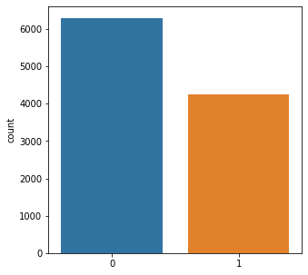
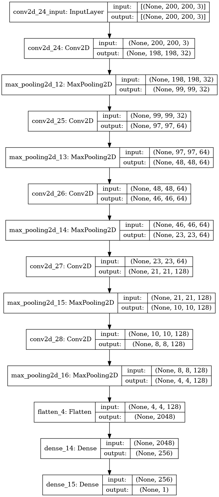

[](https://github.com/Hyuto/bdc-2021)

Beberapa bulan yang lalu penulis dan teman - teman yang tergabung dalam sebuah tim mengikuti lomba
`Big Data Competition` di acara `Satria Data 2021` yang diselenggarakan oleh _PUSPRESNAS_
yang bekerjasama dengan _IPB University_. Ini merupakan kali kedua penulis mengikuti lomba
`BDC - Satria Data`, dengan susunan tim yang sedikit berbeda dan task yang berbeda juga penulis
mendapatkan banyak pengalaman dan ilmu dari lomba tersebut. Meskipun belum diberikan rezeki untuk
menjadi juara _Alhamdulillah_ tim kami berhasil melaju sampai babak final.

Berikut ini adalah kode dan langkah - langkah yang tim kami gunakan pada saat mengikuti lomba
`BDC Satria Data 2021`.

## Author

- [Naufal Zhafran Albaqi](https://www.linkedin.com/in/naufal-zhafran-albaqi-95360b184/)
- [Muhammad Amanda](https://www.linkedin.com/in/muhammadamanda/)
- [Wahyu Setianto](https://www.linkedin.com/in/wahyu-setianto/)

## Running Environment

- Platform : Kaggle
- Accelerator : GPU `NVIDIA TESLA P100`

## Dataset

Dataset hasil preprocessing dan augmentasi dapat diakses lewat platform berikut.

[](https://github.com/Hyuto/bdc-2021/tree/master/data)
[](https://www.kaggle.com/wahyusetianto/bdc-2021)

# Gender Classification

Pada tahap penyisihan kami ditugaskan untuk melakukan pengklasifikasian terhadap _gender_ seseorang
didalam foto (_binary classification_). Data yang disediakan merupakan data gambar dengan ukuran dan
resolusi yang berbeda sehingga merupakan tantangan tersendiri untuk melakukan _data preprocessing_.
Pada data yang disediakan juga terdapat beberapa gambar yang memiliki lebih dari satu orang di
dalamnya sehingga menurut tim kami cukup sulit jika membersihkan data secara otomatis dan perlu
dilakukan _manual filtering_ untuk meningkatkan kualitas data sebelum dilatih kedalam model. Kami
juga melakukan proses _augmentasi_ sehingga data semakin banyak dan lebih banyak yang dapat
dipelajari oleh model. Model yang digunakan oleh tim kami dalam menyelesaikan masalah ini adalah
_tensorflow custom_ model dengan arsitektur 5 `convolution layer` yang dipadukan dengan
`max pooling layer` dan ditutup dengan `dense layer` berkativasi _sigmoid_. Ditahap akhir untuk
meningkatkan kualitas prediksi kami melakukan _ensembel_ terhadap hasil prediksi 5 model yang
dilatih dengan data yang berbeda (menggunakan `StratifiedKfold`).

## First Thing First

Menginstall library yang diperlukan dan mengimport library - library yang akan digunakan serta
menseting variable config yang akan digunakan di dalam notebook ini.

1. Menginstal library `MTCNN` dan `Albumentations`

Library `MTCNN` dan `Albumentations` adalah library yang digunakan untuk preprocessing data gambar
pada notebook ini

```python
!pip -q install mtcnn --upgrade
!pip -q install albumentations --upgrade
```

    WARNING: Running pip as the 'root' user can result in broken permissions and conflicting behaviour with the system package manager. It is recommended to use a virtual environment instead: https://pip.pypa.io/warnings/venv
    WARNING: Running pip as the 'root' user can result in broken permissions and conflicting behaviour with the system package manager. It is recommended to use a virtual environment instead: https://pip.pypa.io/warnings/venv

2. Importing library

Mengimport library yang akan digunakan dalam notebook ini.

```python
# Umum
import os, random, re
from tqdm.notebook import tqdm
import numpy as np
import pandas as pd
from PIL import Image

# Tensorflow
import tensorflow as tf
from tensorflow.keras.preprocessing.image import load_img, img_to_array

# Metrics & Splitting data
from sklearn.metrics import *
from sklearn.model_selection import *

# Plotting
import matplotlib.pyplot as plt
import seaborn as sns

# Preprocessing
import cv2
from mtcnn import MTCNN
import albumentations as A

print("Tensorflow :", tf.__version__)
```

    Tensorflow : 2.6.0

3. Setup `CONFIG`

Mensetup varible - variable yang digunakan sebagai config pada notebook ini

```python
SEED = 2021
SIZE = (200, 200)
BATCH_SIZE = 32
FACE_THRESHOLD = 0.95
FACE_DETECTOR = MTCNN()
```

    2022-03-25 05:01:04.404789: I tensorflow/stream_executor/cuda/cuda_gpu_executor.cc:937] successful NUMA node read from SysFS had negative value (-1), but there must be at least one NUMA node, so returning NUMA node zero
    2022-03-25 05:01:04.507729: I tensorflow/stream_executor/cuda/cuda_gpu_executor.cc:937] successful NUMA node read from SysFS had negative value (-1), but there must be at least one NUMA node, so returning NUMA node zero
    2022-03-25 05:01:04.508532: I tensorflow/stream_executor/cuda/cuda_gpu_executor.cc:937] successful NUMA node read from SysFS had negative value (-1), but there must be at least one NUMA node, so returning NUMA node zero
    2022-03-25 05:01:04.510232: I tensorflow/core/platform/cpu_feature_guard.cc:142] This TensorFlow binary is optimized with oneAPI Deep Neural Network Library (oneDNN) to use the following CPU instructions in performance-critical operations:  AVX2 AVX512F FMA
    To enable them in other operations, rebuild TensorFlow with the appropriate compiler flags.
    2022-03-25 05:01:04.511454: I tensorflow/stream_executor/cuda/cuda_gpu_executor.cc:937] successful NUMA node read from SysFS had negative value (-1), but there must be at least one NUMA node, so returning NUMA node zero
    2022-03-25 05:01:04.512136: I tensorflow/stream_executor/cuda/cuda_gpu_executor.cc:937] successful NUMA node read from SysFS had negative value (-1), but there must be at least one NUMA node, so returning NUMA node zero
    2022-03-25 05:01:04.512828: I tensorflow/stream_executor/cuda/cuda_gpu_executor.cc:937] successful NUMA node read from SysFS had negative value (-1), but there must be at least one NUMA node, so returning NUMA node zero
    2022-03-25 05:01:06.301278: I tensorflow/stream_executor/cuda/cuda_gpu_executor.cc:937] successful NUMA node read from SysFS had negative value (-1), but there must be at least one NUMA node, so returning NUMA node zero
    2022-03-25 05:01:06.302130: I tensorflow/stream_executor/cuda/cuda_gpu_executor.cc:937] successful NUMA node read from SysFS had negative value (-1), but there must be at least one NUMA node, so returning NUMA node zero
    2022-03-25 05:01:06.302815: I tensorflow/stream_executor/cuda/cuda_gpu_executor.cc:937] successful NUMA node read from SysFS had negative value (-1), but there must be at least one NUMA node, so returning NUMA node zero
    2022-03-25 05:01:06.303445: I tensorflow/core/common_runtime/gpu/gpu_device.cc:1510] Created device /job:localhost/replica:0/task:0/device:GPU:0 with 15403 MB memory:  -> device: 0, name: Tesla P100-PCIE-16GB, pci bus id: 0000:00:04.0, compute capability: 6.0

## Dataset

Menggunakan dataset yang telah digunakan oleh tim kami dan melakukan loading agar mendapatkan informasi path dari data gambar

Dataset : [Data SD20210000722](https://www.kaggle.com/wahyusetianto/bdc-2021)

```python
train = pd.read_csv("../input/bdc-2021/train.csv")
test = pd.read_csv("../input/bdc-2021/submission.csv")
train.head()
```

| nomor | jenis kelamin | usia |
| :---: | :-----------: | :--: |
|   1   |       0       |  27  |
|   2   |       1       |  24  |
|   3   |       0       |  29  |
|   4   |       1       |  23  |
|   5   |       0       |  20  |

memperjelas `path` ke setiap data gambar

```python
images = []
labels = []
test_images = []

TRAIN_DIR = "../input/bdc-2021/Training"
TEST_DIR = "../input/bdc-2021/Testing"

for no, label in train[["nomor", "jenis kelamin"]].values:
    TEMP_DIR = os.path.join(TRAIN_DIR, str(no))
    for file in os.listdir(TEMP_DIR):
        file_dir = os.path.join(TEMP_DIR, file)
        if ".ini" not in file_dir:
            images.append(file_dir)
            labels.append(label)

for no in test.id.values:
    file_dir = os.path.join(TEST_DIR, f"{no}.jpg")
    if os.path.isfile(file_dir):
        test_images.append(file_dir)
    else:
        test_images.append(None)
        print(file_dir)
```

menampilkan dan mengecek beberapa gambar pada data `train`

```python
def read(path):
    """
    Read data gambar
    """
    img = Image.open(path)
    return img

def show_images(list_dir, label = None, load_image = read, seed = SEED):
    """
    Menampilkan Gambar Secara acak sebanyak 5 buah.
    """
    random.seed(seed)
    unique = ["init"]
    if label:
        unique = list(set(label))
    fig, axes = plt.subplots(len(unique), 5, figsize = (20, 5 * len(unique)))
    for i in range(len(unique)):
        if i == 0 and unique[i] == "init":
            data = random.sample(list_dir, 5)
        else:
            data = random.sample([x for x in zip(list_dir, label) if x[1] == unique[i]], 5)
        for j in range(5):
            if unique[0] != "init":
                img = load_image(data[j][0])
                axes[i, j].imshow(img)
                axes[i, j].set_title(f'Label : {data[j][1]}', fontsize = 14)
                axes[i, j].axis('off')
            else:
                img = load_image(data[j])
                axes[j].imshow(img)
                axes[j].axis('off')
    fig.tight_layout()
    plt.show()
```

```python
show_images(images, labels, seed=20)
```


## Preprocess Data

Metode yang digunakan:

1. Mengekstrak wajah - wajah yang terdapat pada gambar menjadi gambar - gambar baru dengan label yang sama dengan menggunakan model `MTCNN`
2. Pada data test jika terdapat dua wajah yang terdeteksi pada satu gambar akan di ambil wajah dengan tingkat confidence terbesar yang diberikan oleh model `MTCNN`.
3. Jika tidak terdetect wajah pada salah satu gambar maka akan dilakukan crop pada bagian tengah gambar sehingga gambar berbentuk persegi atau `jxj` pixel.
4. Selanjutnya gambar akan di resize menjadi ukuran `256x256` pixel

berikut adalah contoh hasil preprocess data gambar.

```python
def get_faces(path):
    image = cv2.cvtColor(cv2.imread(path), cv2.COLOR_BGR2RGB)
    faces = FACE_DETECTOR.detect_faces(image)
    return faces

def load_and_preprocess_image(path: str, size = SIZE):
    """
    Load & Preprocess data gambar
    """
    image = img_to_array(load_img(path))
    faces = [x['box'] for x in get_faces(path) if x['confidence'] > FACE_THRESHOLD]
    if len(faces) > 0:
        x, y, w, h = faces[0]
        image = image[y:y+h, x:x+w]
    img = tf.convert_to_tensor(image, dtype=tf.float32)
    if len(faces) == 0:
        shapes = tf.shape(img)
        h, w = shapes[-3], shapes[-2]
        dim = tf.minimum(h, w)
        img = tf.image.resize_with_crop_or_pad(img, dim, dim)
    img = tf.image.resize(img, size)
    img = tf.cast(img, tf.float32) / 255.0
    return img.numpy()
```

```python
show_images(images, labels, load_image = load_and_preprocess_image, seed=20)
```

    2022-03-25 05:01:13.728692: I tensorflow/compiler/mlir/mlir_graph_optimization_pass.cc:185] None of the MLIR Optimization Passes are enabled (registered 2)
    2022-03-25 05:01:14.721635: I tensorflow/stream_executor/cuda/cuda_dnn.cc:369] Loaded cuDNN version 8005


## Augmentasi Data

Melakukan augmentasi untuk memperbanyak data. Metode augmentasi yang digunakan yaitu:

1. Horizontal flip
2. Donwscale kualitas gambar
3. Random rotate dengan rentang -30 sampai 30 derajad
4. Shift, scale, dan rotate gambar
5. Blur
6. Random brightness

```python
aug = A.Compose([
    A.HorizontalFlip(p=0.4),
    A.Downscale(scale_min=0.6, scale_max=0.9, p=0.3),
    A.Rotate(limit=(-30,30), p=0.6),
    A.ShiftScaleRotate(shift_limit=(-0.07, 0.07), scale_limit=(-0.05, 0.1), rotate_limit=(-15, 15), p=0.4),
    A.OneOf([
        A.MotionBlur(p=.4),
        A.MedianBlur(blur_limit=3, p=0.4),
        A.Blur(blur_limit=3, p=0.4),
    ], p=0.4),
    A.RandomBrightnessContrast(brightness_limit=(-0.25, 0.15), p=0.4),
])
```

```python
def visualize_aug(path):
    fig, axes = plt.subplots(1, 5, figsize = (20, 5))
    image = load_and_preprocess_image(path)
    axes[0].imshow(image)
    axes[0].axis('off')
    for i in range(1, 5):
        augmented = aug(image=image)['image']
        axes[i].imshow(augmented)
        axes[i].axis('off')
    fig.tight_layout()
    plt.show()
```

```python
random.seed(SEED)
for i in range(3):
    visualize_aug(images[i])
```


Running preprocessing pada data gambar secara keseluruhan

```python
def image_preprocessing(new_dir, images, labels=None):
    if os.path.isdir(new_dir):
        !rm -rf {new_dir}
    os.mkdir(new_dir)

    new_images, new_labels = [], []
    if not labels:
        labels = [None for _ in range(len(images))]

    for path, label in tqdm(zip(images, labels), total=len(images)):
        image = img_to_array(load_img(path))
        if label != None:
            faces = [x['box'] for x in sorted(get_faces(path), key=lambda x: x['confidence'],
                                              reverse=True) if x['confidence'] > FACE_THRESHOLD]
        else:
            faces = [x['box'] for x in sorted(get_faces(path), key=lambda x: x['confidence'], reverse=True)]
        if len(faces) > 0:
            if label != None:
                for j, (x, y, w, h) in enumerate(faces):
                    img = image[y:y+h, x:x+w]
                    img = tf.convert_to_tensor(img, dtype=tf.float32)
                    img = tf.image.resize(img, SIZE)
                    img = tf.cast(img, tf.float32) / 255.0

                    img_dir = os.path.join(new_dir, f'{j}_{path.split("/")[-1]}')
                    new_images.append(img_dir)
                    new_labels.append(label)
                    tf.keras.preprocessing.image.save_img(img_dir, img)

                    for k in range(3):
                        augmented = aug(image=img.numpy())['image']
                        img_dir = os.path.join(new_dir, f'aug-{k}_{j}_{path.split("/")[-1]}')
                        new_images.append(img_dir)
                        new_labels.append(label)
                        tf.keras.preprocessing.image.save_img(img_dir, augmented)
            else:
                x, y, w, h = faces[0]
                img = image[y:y+h, x:x+w]
                img = tf.convert_to_tensor(img, dtype=tf.float32)
                img = tf.image.resize(img, SIZE)
                img = tf.cast(img, tf.float32) / 255.0

                img_dir = os.path.join(new_dir, path.split('/')[-1])
                new_images.append(img_dir)
                new_labels.append(label)
                tf.keras.preprocessing.image.save_img(img_dir, img)
        else :
            img = tf.convert_to_tensor(image, dtype=tf.float32)
            shapes = tf.shape(img)
            h, w = shapes[-3], shapes[-2]
            dim = tf.minimum(h, w)
            img = tf.image.resize_with_crop_or_pad(img, dim, dim)
            img = tf.image.resize(img, SIZE)
            img = tf.cast(img, tf.float32) / 255.0

            img_dir = os.path.join(new_dir, path.split('/')[-1])
            new_images.append(img_dir)
            new_labels.append(label)
            tf.keras.preprocessing.image.save_img(img_dir, img)

            if label != None:
                for k in range(3):
                    augmented = aug(image=img.numpy())['image']
                    img_dir = os.path.join(new_dir,  f'aug-{k}_{path.split("/")[-1]}')
                    new_images.append(img_dir)
                    new_labels.append(label)
                    tf.keras.preprocessing.image.save_img(img_dir, augmented)

    return new_images, new_labels
```

Untuk menghemat waktu running akan di skip bagian ini dan di ganti dengan meload data hasil preprocess yang sudah di save pada run sebelumnya. Namun jika ingin melakukan preprocess pada run sekarang maka uncomment code di bawah ini.

**Peringatan** : running block code di bawah memakan waktu sekitar 50 menit dengan GPU Nvidia Tesla P100-PCIE.

```python
# new_train_dir = "./train"
# new_test_dir = "./test"

# random.seed(SEED)
# new_images, new_labels = image_preprocessing(new_train_dir, images, labels)
# new_test_images, _ = image_preprocessing(new_test_dir, test_images)
```

**Note** : Comment dua block kode di bawah jika melakukan preprocess pada run saat ini.

```python
preprocessed = pd.read_csv("../input/bdc-2021/preprocessed-augmented/preprocessed.csv")
preprocessed.head()
```

| image                   | label | age |
| :---------------------- | :---: | :-: |
| ./train/0_1_3.jpg       |   0   | 27  |
| ./train/aug-0_0_1_3.jpg |   0   | 27  |
| ./train/aug-1_0_1_3.jpg |   0   | 27  |
| ./train/aug-2_0_1_3.jpg |   0   | 27  |
| ./train/0_1_1.jpg       |   0   | 27  |

## Filterisasi Data

Menyaring data yang akan dilatih ke dalam model dengan melakukan filterisasi terhadap data gambar yang memiliki kualitas gambar yang kurang baik dan misslabel.

1. Mendownload list data gambar yang akan dibuang.

```python
!wget https://raw.githubusercontent.com/Hyuto/bdc-2021/master/excluded-gender.txt

with open("./excluded-gender.txt") as f:
    excluded = f.read().split("\n")

patterns = fr'{"|".join(excluded)}'
```

    --2022-03-25 05:01:44--  https://raw.githubusercontent.com/Hyuto/bdc-2021/master/excluded-gender.txt
    Resolving raw.githubusercontent.com (raw.githubusercontent.com)... 185.199.110.133, 185.199.111.133, 185.199.108.133, ...
    Connecting to raw.githubusercontent.com (raw.githubusercontent.com)|185.199.110.133|:443... connected.
    HTTP request sent, awaiting response... 200 OK
    Length: 3111 (3.0K) [text/plain]
    Saving to: ‘excluded-gender.txt’

    excluded-gender.txt 100%[===================>]   3.04K  --.-KB/s    in 0s

    2022-03-25 05:01:44 (23.6 MB/s) - ‘excluded-gender.txt’ saved [3111/3111]

2. Filterisasi data

```python
preprocessed_dir = "../input/bdc-2021/preprocessed-augmented"
new_images, new_labels = [], []

for image, label in preprocessed[["image", "label"]].values:
    if not re.search(patterns, image):
        new_images.append(os.path.join(preprocessed_dir, image))
        new_labels.append(label)

new_test_images = np.asarray([os.path.join(preprocessed_dir, "test", f"{x}.jpg") for x in test.id.values])

new_images = np.asarray(new_images)
new_labels = np.asarray(new_labels)
```

Mengecek distribusi label pada data

```python
plt.figure(figsize=(5, 5))
sns.countplot(x=new_labels)
plt.show()
```



Jumlah data yang berlabel `0` dan `1` cenderung sama.

## Modelling

Membuat model dengan arsitektur sebagai berikut



```python
def build_model(kernel_s=(3,3)):
    model = tf.keras.models.Sequential([
        tf.keras.layers.Conv2D(32,kernel_s,activation='relu',input_shape=(200,200,3),
                            kernel_regularizer=tf.keras.regularizers.l2(0.001),padding="VALID"),
        tf.keras.layers.MaxPooling2D((2,2)),
        tf.keras.layers.Conv2D(64,kernel_s,activation='relu'),
        tf.keras.layers.MaxPooling2D((2,2)),
        tf.keras.layers.Conv2D(64,kernel_s,activation='relu'),
        tf.keras.layers.MaxPooling2D((2,2)),
        tf.keras.layers.Conv2D(128,kernel_s,activation='relu'),
        tf.keras.layers.MaxPooling2D((2,2)),
        tf.keras.layers.Conv2D(128,kernel_s,activation='relu'),
        tf.keras.layers.MaxPooling2D((2,2)),
        tf.keras.layers.Flatten(),
        tf.keras.layers.Dense(256, activation='relu',
                              kernel_regularizer=tf.keras.regularizers.l2(5e-4)),
        tf.keras.layers.Dense(1, activation='sigmoid')
    ])
    model.compile(loss="binary_crossentropy", optimizer="adam", metrics=['accuracy'])
    return model
```

**Tensorflow Data**

Load data gambar menggunakan `Tensorflow Data` agar pada saat pelatihan model penggunaan memmori dapat lebih optimal

```python
def decode_image(filename, label=None, image_size=SIZE):
    """
    Decode Image from String Path Tensor
    """
    bits = tf.io.read_file(filename)
    image = tf.image.decode_jpeg(bits, channels=3)
    image = tf.cast(image, tf.float32) / 255.0
    image = tf.image.resize(image, SIZE)

    if label is None: # if test
        return image
    else:
        return image, label
```

**Training Model**

Proses ini dilakukan dengan mensplit data menggunakan `StratifiedKFold` sebanyak 5 split lalu untuk setiap split akan dibangun sebuah model untuk dilatih. Setiap model ini akan digunakan untuk melakukan peramalan terhadap data test. Pada proses trainingnya setiap model akan diukur tingkat kebaikannya dengan menggunakan metric `accuracy` lalu dikakukan penyimpanan weight pada model saat `val_accuracy` berada pada nilai terbesar selama pelatihan model sebanyak `50 epochs`.

```python
split = 5
prediksi = np.zeros((len(new_test_images), 1), dtype=np.float32)
acc_scores, f1_scores = [], []

test_dataset = (
    tf.data.Dataset
    .from_tensor_slices((new_test_images))
    .map(decode_image)
    .batch(BATCH_SIZE)
)

cv = StratifiedKFold(n_splits=split, shuffle=True, random_state=SEED)
for i, (train_index, test_index) in enumerate(cv.split(new_images, new_labels)):
    tf.keras.backend.clear_session()
    x_train, x_valid = new_images[train_index], new_images[test_index]
    y_train, y_valid = new_labels[train_index], new_labels[test_index]

    train_dataset = (
        tf.data.Dataset
        .from_tensor_slices((x_train, y_train))
        .map(decode_image, num_parallel_calls=tf.data.AUTOTUNE)
        .cache()
        .repeat()
        .shuffle(1024)
        .batch(BATCH_SIZE)
        .prefetch(tf.data.AUTOTUNE)
    )

    valid_dataset = (
        tf.data.Dataset
        .from_tensor_slices((x_valid, y_valid))
        .map(decode_image, num_parallel_calls=tf.data.AUTOTUNE)
        .batch(BATCH_SIZE)
        .cache()
        .prefetch(tf.data.AUTOTUNE)
    )

    model = build_model()
    checkpoint = tf.keras.callbacks.ModelCheckpoint(f'{i}_best_model.h5', monitor='val_accuracy',
                                                save_best_only=True, save_weights_only=True,
                                                mode='max')
    print(f"\nCV {i+1}")
    model.fit(train_dataset, epochs=50, validation_data=valid_dataset,
              steps_per_epoch=len(x_train) // BATCH_SIZE,
              callbacks = [checkpoint])
    model.load_weights(f'{i}_best_model.h5')
    val_pred_classes = np.array(model.predict(valid_dataset).flatten() >= .5, dtype = 'int')
    acc, f1 = accuracy_score(y_valid, val_pred_classes), f1_score(y_valid, val_pred_classes)

    acc_scores.append(acc)
    f1_scores.append(f1)
    prediksi += model.predict(test_dataset)

    del train_dataset
    del valid_dataset
```

    CV 1
    Epoch 1/50
    263/263 [==============================] - 32s 107ms/step - loss: 0.5496 - accuracy: 0.7317 - val_loss: 0.3710 - val_accuracy: 0.8544
    Epoch 2/50
    263/263 [==============================] - 7s 27ms/step - loss: 0.3210 - accuracy: 0.8819 - val_loss: 0.3272 - val_accuracy: 0.8753
    Epoch 3/50
    263/263 [==============================] - 7s 26ms/step - loss: 0.2792 - accuracy: 0.8977 - val_loss: 0.2815 - val_accuracy: 0.8957
    Epoch 4/50
    263/263 [==============================] - 7s 26ms/step - loss: 0.2451 - accuracy: 0.9177 - val_loss: 0.2392 - val_accuracy: 0.9189
    Epoch 5/50
    263/263 [==============================] - 7s 26ms/step - loss: 0.2160 - accuracy: 0.9268 - val_loss: 0.2512 - val_accuracy: 0.9151
    Epoch 6/50
    263/263 [==============================] - 7s 28ms/step - loss: 0.1843 - accuracy: 0.9437 - val_loss: 0.2210 - val_accuracy: 0.9265
    Epoch 7/50
    263/263 [==============================] - 7s 26ms/step - loss: 0.1688 - accuracy: 0.9470 - val_loss: 0.2120 - val_accuracy: 0.9336
    Epoch 8/50
    263/263 [==============================] - 7s 26ms/step - loss: 0.1480 - accuracy: 0.9578 - val_loss: 0.2075 - val_accuracy: 0.9346
    Epoch 9/50
    263/263 [==============================] - 7s 26ms/step - loss: 0.1341 - accuracy: 0.9627 - val_loss: 0.2290 - val_accuracy: 0.9294
    Epoch 10/50
    263/263 [==============================] - 7s 26ms/step - loss: 0.1163 - accuracy: 0.9701 - val_loss: 0.1956 - val_accuracy: 0.9417
    Epoch 11/50
    263/263 [==============================] - 7s 27ms/step - loss: 0.1062 - accuracy: 0.9718 - val_loss: 0.2243 - val_accuracy: 0.9369
    Epoch 12/50
    263/263 [==============================] - 7s 26ms/step - loss: 0.0872 - accuracy: 0.9802 - val_loss: 0.2190 - val_accuracy: 0.9403
    Epoch 13/50
    263/263 [==============================] - 7s 26ms/step - loss: 0.0953 - accuracy: 0.9781 - val_loss: 0.2050 - val_accuracy: 0.9507
    Epoch 14/50
    263/263 [==============================] - 7s 26ms/step - loss: 0.0794 - accuracy: 0.9841 - val_loss: 0.2156 - val_accuracy: 0.9455
    Epoch 15/50
    263/263 [==============================] - 7s 26ms/step - loss: 0.0732 - accuracy: 0.9874 - val_loss: 0.2320 - val_accuracy: 0.9426
    Epoch 16/50
    263/263 [==============================] - 7s 27ms/step - loss: 0.0663 - accuracy: 0.9870 - val_loss: 0.2245 - val_accuracy: 0.9502
    Epoch 17/50
    263/263 [==============================] - 7s 26ms/step - loss: 0.0748 - accuracy: 0.9843 - val_loss: 0.2315 - val_accuracy: 0.9469
    Epoch 18/50
    263/263 [==============================] - 7s 26ms/step - loss: 0.0637 - accuracy: 0.9884 - val_loss: 0.2470 - val_accuracy: 0.9497
    Epoch 19/50
    263/263 [==============================] - 7s 26ms/step - loss: 0.0601 - accuracy: 0.9892 - val_loss: 0.2627 - val_accuracy: 0.9436
    Epoch 20/50
    263/263 [==============================] - 7s 26ms/step - loss: 0.0570 - accuracy: 0.9901 - val_loss: 0.3084 - val_accuracy: 0.9360
    Epoch 21/50
    263/263 [==============================] - 7s 27ms/step - loss: 0.0535 - accuracy: 0.9916 - val_loss: 0.2784 - val_accuracy: 0.9393
    Epoch 22/50
    263/263 [==============================] - 7s 26ms/step - loss: 0.0552 - accuracy: 0.9910 - val_loss: 0.2408 - val_accuracy: 0.9488
    Epoch 23/50
    263/263 [==============================] - 7s 26ms/step - loss: 0.0517 - accuracy: 0.9925 - val_loss: 0.2810 - val_accuracy: 0.9350
    Epoch 24/50
    263/263 [==============================] - 7s 26ms/step - loss: 0.0525 - accuracy: 0.9914 - val_loss: 0.2122 - val_accuracy: 0.9459
    Epoch 25/50
    263/263 [==============================] - 7s 27ms/step - loss: 0.0522 - accuracy: 0.9917 - val_loss: 0.2259 - val_accuracy: 0.9493
    Epoch 26/50
    263/263 [==============================] - 7s 26ms/step - loss: 0.0522 - accuracy: 0.9919 - val_loss: 0.2751 - val_accuracy: 0.9379
    Epoch 27/50
    263/263 [==============================] - 7s 26ms/step - loss: 0.0560 - accuracy: 0.9904 - val_loss: 0.2802 - val_accuracy: 0.9422
    Epoch 28/50
    263/263 [==============================] - 7s 26ms/step - loss: 0.0383 - accuracy: 0.9960 - val_loss: 0.2612 - val_accuracy: 0.9464
    Epoch 29/50
    263/263 [==============================] - 7s 27ms/step - loss: 0.0558 - accuracy: 0.9905 - val_loss: 0.2870 - val_accuracy: 0.9440
    Epoch 30/50
    263/263 [==============================] - 7s 27ms/step - loss: 0.0329 - accuracy: 0.9981 - val_loss: 0.2645 - val_accuracy: 0.9559
    Epoch 31/50
    263/263 [==============================] - 7s 26ms/step - loss: 0.0476 - accuracy: 0.9923 - val_loss: 0.2235 - val_accuracy: 0.9464
    Epoch 32/50
    263/263 [==============================] - 7s 26ms/step - loss: 0.0371 - accuracy: 0.9961 - val_loss: 0.2934 - val_accuracy: 0.9521
    Epoch 33/50
    263/263 [==============================] - 7s 27ms/step - loss: 0.0494 - accuracy: 0.9923 - val_loss: 0.2960 - val_accuracy: 0.9393
    Epoch 34/50
    263/263 [==============================] - 7s 25ms/step - loss: 0.0551 - accuracy: 0.9905 - val_loss: 0.2176 - val_accuracy: 0.9535
    Epoch 35/50
    263/263 [==============================] - 7s 27ms/step - loss: 0.0355 - accuracy: 0.9958 - val_loss: 0.2783 - val_accuracy: 0.9502
    Epoch 36/50
    263/263 [==============================] - 7s 26ms/step - loss: 0.0387 - accuracy: 0.9949 - val_loss: 0.2497 - val_accuracy: 0.9493
    Epoch 37/50
    263/263 [==============================] - 7s 26ms/step - loss: 0.0338 - accuracy: 0.9957 - val_loss: 0.2888 - val_accuracy: 0.9521
    Epoch 38/50
    263/263 [==============================] - 7s 27ms/step - loss: 0.0592 - accuracy: 0.9891 - val_loss: 0.2465 - val_accuracy: 0.9422
    Epoch 39/50
    263/263 [==============================] - 7s 26ms/step - loss: 0.0314 - accuracy: 0.9980 - val_loss: 0.2826 - val_accuracy: 0.9478
    Epoch 40/50
    263/263 [==============================] - 7s 26ms/step - loss: 0.0322 - accuracy: 0.9966 - val_loss: 0.3041 - val_accuracy: 0.9474
    Epoch 41/50
    263/263 [==============================] - 7s 26ms/step - loss: 0.0365 - accuracy: 0.9954 - val_loss: 0.4735 - val_accuracy: 0.9241
    Epoch 42/50
    263/263 [==============================] - 7s 26ms/step - loss: 0.0423 - accuracy: 0.9935 - val_loss: 0.2528 - val_accuracy: 0.9578
    Epoch 43/50
    263/263 [==============================] - 7s 27ms/step - loss: 0.0274 - accuracy: 0.9982 - val_loss: 0.3552 - val_accuracy: 0.9459
    Epoch 44/50
    263/263 [==============================] - 7s 27ms/step - loss: 0.0300 - accuracy: 0.9973 - val_loss: 0.2836 - val_accuracy: 0.9398
    Epoch 45/50
    263/263 [==============================] - 7s 25ms/step - loss: 0.0340 - accuracy: 0.9952 - val_loss: 0.2927 - val_accuracy: 0.9497
    Epoch 46/50
    263/263 [==============================] - 7s 26ms/step - loss: 0.0442 - accuracy: 0.9917 - val_loss: 0.3046 - val_accuracy: 0.9388
    Epoch 47/50
    263/263 [==============================] - 7s 26ms/step - loss: 0.0264 - accuracy: 0.9986 - val_loss: 0.2410 - val_accuracy: 0.9540
    Epoch 48/50
    263/263 [==============================] - 7s 26ms/step - loss: 0.0287 - accuracy: 0.9973 - val_loss: 0.3600 - val_accuracy: 0.9374
    Epoch 49/50
    263/263 [==============================] - 7s 27ms/step - loss: 0.0464 - accuracy: 0.9907 - val_loss: 0.2628 - val_accuracy: 0.9469
    Epoch 50/50
    263/263 [==============================] - 7s 26ms/step - loss: 0.0275 - accuracy: 0.9976 - val_loss: 0.2887 - val_accuracy: 0.9578

    CV 2
    Epoch 1/50
    263/263 [==============================] - 17s 57ms/step - loss: 0.6296 - accuracy: 0.6513 - val_loss: 0.5415 - val_accuracy: 0.7240
    Epoch 2/50
    263/263 [==============================] - 7s 26ms/step - loss: 0.3590 - accuracy: 0.8524 - val_loss: 0.3806 - val_accuracy: 0.8350
    Epoch 3/50
    263/263 [==============================] - 7s 26ms/step - loss: 0.3032 - accuracy: 0.8843 - val_loss: 0.3152 - val_accuracy: 0.8630
    Epoch 4/50
    263/263 [==============================] - 7s 26ms/step - loss: 0.2561 - accuracy: 0.9057 - val_loss: 0.2714 - val_accuracy: 0.8928
    Epoch 5/50
    263/263 [==============================] - 7s 27ms/step - loss: 0.2361 - accuracy: 0.9123 - val_loss: 0.2537 - val_accuracy: 0.9090
    Epoch 6/50
    263/263 [==============================] - 7s 26ms/step - loss: 0.2088 - accuracy: 0.9269 - val_loss: 0.2638 - val_accuracy: 0.8985
    Epoch 7/50
    263/263 [==============================] - 7s 26ms/step - loss: 0.2099 - accuracy: 0.9269 - val_loss: 0.2278 - val_accuracy: 0.9156
    Epoch 8/50
    263/263 [==============================] - 7s 26ms/step - loss: 0.1721 - accuracy: 0.9433 - val_loss: 0.2418 - val_accuracy: 0.9042
    Epoch 9/50
    263/263 [==============================] - 7s 25ms/step - loss: 0.1546 - accuracy: 0.9474 - val_loss: 0.2095 - val_accuracy: 0.9298
    Epoch 10/50
    263/263 [==============================] - 7s 27ms/step - loss: 0.1497 - accuracy: 0.9527 - val_loss: 0.2097 - val_accuracy: 0.9213
    Epoch 11/50
    263/263 [==============================] - 7s 26ms/step - loss: 0.1343 - accuracy: 0.9588 - val_loss: 0.2332 - val_accuracy: 0.9075
    Epoch 12/50
    263/263 [==============================] - 7s 26ms/step - loss: 0.1173 - accuracy: 0.9630 - val_loss: 0.1970 - val_accuracy: 0.9350
    Epoch 13/50
    263/263 [==============================] - 7s 26ms/step - loss: 0.1042 - accuracy: 0.9686 - val_loss: 0.1894 - val_accuracy: 0.9407
    Epoch 14/50
    263/263 [==============================] - 7s 26ms/step - loss: 0.1053 - accuracy: 0.9697 - val_loss: 0.2082 - val_accuracy: 0.9350
    Epoch 15/50
    263/263 [==============================] - 7s 27ms/step - loss: 0.0924 - accuracy: 0.9745 - val_loss: 0.2383 - val_accuracy: 0.9241
    Epoch 16/50
    263/263 [==============================] - 7s 27ms/step - loss: 0.0796 - accuracy: 0.9806 - val_loss: 0.2311 - val_accuracy: 0.9398
    Epoch 17/50
    263/263 [==============================] - 7s 26ms/step - loss: 0.0795 - accuracy: 0.9787 - val_loss: 0.1954 - val_accuracy: 0.9478
    Epoch 18/50
    263/263 [==============================] - 7s 26ms/step - loss: 0.0676 - accuracy: 0.9837 - val_loss: 0.2104 - val_accuracy: 0.9488
    Epoch 19/50
    263/263 [==============================] - 7s 26ms/step - loss: 0.0645 - accuracy: 0.9849 - val_loss: 0.2294 - val_accuracy: 0.9464
    Epoch 20/50
    263/263 [==============================] - 7s 28ms/step - loss: 0.0607 - accuracy: 0.9861 - val_loss: 0.2366 - val_accuracy: 0.9398
    Epoch 21/50
    263/263 [==============================] - 7s 26ms/step - loss: 0.0668 - accuracy: 0.9822 - val_loss: 0.2420 - val_accuracy: 0.9360
    Epoch 22/50
    263/263 [==============================] - 7s 26ms/step - loss: 0.0617 - accuracy: 0.9869 - val_loss: 0.2115 - val_accuracy: 0.9478
    Epoch 23/50
    263/263 [==============================] - 7s 26ms/step - loss: 0.0499 - accuracy: 0.9898 - val_loss: 0.3090 - val_accuracy: 0.9284
    Epoch 24/50
    263/263 [==============================] - 7s 26ms/step - loss: 0.0541 - accuracy: 0.9895 - val_loss: 0.2563 - val_accuracy: 0.9403
    Epoch 25/50
    263/263 [==============================] - 7s 28ms/step - loss: 0.0453 - accuracy: 0.9913 - val_loss: 0.2587 - val_accuracy: 0.9483
    Epoch 26/50
    263/263 [==============================] - 7s 26ms/step - loss: 0.0576 - accuracy: 0.9881 - val_loss: 0.2429 - val_accuracy: 0.9488
    Epoch 27/50
    263/263 [==============================] - 7s 26ms/step - loss: 0.0355 - accuracy: 0.9955 - val_loss: 0.2969 - val_accuracy: 0.9384
    Epoch 28/50
    263/263 [==============================] - 7s 26ms/step - loss: 0.0564 - accuracy: 0.9875 - val_loss: 0.2725 - val_accuracy: 0.9388
    Epoch 29/50
    263/263 [==============================] - 7s 26ms/step - loss: 0.0396 - accuracy: 0.9949 - val_loss: 0.2618 - val_accuracy: 0.9526
    Epoch 30/50
    263/263 [==============================] - 7s 27ms/step - loss: 0.0440 - accuracy: 0.9928 - val_loss: 0.3184 - val_accuracy: 0.9398
    Epoch 31/50
    263/263 [==============================] - 7s 26ms/step - loss: 0.0753 - accuracy: 0.9816 - val_loss: 0.2277 - val_accuracy: 0.9388
    Epoch 32/50
    263/263 [==============================] - 7s 26ms/step - loss: 0.0435 - accuracy: 0.9922 - val_loss: 0.2447 - val_accuracy: 0.9502
    Epoch 33/50
    263/263 [==============================] - 7s 26ms/step - loss: 0.0357 - accuracy: 0.9955 - val_loss: 0.2904 - val_accuracy: 0.9455
    Epoch 34/50
    263/263 [==============================] - 7s 26ms/step - loss: 0.0654 - accuracy: 0.9850 - val_loss: 0.2455 - val_accuracy: 0.9436
    Epoch 35/50
    263/263 [==============================] - 7s 27ms/step - loss: 0.0321 - accuracy: 0.9966 - val_loss: 0.2937 - val_accuracy: 0.9516
    Epoch 36/50
    263/263 [==============================] - 7s 26ms/step - loss: 0.0222 - accuracy: 0.9999 - val_loss: 0.2844 - val_accuracy: 0.9559
    Epoch 37/50
    263/263 [==============================] - 7s 26ms/step - loss: 0.0193 - accuracy: 1.0000 - val_loss: 0.2873 - val_accuracy: 0.9602
    Epoch 38/50
    263/263 [==============================] - 7s 26ms/step - loss: 0.0174 - accuracy: 1.0000 - val_loss: 0.2869 - val_accuracy: 0.9602
    Epoch 39/50
    263/263 [==============================] - 7s 27ms/step - loss: 0.0157 - accuracy: 1.0000 - val_loss: 0.2909 - val_accuracy: 0.9602
    Epoch 40/50
    263/263 [==============================] - 7s 27ms/step - loss: 0.0141 - accuracy: 1.0000 - val_loss: 0.2880 - val_accuracy: 0.9592
    Epoch 41/50
    263/263 [==============================] - 7s 25ms/step - loss: 0.0127 - accuracy: 1.0000 - val_loss: 0.2887 - val_accuracy: 0.9616
    Epoch 42/50
    263/263 [==============================] - 7s 26ms/step - loss: 0.0113 - accuracy: 1.0000 - val_loss: 0.2911 - val_accuracy: 0.9625
    Epoch 43/50
    263/263 [==============================] - 7s 26ms/step - loss: 0.0100 - accuracy: 1.0000 - val_loss: 0.2906 - val_accuracy: 0.9611
    Epoch 44/50
    263/263 [==============================] - 7s 26ms/step - loss: 0.0088 - accuracy: 1.0000 - val_loss: 0.2956 - val_accuracy: 0.9545
    Epoch 45/50
    263/263 [==============================] - 7s 28ms/step - loss: 0.0251 - accuracy: 0.9945 - val_loss: 0.3765 - val_accuracy: 0.8853
    Epoch 46/50
    263/263 [==============================] - 7s 26ms/step - loss: 0.1159 - accuracy: 0.9606 - val_loss: 0.2241 - val_accuracy: 0.9360
    Epoch 47/50
    263/263 [==============================] - 7s 26ms/step - loss: 0.0551 - accuracy: 0.9849 - val_loss: 0.2401 - val_accuracy: 0.9426
    Epoch 48/50
    263/263 [==============================] - 7s 27ms/step - loss: 0.0517 - accuracy: 0.9873 - val_loss: 0.2366 - val_accuracy: 0.9388
    Epoch 49/50
    263/263 [==============================] - 7s 26ms/step - loss: 0.0354 - accuracy: 0.9933 - val_loss: 0.2496 - val_accuracy: 0.9393
    Epoch 50/50
    263/263 [==============================] - 7s 28ms/step - loss: 0.0344 - accuracy: 0.9917 - val_loss: 0.2557 - val_accuracy: 0.9379

    CV 3
    Epoch 1/50
    263/263 [==============================] - 18s 60ms/step - loss: 0.7068 - accuracy: 0.5899 - val_loss: 0.6871 - val_accuracy: 0.5965
    Epoch 2/50
    263/263 [==============================] - 7s 25ms/step - loss: 0.5515 - accuracy: 0.6947 - val_loss: 0.3532 - val_accuracy: 0.8525
    Epoch 3/50
    263/263 [==============================] - 7s 27ms/step - loss: 0.3284 - accuracy: 0.8645 - val_loss: 0.3120 - val_accuracy: 0.8853
    Epoch 4/50
    263/263 [==============================] - 7s 26ms/step - loss: 0.2807 - accuracy: 0.8931 - val_loss: 0.3025 - val_accuracy: 0.8862
    Epoch 5/50
    263/263 [==============================] - 7s 26ms/step - loss: 0.2362 - accuracy: 0.9144 - val_loss: 0.2469 - val_accuracy: 0.9099
    Epoch 6/50
    263/263 [==============================] - 7s 27ms/step - loss: 0.2126 - accuracy: 0.9247 - val_loss: 0.2345 - val_accuracy: 0.9194
    Epoch 7/50
    263/263 [==============================] - 7s 26ms/step - loss: 0.1923 - accuracy: 0.9344 - val_loss: 0.2541 - val_accuracy: 0.9203
    Epoch 8/50
    263/263 [==============================] - 7s 26ms/step - loss: 0.1788 - accuracy: 0.9387 - val_loss: 0.2092 - val_accuracy: 0.9355
    Epoch 9/50
    263/263 [==============================] - 7s 27ms/step - loss: 0.1509 - accuracy: 0.9491 - val_loss: 0.2047 - val_accuracy: 0.9398
    Epoch 10/50
    263/263 [==============================] - 7s 26ms/step - loss: 0.1353 - accuracy: 0.9569 - val_loss: 0.2152 - val_accuracy: 0.9369
    Epoch 11/50
    263/263 [==============================] - 7s 27ms/step - loss: 0.1220 - accuracy: 0.9664 - val_loss: 0.2115 - val_accuracy: 0.9417
    Epoch 12/50
    263/263 [==============================] - 7s 26ms/step - loss: 0.1036 - accuracy: 0.9709 - val_loss: 0.2067 - val_accuracy: 0.9440
    Epoch 13/50
    263/263 [==============================] - 7s 26ms/step - loss: 0.1018 - accuracy: 0.9712 - val_loss: 0.2111 - val_accuracy: 0.9369
    Epoch 14/50
    263/263 [==============================] - 7s 27ms/step - loss: 0.0852 - accuracy: 0.9766 - val_loss: 0.2244 - val_accuracy: 0.9412
    Epoch 15/50
    263/263 [==============================] - 7s 26ms/step - loss: 0.0773 - accuracy: 0.9812 - val_loss: 0.2498 - val_accuracy: 0.9260
    Epoch 16/50
    263/263 [==============================] - 7s 25ms/step - loss: 0.0757 - accuracy: 0.9805 - val_loss: 0.2084 - val_accuracy: 0.9440
    Epoch 17/50
    263/263 [==============================] - 7s 26ms/step - loss: 0.0645 - accuracy: 0.9844 - val_loss: 0.2288 - val_accuracy: 0.9426
    Epoch 18/50
    263/263 [==============================] - 7s 25ms/step - loss: 0.0628 - accuracy: 0.9840 - val_loss: 0.2407 - val_accuracy: 0.9422
    Epoch 19/50
    263/263 [==============================] - 7s 28ms/step - loss: 0.0561 - accuracy: 0.9873 - val_loss: 0.2402 - val_accuracy: 0.9488
    Epoch 20/50
    263/263 [==============================] - 7s 27ms/step - loss: 0.0521 - accuracy: 0.9894 - val_loss: 0.3115 - val_accuracy: 0.9379
    Epoch 21/50
    263/263 [==============================] - 7s 25ms/step - loss: 0.0628 - accuracy: 0.9847 - val_loss: 0.2724 - val_accuracy: 0.9426
    Epoch 22/50
    263/263 [==============================] - 7s 26ms/step - loss: 0.0561 - accuracy: 0.9861 - val_loss: 0.2290 - val_accuracy: 0.9512
    Epoch 23/50
    263/263 [==============================] - 7s 26ms/step - loss: 0.0502 - accuracy: 0.9904 - val_loss: 0.2277 - val_accuracy: 0.9474
    Epoch 24/50
    263/263 [==============================] - 7s 27ms/step - loss: 0.0501 - accuracy: 0.9898 - val_loss: 0.2613 - val_accuracy: 0.9464
    Epoch 25/50
    263/263 [==============================] - 7s 27ms/step - loss: 0.0316 - accuracy: 0.9963 - val_loss: 0.2643 - val_accuracy: 0.9488
    Epoch 26/50
    263/263 [==============================] - 7s 25ms/step - loss: 0.0223 - accuracy: 0.9998 - val_loss: 0.3362 - val_accuracy: 0.9502
    Epoch 27/50
    263/263 [==============================] - 7s 26ms/step - loss: 0.0540 - accuracy: 0.9872 - val_loss: 0.3159 - val_accuracy: 0.9161
    Epoch 28/50
    263/263 [==============================] - 7s 26ms/step - loss: 0.0542 - accuracy: 0.9882 - val_loss: 0.2793 - val_accuracy: 0.9431
    Epoch 29/50
    263/263 [==============================] - 7s 26ms/step - loss: 0.0355 - accuracy: 0.9947 - val_loss: 0.2806 - val_accuracy: 0.9417
    Epoch 30/50
    263/263 [==============================] - 7s 28ms/step - loss: 0.0498 - accuracy: 0.9887 - val_loss: 0.2897 - val_accuracy: 0.9464
    Epoch 31/50
    263/263 [==============================] - 7s 26ms/step - loss: 0.0443 - accuracy: 0.9918 - val_loss: 0.2955 - val_accuracy: 0.9341
    Epoch 32/50
    263/263 [==============================] - 7s 25ms/step - loss: 0.0433 - accuracy: 0.9923 - val_loss: 0.3032 - val_accuracy: 0.9497
    Epoch 33/50
    263/263 [==============================] - 7s 26ms/step - loss: 0.0397 - accuracy: 0.9932 - val_loss: 0.3064 - val_accuracy: 0.9483
    Epoch 34/50
    263/263 [==============================] - 7s 25ms/step - loss: 0.0307 - accuracy: 0.9963 - val_loss: 0.3349 - val_accuracy: 0.9436
    Epoch 35/50
    263/263 [==============================] - 7s 27ms/step - loss: 0.0324 - accuracy: 0.9964 - val_loss: 0.4585 - val_accuracy: 0.9256
    Epoch 36/50
    263/263 [==============================] - 7s 26ms/step - loss: 0.0497 - accuracy: 0.9900 - val_loss: 0.3056 - val_accuracy: 0.9317
    Epoch 37/50
    263/263 [==============================] - 7s 26ms/step - loss: 0.0489 - accuracy: 0.9888 - val_loss: 0.2959 - val_accuracy: 0.9469
    Epoch 38/50
    263/263 [==============================] - 7s 26ms/step - loss: 0.0313 - accuracy: 0.9962 - val_loss: 0.3199 - val_accuracy: 0.9469
    Epoch 39/50
    263/263 [==============================] - 7s 27ms/step - loss: 0.0278 - accuracy: 0.9973 - val_loss: 0.3277 - val_accuracy: 0.9445
    Epoch 40/50
    263/263 [==============================] - 7s 28ms/step - loss: 0.0473 - accuracy: 0.9904 - val_loss: 0.2563 - val_accuracy: 0.9412
    Epoch 41/50
    263/263 [==============================] - 7s 26ms/step - loss: 0.0343 - accuracy: 0.9944 - val_loss: 0.2936 - val_accuracy: 0.9474
    Epoch 42/50
    263/263 [==============================] - 7s 25ms/step - loss: 0.0344 - accuracy: 0.9941 - val_loss: 0.3198 - val_accuracy: 0.9450
    Epoch 43/50
    263/263 [==============================] - 7s 26ms/step - loss: 0.0365 - accuracy: 0.9945 - val_loss: 0.2744 - val_accuracy: 0.9426
    Epoch 44/50
    263/263 [==============================] - 7s 26ms/step - loss: 0.0310 - accuracy: 0.9962 - val_loss: 0.4059 - val_accuracy: 0.9360
    Epoch 45/50
    263/263 [==============================] - 7s 25ms/step - loss: 0.0439 - accuracy: 0.9913 - val_loss: 0.3263 - val_accuracy: 0.9450
    Epoch 46/50
    263/263 [==============================] - 7s 26ms/step - loss: 0.0281 - accuracy: 0.9970 - val_loss: 0.3318 - val_accuracy: 0.9483
    Epoch 47/50
    263/263 [==============================] - 7s 26ms/step - loss: 0.0315 - accuracy: 0.9956 - val_loss: 0.4163 - val_accuracy: 0.9317
    Epoch 48/50
    263/263 [==============================] - 7s 25ms/step - loss: 0.0377 - accuracy: 0.9932 - val_loss: 0.3119 - val_accuracy: 0.9417
    Epoch 49/50
    263/263 [==============================] - 7s 28ms/step - loss: 0.0329 - accuracy: 0.9952 - val_loss: 0.3192 - val_accuracy: 0.9455
    Epoch 50/50
    263/263 [==============================] - 7s 27ms/step - loss: 0.0200 - accuracy: 0.9993 - val_loss: 0.3720 - val_accuracy: 0.9497

    CV 4
    Epoch 1/50
    263/263 [==============================] - 16s 54ms/step - loss: 0.5668 - accuracy: 0.7114 - val_loss: 0.3847 - val_accuracy: 0.8412
    Epoch 2/50
    263/263 [==============================] - 7s 27ms/step - loss: 0.3313 - accuracy: 0.8683 - val_loss: 0.3414 - val_accuracy: 0.8644
    Epoch 3/50
    263/263 [==============================] - 7s 25ms/step - loss: 0.2821 - accuracy: 0.8963 - val_loss: 0.2769 - val_accuracy: 0.8933
    Epoch 4/50
    263/263 [==============================] - 7s 26ms/step - loss: 0.2404 - accuracy: 0.9144 - val_loss: 0.2703 - val_accuracy: 0.9000
    Epoch 5/50
    263/263 [==============================] - 7s 26ms/step - loss: 0.2224 - accuracy: 0.9198 - val_loss: 0.3158 - val_accuracy: 0.8985
    Epoch 6/50
    263/263 [==============================] - 7s 26ms/step - loss: 0.2027 - accuracy: 0.9324 - val_loss: 0.2464 - val_accuracy: 0.9161
    Epoch 7/50
    263/263 [==============================] - 7s 27ms/step - loss: 0.1660 - accuracy: 0.9482 - val_loss: 0.2103 - val_accuracy: 0.9279
    Epoch 8/50
    263/263 [==============================] - 7s 28ms/step - loss: 0.1506 - accuracy: 0.9544 - val_loss: 0.2314 - val_accuracy: 0.9227
    Epoch 9/50
    263/263 [==============================] - 7s 26ms/step - loss: 0.1538 - accuracy: 0.9526 - val_loss: 0.1944 - val_accuracy: 0.9426
    Epoch 10/50
    263/263 [==============================] - 7s 26ms/step - loss: 0.1245 - accuracy: 0.9639 - val_loss: 0.2137 - val_accuracy: 0.9327
    Epoch 11/50
    263/263 [==============================] - 7s 25ms/step - loss: 0.1091 - accuracy: 0.9697 - val_loss: 0.2203 - val_accuracy: 0.9327
    Epoch 12/50
    263/263 [==============================] - 7s 26ms/step - loss: 0.1108 - accuracy: 0.9727 - val_loss: 0.2389 - val_accuracy: 0.9322
    Epoch 13/50
    263/263 [==============================] - 7s 25ms/step - loss: 0.0898 - accuracy: 0.9766 - val_loss: 0.2162 - val_accuracy: 0.9440
    Epoch 14/50
    263/263 [==============================] - 6s 25ms/step - loss: 0.0893 - accuracy: 0.9790 - val_loss: 0.2326 - val_accuracy: 0.9393
    Epoch 15/50
    263/263 [==============================] - 7s 25ms/step - loss: 0.0767 - accuracy: 0.9824 - val_loss: 0.2705 - val_accuracy: 0.9279
    Epoch 16/50
    263/263 [==============================] - 7s 25ms/step - loss: 0.0746 - accuracy: 0.9843 - val_loss: 0.2469 - val_accuracy: 0.9327
    Epoch 17/50
    263/263 [==============================] - 7s 26ms/step - loss: 0.0844 - accuracy: 0.9803 - val_loss: 0.2399 - val_accuracy: 0.9440
    Epoch 18/50
    263/263 [==============================] - 7s 27ms/step - loss: 0.0657 - accuracy: 0.9865 - val_loss: 0.2712 - val_accuracy: 0.9303
    Epoch 19/50
    263/263 [==============================] - 7s 25ms/step - loss: 0.0463 - accuracy: 0.9938 - val_loss: 0.2771 - val_accuracy: 0.9403
    Epoch 20/50
    263/263 [==============================] - 7s 25ms/step - loss: 0.0694 - accuracy: 0.9842 - val_loss: 0.2531 - val_accuracy: 0.9440
    Epoch 21/50
    263/263 [==============================] - 7s 25ms/step - loss: 0.0579 - accuracy: 0.9887 - val_loss: 0.2975 - val_accuracy: 0.9331
    Epoch 22/50
    263/263 [==============================] - 7s 26ms/step - loss: 0.0626 - accuracy: 0.9873 - val_loss: 0.2944 - val_accuracy: 0.9312
    Epoch 23/50
    263/263 [==============================] - 7s 25ms/step - loss: 0.0560 - accuracy: 0.9899 - val_loss: 0.3258 - val_accuracy: 0.9270
    Epoch 24/50
    263/263 [==============================] - 7s 25ms/step - loss: 0.0398 - accuracy: 0.9961 - val_loss: 0.3283 - val_accuracy: 0.9426
    Epoch 25/50
    263/263 [==============================] - 7s 25ms/step - loss: 0.0512 - accuracy: 0.9912 - val_loss: 0.2765 - val_accuracy: 0.9384
    Epoch 26/50
    263/263 [==============================] - 6s 25ms/step - loss: 0.0443 - accuracy: 0.9936 - val_loss: 0.3364 - val_accuracy: 0.9469
    Epoch 27/50
    263/263 [==============================] - 7s 26ms/step - loss: 0.0699 - accuracy: 0.9843 - val_loss: 0.3219 - val_accuracy: 0.9336
    Epoch 28/50
    263/263 [==============================] - 7s 26ms/step - loss: 0.0470 - accuracy: 0.9923 - val_loss: 0.2976 - val_accuracy: 0.9436
    Epoch 29/50
    263/263 [==============================] - 7s 27ms/step - loss: 0.0506 - accuracy: 0.9907 - val_loss: 0.3426 - val_accuracy: 0.9294
    Epoch 30/50
    263/263 [==============================] - 7s 26ms/step - loss: 0.0512 - accuracy: 0.9904 - val_loss: 0.3651 - val_accuracy: 0.9322
    Epoch 31/50
    263/263 [==============================] - 7s 25ms/step - loss: 0.0451 - accuracy: 0.9928 - val_loss: 0.3058 - val_accuracy: 0.9360
    Epoch 32/50
    263/263 [==============================] - 7s 25ms/step - loss: 0.0482 - accuracy: 0.9928 - val_loss: 0.2869 - val_accuracy: 0.9412
    Epoch 33/50
    263/263 [==============================] - 7s 25ms/step - loss: 0.0499 - accuracy: 0.9916 - val_loss: 0.3573 - val_accuracy: 0.9298
    Epoch 34/50
    263/263 [==============================] - 7s 25ms/step - loss: 0.0346 - accuracy: 0.9967 - val_loss: 0.3462 - val_accuracy: 0.9417
    Epoch 35/50
    263/263 [==============================] - 7s 25ms/step - loss: 0.0316 - accuracy: 0.9971 - val_loss: 0.3925 - val_accuracy: 0.9317
    Epoch 36/50
    263/263 [==============================] - 7s 25ms/step - loss: 0.0537 - accuracy: 0.9895 - val_loss: 0.2978 - val_accuracy: 0.9440
    Epoch 37/50
    263/263 [==============================] - 7s 26ms/step - loss: 0.0398 - accuracy: 0.9943 - val_loss: 0.3594 - val_accuracy: 0.9275
    Epoch 38/50
    263/263 [==============================] - 7s 26ms/step - loss: 0.0467 - accuracy: 0.9920 - val_loss: 0.3128 - val_accuracy: 0.9445
    Epoch 39/50
    263/263 [==============================] - 7s 27ms/step - loss: 0.0313 - accuracy: 0.9974 - val_loss: 0.4037 - val_accuracy: 0.9398
    Epoch 40/50
    263/263 [==============================] - 7s 26ms/step - loss: 0.0485 - accuracy: 0.9909 - val_loss: 0.3852 - val_accuracy: 0.9369
    Epoch 41/50
    263/263 [==============================] - 7s 26ms/step - loss: 0.0391 - accuracy: 0.9950 - val_loss: 0.3830 - val_accuracy: 0.9331
    Epoch 42/50
    263/263 [==============================] - 7s 25ms/step - loss: 0.0416 - accuracy: 0.9930 - val_loss: 0.3671 - val_accuracy: 0.9374
    Epoch 43/50
    263/263 [==============================] - 7s 25ms/step - loss: 0.0364 - accuracy: 0.9950 - val_loss: 0.3237 - val_accuracy: 0.9474
    Epoch 44/50
    263/263 [==============================] - 7s 25ms/step - loss: 0.0264 - accuracy: 0.9985 - val_loss: 0.3693 - val_accuracy: 0.9417
    Epoch 45/50
    263/263 [==============================] - 7s 25ms/step - loss: 0.0433 - accuracy: 0.9932 - val_loss: 0.3646 - val_accuracy: 0.9279
    Epoch 46/50
    263/263 [==============================] - 7s 26ms/step - loss: 0.0444 - accuracy: 0.9928 - val_loss: 0.3437 - val_accuracy: 0.9431
    Epoch 47/50
    263/263 [==============================] - 7s 25ms/step - loss: 0.0250 - accuracy: 0.9986 - val_loss: 0.3882 - val_accuracy: 0.9388
    Epoch 48/50
    263/263 [==============================] - 7s 25ms/step - loss: 0.0246 - accuracy: 0.9980 - val_loss: 0.3886 - val_accuracy: 0.9426
    Epoch 49/50
    263/263 [==============================] - 7s 26ms/step - loss: 0.0425 - accuracy: 0.9918 - val_loss: 0.3517 - val_accuracy: 0.9507
    Epoch 50/50
    263/263 [==============================] - 7s 26ms/step - loss: 0.0303 - accuracy: 0.9969 - val_loss: 0.3057 - val_accuracy: 0.9478

    CV 5
    Epoch 1/50
    263/263 [==============================] - 17s 55ms/step - loss: 0.5526 - accuracy: 0.7123 - val_loss: 0.4276 - val_accuracy: 0.8112
    Epoch 2/50
    263/263 [==============================] - 7s 25ms/step - loss: 0.3423 - accuracy: 0.8639 - val_loss: 0.3358 - val_accuracy: 0.8657
    Epoch 3/50
    263/263 [==============================] - 7s 25ms/step - loss: 0.2658 - accuracy: 0.8976 - val_loss: 0.2966 - val_accuracy: 0.8824
    Epoch 4/50
    263/263 [==============================] - 7s 26ms/step - loss: 0.2423 - accuracy: 0.9117 - val_loss: 0.2690 - val_accuracy: 0.9009
    Epoch 5/50
    263/263 [==============================] - 7s 25ms/step - loss: 0.2077 - accuracy: 0.9260 - val_loss: 0.2571 - val_accuracy: 0.9023
    Epoch 6/50
    263/263 [==============================] - 7s 25ms/step - loss: 0.1903 - accuracy: 0.9318 - val_loss: 0.2284 - val_accuracy: 0.9222
    Epoch 7/50
    263/263 [==============================] - 7s 25ms/step - loss: 0.1657 - accuracy: 0.9445 - val_loss: 0.2258 - val_accuracy: 0.9213
    Epoch 8/50
    263/263 [==============================] - 7s 26ms/step - loss: 0.1652 - accuracy: 0.9432 - val_loss: 0.2013 - val_accuracy: 0.9355
    Epoch 9/50
    263/263 [==============================] - 7s 28ms/step - loss: 0.1431 - accuracy: 0.9538 - val_loss: 0.2040 - val_accuracy: 0.9331
    Epoch 10/50
    263/263 [==============================] - 7s 25ms/step - loss: 0.1299 - accuracy: 0.9596 - val_loss: 0.2155 - val_accuracy: 0.9341
    Epoch 11/50
    263/263 [==============================] - 7s 25ms/step - loss: 0.1153 - accuracy: 0.9677 - val_loss: 0.2186 - val_accuracy: 0.9317
    Epoch 12/50
    263/263 [==============================] - 7s 25ms/step - loss: 0.1065 - accuracy: 0.9691 - val_loss: 0.2047 - val_accuracy: 0.9360
    Epoch 13/50
    263/263 [==============================] - 7s 25ms/step - loss: 0.0938 - accuracy: 0.9743 - val_loss: 0.2146 - val_accuracy: 0.9369
    Epoch 14/50
    263/263 [==============================] - 7s 26ms/step - loss: 0.0882 - accuracy: 0.9766 - val_loss: 0.2535 - val_accuracy: 0.9341
    Epoch 15/50
    263/263 [==============================] - 7s 25ms/step - loss: 0.0912 - accuracy: 0.9754 - val_loss: 0.2184 - val_accuracy: 0.9369
    Epoch 16/50
    263/263 [==============================] - 7s 25ms/step - loss: 0.0677 - accuracy: 0.9835 - val_loss: 0.2354 - val_accuracy: 0.9417
    Epoch 17/50
    263/263 [==============================] - 7s 25ms/step - loss: 0.0715 - accuracy: 0.9815 - val_loss: 0.2516 - val_accuracy: 0.9464
    Epoch 18/50
    263/263 [==============================] - 7s 26ms/step - loss: 0.0579 - accuracy: 0.9867 - val_loss: 0.2567 - val_accuracy: 0.9412
    Epoch 19/50
    263/263 [==============================] - 7s 28ms/step - loss: 0.0695 - accuracy: 0.9823 - val_loss: 0.2783 - val_accuracy: 0.9369
    Epoch 20/50
    263/263 [==============================] - 7s 26ms/step - loss: 0.0583 - accuracy: 0.9846 - val_loss: 0.3258 - val_accuracy: 0.9231
    Epoch 21/50
    263/263 [==============================] - 7s 25ms/step - loss: 0.0544 - accuracy: 0.9884 - val_loss: 0.2713 - val_accuracy: 0.9431
    Epoch 22/50
    263/263 [==============================] - 7s 25ms/step - loss: 0.0559 - accuracy: 0.9876 - val_loss: 0.2624 - val_accuracy: 0.9454
    Epoch 23/50
    263/263 [==============================] - 7s 25ms/step - loss: 0.0464 - accuracy: 0.9901 - val_loss: 0.2678 - val_accuracy: 0.9417
    Epoch 24/50
    263/263 [==============================] - 7s 26ms/step - loss: 0.0545 - accuracy: 0.9887 - val_loss: 0.2304 - val_accuracy: 0.9435
    Epoch 25/50
    263/263 [==============================] - 7s 25ms/step - loss: 0.0389 - accuracy: 0.9932 - val_loss: 0.2915 - val_accuracy: 0.9450
    Epoch 26/50
    263/263 [==============================] - 7s 25ms/step - loss: 0.0637 - accuracy: 0.9851 - val_loss: 0.2919 - val_accuracy: 0.9255
    Epoch 27/50
    263/263 [==============================] - 7s 25ms/step - loss: 0.0538 - accuracy: 0.9894 - val_loss: 0.2124 - val_accuracy: 0.9435
    Epoch 28/50
    263/263 [==============================] - 7s 25ms/step - loss: 0.0286 - accuracy: 0.9975 - val_loss: 0.2864 - val_accuracy: 0.9507
    Epoch 29/50
    263/263 [==============================] - 7s 27ms/step - loss: 0.0464 - accuracy: 0.9887 - val_loss: 0.3532 - val_accuracy: 0.9398
    Epoch 30/50
    263/263 [==============================] - 7s 28ms/step - loss: 0.0390 - accuracy: 0.9923 - val_loss: 0.2825 - val_accuracy: 0.9492
    Epoch 31/50
    263/263 [==============================] - 7s 25ms/step - loss: 0.0379 - accuracy: 0.9943 - val_loss: 0.2991 - val_accuracy: 0.9454
    Epoch 32/50
    263/263 [==============================] - 7s 25ms/step - loss: 0.0388 - accuracy: 0.9931 - val_loss: 0.3238 - val_accuracy: 0.9407
    Epoch 33/50
    263/263 [==============================] - 7s 26ms/step - loss: 0.0400 - accuracy: 0.9930 - val_loss: 0.2848 - val_accuracy: 0.9488
    Epoch 34/50
    263/263 [==============================] - 7s 25ms/step - loss: 0.0354 - accuracy: 0.9947 - val_loss: 0.3607 - val_accuracy: 0.9350
    Epoch 35/50
    263/263 [==============================] - 7s 26ms/step - loss: 0.0479 - accuracy: 0.9909 - val_loss: 0.2716 - val_accuracy: 0.9417
    Epoch 36/50
    263/263 [==============================] - 7s 25ms/step - loss: 0.0425 - accuracy: 0.9930 - val_loss: 0.2982 - val_accuracy: 0.9412
    Epoch 37/50
    263/263 [==============================] - 7s 25ms/step - loss: 0.0332 - accuracy: 0.9957 - val_loss: 0.3064 - val_accuracy: 0.9421
    Epoch 38/50
    263/263 [==============================] - 7s 26ms/step - loss: 0.0391 - accuracy: 0.9930 - val_loss: 0.3159 - val_accuracy: 0.9488
    Epoch 39/50
    263/263 [==============================] - 7s 25ms/step - loss: 0.0214 - accuracy: 0.9988 - val_loss: 0.3776 - val_accuracy: 0.9473
    Epoch 40/50
    263/263 [==============================] - 7s 27ms/step - loss: 0.0334 - accuracy: 0.9939 - val_loss: 0.3528 - val_accuracy: 0.9241
    Epoch 41/50
    263/263 [==============================] - 7s 26ms/step - loss: 0.0408 - accuracy: 0.9907 - val_loss: 0.3231 - val_accuracy: 0.9440
    Epoch 42/50
    263/263 [==============================] - 7s 25ms/step - loss: 0.0196 - accuracy: 0.9994 - val_loss: 0.3313 - val_accuracy: 0.9464
    Epoch 43/50
    263/263 [==============================] - 7s 26ms/step - loss: 0.0296 - accuracy: 0.9961 - val_loss: 0.3367 - val_accuracy: 0.9445
    Epoch 44/50
    263/263 [==============================] - 7s 25ms/step - loss: 0.0429 - accuracy: 0.9903 - val_loss: 0.3703 - val_accuracy: 0.9398
    Epoch 45/50
    263/263 [==============================] - 7s 25ms/step - loss: 0.0447 - accuracy: 0.9888 - val_loss: 0.3111 - val_accuracy: 0.9417
    Epoch 46/50
    263/263 [==============================] - 7s 25ms/step - loss: 0.0230 - accuracy: 0.9976 - val_loss: 0.4020 - val_accuracy: 0.9435
    Epoch 47/50
    263/263 [==============================] - 7s 25ms/step - loss: 0.0436 - accuracy: 0.9903 - val_loss: 0.3020 - val_accuracy: 0.9393
    Epoch 48/50
    263/263 [==============================] - 7s 25ms/step - loss: 0.0235 - accuracy: 0.9981 - val_loss: 0.3608 - val_accuracy: 0.9507
    Epoch 49/50
    263/263 [==============================] - 7s 25ms/step - loss: 0.0374 - accuracy: 0.9929 - val_loss: 0.3193 - val_accuracy: 0.9469
    Epoch 50/50
    263/263 [==============================] - 7s 25ms/step - loss: 0.0223 - accuracy: 0.9980 - val_loss: 0.3957 - val_accuracy: 0.9388

## Evaluasi Model

Melihat kualitas model pada setiap split terhadap data validasi dengan akurasi dan f1-scorenya

```python
for i in range(split):
    print(f"Split {i + 1} : {acc_scores[i]} acc - {f1_scores[i]} f1")

print("\nMean Acc", sum(acc_scores) / split)
print("Mean F1 ", sum(f1_scores) / split)
```

    Split 1 : 0.9577999051683262 acc - 0.9470553242117787 f1
    Split 2 : 0.9625414888572783 acc - 0.9533923303834808 f1
    Split 3 : 0.9511616880037933 acc - 0.939161252215003 f1
    Split 4 : 0.9506875296348981 acc - 0.938751472320377 f1
    Split 5 : 0.9506641366223909 acc - 0.937799043062201 f1

    Mean Acc 0.9545709496573374
    Mean F1  0.943231884438568

## Membuat Submission

Membuat submission

```python
submission = pd.DataFrame({'id' : [x.split('/')[-1].split('.')[0] for x in new_test_images],
                           'jenis kelamin': np.array((prediksi / split).flatten() >= .5, dtype = 'int')})
test = test.merge(submission, on="id")
test.head()
```

|                  id                  | jenis kelamin |
| :----------------------------------: | :-----------: |
| 005093b2-8c4b-4ed7-91c3-f5f4d50f8d27 |       1       |
| 0052554e-069e-4c43-beb0-0885e8f7684e |       1       |
| 0092b954-1143-4a95-a17b-1edfa6af3b01 |       0       |
| 009fc28b-fe9b-441d-b8a2-ea8b7ae6ca16 |       0       |
| 00d0e306-06fe-45d8-ae6c-6f83ab8f7810 |       1       |

**Export csv**

```python
test.to_csv("submission-gender.csv", index=False)
```

# Age Detection

Pada tahap semifinal kami ditugaskan untuk melakukan pendeteksian terhadap umur seseorang didalam
foto (_regression_). Data yang disediakan merupakan data gambar yang sama pada tahap penyisihan.
Pada tahap _data preprocessing_ kami melakukan hal yang cukup sama seperti pada tahap penyisihan
namun pada tahap _maual filtering_ sedikit lebih diketatkan. Model yang digunakan oleh tim kami
dalam menyelesaikan masalah ini adalah _tensorflow custom_ model dengan arsitektur 6
`convolution layer` yang dipadukan dengan `max pooling layer` dan `batch normalization`, kami
menginkan model yang lebih besar dan lebih dalam dari model yang digunakan pada tahap penyisihan.
Kemudian, ditutup dengan `dense layer` berkativasi _linear_. Sama seperti tahap penyisihan kami
melakukan _ensembel_ terhadap hasil prediksi 3 model yang dilatih dengan data yang berbeda
(menggunakan `StratifiedKfold`) untuk meningkatkan kualitas prediksi.
